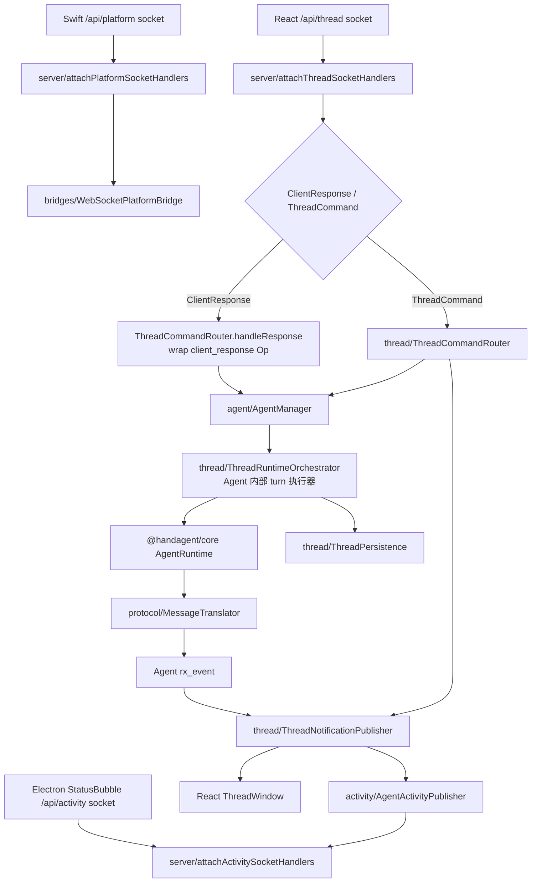

# agent-server

`apps/agent-server` 是 desktop 派生的本地 Node 服务。它只做本地 bridge、路由、持久化封装和 runtime 驱动：不渲染 ThreadWindow UI，不实现 macOS 原生能力，也不在本包定义跨进程 DTO。

同一端口 `127.0.0.1:4317` 暴露五类入口：

| 入口 | 消费方 | 消息边界 |
|------|------|------|
| `ws://127.0.0.1:4317/api/thread` | React ThreadWindow | 接收 `ThreadCommand` / `ClientResponse`，发送 `ThreadNotification` / `ServerRequest` |
| `ws://127.0.0.1:4317/api/activity` | Electron StatusBubble；后续桌宠 | 只发送 `AgentActivityEvent`，连接后先发 `activity.snapshot`，状态变化时发 `activity.changed` |
| `ws://127.0.0.1:4317/api/agent-trigger/attention` | Electron main | 只发送后台 AgentTrigger 的宿主级 attention 事件；命中权限、工作区选择或失败时触发 |
| `ws://127.0.0.1:4317/api/platform` | Swift desktop | 只承载 `PlatformBridgeMessage`，用于 core platform tool 反向请求 desktop |
| `http://127.0.0.1:4317/thread-window/*` | Electron ThreadWindow `BrowserWindow` | 返回 React 静态资源，不参与 thread 协议 |

## 直接子节点

| 子节点 | 文档 | 职责 |
|------|------|------|
| `src/` | [src/src.md](/Users/mu9/proj/handAgent/apps/agent-server/src/src.md) | agent-server 源码；按 `server / thread / protocol / settings / actions / bridges` 拆分 |
| `tests/` | [tests/tests.md](/Users/mu9/proj/handAgent/apps/agent-server/tests/tests.md) | agent-server 单元测试；目录结构跟 `src/` 职责对齐 |
| `package.json` | 无独立文档 | workspace 包声明；`main` 和 `start` 指向 `src/server/server.ts` |
| `node_modules/` | 不纳入仓库文档 | pnpm 安装产物，不提交、不维护文档 |

## 启动与组合

Electron main 作为唯一 supervisor，会在桌面 App 启动时定位仓库根目录并启动：

```bash
node --experimental-transform-types --experimental-specifier-resolution=node apps/agent-server/src/server/server.ts
```

启动后 `src/server/server.ts` 是组合根，负责把 core 和本目录模块接起来：

1. 构造 `ThreadStore({ dbPath: ~/.spotAgent/threads.sqlite })`、`FilesystemBlobStore`、`FileNetworkLogger`、`FileWorkspaceRegistry`。
2. 读取 `~/.spotAgent/mcp.json` 并创建 `MCPServerRegistry`。
3. 创建 `WebSocketPlatformBridge` 与 `AgentRequestBroker`；permission/workspace ask 先进入 Agent `rx_event`。
4. 通过 `SettingsBackedToolRegistry` 注册 builtin tools。
5. 通过 `SettingsBackedLLMClient` 或 `MockLLMClient` 选择 LLM 模式。
6. 按 thread 缓存 `AgentRuntime`，注入 thread 级 tool registry、permission policy、blob store 和 turn summarizer；mock 模式使用 `MockLLMClient` 且不启用 summarizer。
7. 创建 `AgentManager` 作为持久 Agent owner；每个 Agent 暴露 `tx_sub`、`rx_event`、`agent_status`、`session`，并在内部复用 `ThreadRuntimeOrchestrator` 执行 ReAct turn。
8. 创建 `AgentActivityPublisher`、`AgentTriggerAttentionPublisher`、`ThreadPersistence`、`ThreadNotificationPublisher`、`ThreadCommandRouter`、`AgentTriggerLaunchService`。
9. 启动同端口 HTTP + WebSocket 服务：`/api/thread` 挂载 thread command/response handler，`/api/activity` 挂载 activity subscriber handler，`/api/agent-trigger/attention` 挂载后台 trigger attention subscriber，`/api/platform` 挂载 platform bridge handler，`/thread-window/*` 提供 React 静态资源，`POST /api/agent-trigger/fire` 作为后台启动入口，未知 path 直接关闭或返回 404。

## 主消息流



`op.submit` 是公开运行期输入入口，payload 内的 `op` 只能是 `UserInput` 或 `Interrupt`。`thread.start` 只负责创建 thread 并注册持久 Agent；PromptPanel/Composer 的 action 信息已经作为 `UserInput.items` 中的 `skill` item 随首轮或后续 `op.submit` 进入 server。React 回传的 `ClientResponse` 不直接触碰 request broker，server 会将其包装为 `client_response` Op 再投递到同一个 Agent `tx_sub`。router 不再因为 thread running 拒绝用户 follow-up；是否排队由 Agent / 内部 turn 执行器处理。

## 协议主干

- `/api/thread` 顶层只接收 `ThreadCommand`、`ClientResponse`。
- `/api/activity` 顶层只发送 `AgentActivityEvent`，新连接立即收到 `activity.snapshot`，后续状态变化收到 `activity.changed`。
- `/api/platform` 顶层只接收 `PlatformBridgeMessage`。
- thread 通知主干统一走 `ThreadNotification`；`thread.snapshot` 是用户打开历史 thread 或初始 prompt 建立 thread 后的状态入口，不是 React 断线恢复入口。
- activity 状态由 `AgentActivityPublisher` 从 `ThreadNotification` / `ServerRequest` 派生；activity subscriber 发送失败只影响该 subscriber，不影响 `/api/thread` 分发。
- permission / workspace 的交互式请求统一由 Agent `rx_event` 产出 `server.request`，app-server 发布为 `ServerRequest`；React 回 `ClientResponse` 后由 app-server 包装成 `client_response` Op。
- `workspace.listed` 是 `workspace.list` 的连接级响应，不带 `threadId`，只发给发起命令的 `/api/thread` 连接。
- `op.submit` 是运行期输入 envelope；`input.submit` 与 `turn.interrupt` 不再属于公开 `ThreadCommand`。
- permission / workspace request-response 都绑定到 thread 当前连接；断线或旧 token 回包不能影响新连接。
- 单条 React thread socket 可以同时接收多个已订阅 thread 的通知；当前协议不承诺显式 unsubscribe。

## 与文件系统约定

| 路径 | 写入方 | 读取方 | 说明 |
|------|--------|--------|------|
| `~/.spotAgent/settings.json` | desktop settings | `settings/` | LLM provider/model/API 与 builtin tool 开关；按文件 stamp 热加载 |
| `~/.spotAgent/threads.sqlite` | `@handagent/thread-store` / `thread/ThreadPersistence` | agent-server / React ThreadWindow 历史列表 | SQLite thread rollout items，派生 messages、events 与 history summary |
| `~/.spotAgent/blobs/` | `protocol/composeUserContent`、core runtime summary | LLM adapter / 后续 tool | 图片附件、大段 tool 输出与 summary 元数据 |
| `~/.spotAgent/log/` | `FileNetworkLogger` | 人工排查 | LLM 请求/响应 JSONL |
| `~/.spotAgent/workspaces.json` | desktop settings + core registry | agent-server / desktop | workspace 注册表 |
| `~/.spotAgent/permissions.json` | core `FilePermissionPolicy` | agent-server | 永久权限规则 |
| `~/.spotAgent/mcp.json` | 用户/安装流程 | `server/readMCPConfig` | 全局 MCP server 配置 |

## LLM 模式

- 默认是 `settings`：读取 `~/.spotAgent/settings.json`，使用 `SettingsBackedLLMClient`，并启用 `TurnSummarizer`。
- `HANDAGENT_LLM_MODE=mock` 时使用 core `MockLLMClient`，关闭 summarizer，并允许未激活 thread 暴露 builtin tools，方便 mock QA 触发固定 tool 场景。
- 打包 mock QA 可执行：

```bash
bash ./scripts/package-app.sh --mock-llm
open dist/HandAgentDesktop.app
```

## 编辑约束

- 不在 `agent-server` 内定义跨进程 DTO；thread 命令走 `@handagent/core/protocol/ThreadCommand.ts`，thread 通知走 `@handagent/core/protocol/ThreadNotification.ts`，请求回流走 `ServerRequest` / `ClientResponse`，Agent 内部事件走 `AgentEvent` / `Op`，平台帧走 `@handagent/core/protocol/PlatformBridgeMessage.ts`。
- 不 import macOS、Swift、AppKit、SwiftUI 或 browser-only 模块；平台能力一律经 `PlatformAdapter` / `PlatformBridge`。
- 不在这里实现 UI 状态；ThreadWindow 后台 thread 状态缓存、当前展示 thread、composer、请求面板和消息展示属于 React 前端。
- 不在这里实现平台原生能力；`/api/platform` 只把 core `RemotePlatformAdapter` 的请求转给 desktop。
- 新增源码子目录时，更新 [src/src.md](/Users/mu9/proj/handAgent/apps/agent-server/src/src.md)；新增测试子目录时，更新 [tests/tests.md](/Users/mu9/proj/handAgent/apps/agent-server/tests/tests.md)。
- 修改 TypeScript 后必须重启 desktop app 才能生效，无 hot reload。
- 验证命令：`bash ./scripts/test.sh`；涉及 desktop 启动路径时同时跑 `bash ./scripts/swiftw test` 与 `bash ./scripts/swiftw build`。

## 调试入口

- thread / notification 问题先看 `~/.spotAgent/threads.sqlite` 中的 `threads` / `thread_items`。
- LLM provider 或 tool calling 问题先看 `~/.spotAgent/log/<YYYY-MM-DD>/network-NNN.jsonl`。
- 平台能力无响应先看 `bridges/` 是否有 active desktop bridge，再看 desktop `PlatformBridgeService`。
