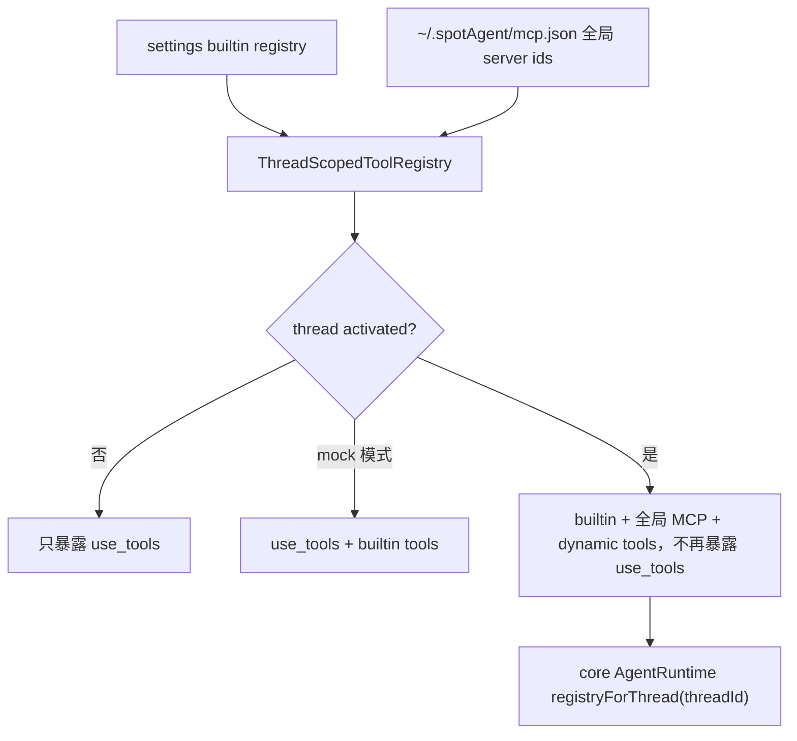

# actions

## 目录职责

`actions/` 管理 thread 可用工具集合。它连接 settings 生成的 builtin workspace/file tools、`~/.spotAgent/mcp.json` 中的全局 MCP server，以及 thread metadata 中保存的 dynamic tools。

## 文件

| 文件 | 职责 |
|------|------|
| `MCPServerRegistry.ts` | 按 `serverId` 缓存 MCP client 和适配后的 tools；代理 prompts/resources 能力 |
| `ThreadScopedToolRegistry.ts` | 为每个 thread 维护独立 `ToolRegistry`；处理 `use_tools` 懒加载、全局 MCP、dynamic tools、mock LLM 特例和删除清理 |

## 工具组合流

`thread.start` 不再携带 action binding，thread metadata 也不再决定 MCP scope。PromptPanel action 会作为 `UserInput.items` 中的 `skill` item 进入消息内容。

## MCP client 与 tool cache

`MCPServerRegistry` 让同一个 serverId 复用同一个 initialized client。tools 只适配一次，后续 thread 组合时复用 `AgentTool` 包装。

## thread 懒激活

未激活 thread 默认只暴露 `use_tools`，减少普通聊天请求里的工具噪音。模型调用 meta-tool 后，core runtime 触发 `activate(threadId)`，下一轮工具表扩展为 builtin + 全局 MCP，并移除 `use_tools`。

## Dynamic tools

`ThreadScopedToolRegistry` 在 thread 激活后把 `metadata.dynamicTools` 转换为 `DynamicToolAdapter`。adapter 的模型可见名称为 `namespace.name`，例如 `host_macos.screen_capture`；调用时 agent-server 通过 `WebSocketDynamicToolBridge` 按 `clientId` 转发给 provider。

## 编辑约束

- 新增 MCP server transport 时，先扩展 core `MCPClient` / config，再在 `server/createMCPClientFromConfig()` 接入。
- `ThreadScopedToolRegistry` 不直接读取磁盘配置；全局 server id 由上游传入。
- 缺失或失败的 MCP server 应记录 skip 日志并保留 builtin tools，不阻断整轮 prompt。

## 下一步阅读

- core MCP 协议：[packages/core/src/mcp/mcp.md](/Users/mu9/proj/handAgent/packages/core/src/mcp/mcp.md)
- settings builtin tools：[settings/settings.md](/Users/mu9/proj/handAgent/apps/agent-server/src/settings/settings.md)
