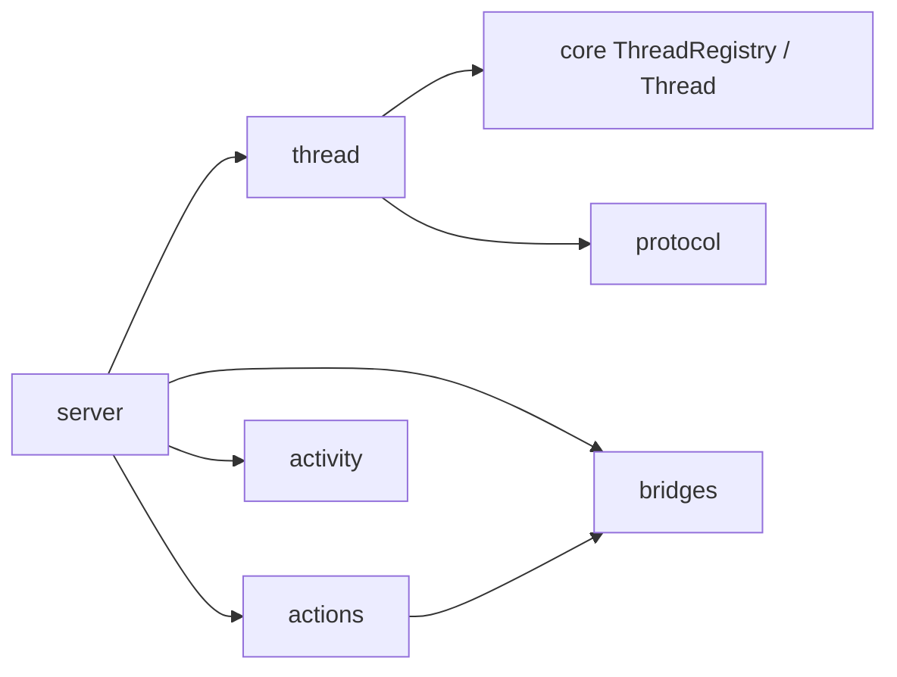

# src

`apps/agent-server/src` 把 core 能力组合成本地服务。每个子目录只拥有一种适配职责。

## 直接子节点

- [server/server.md](/Users/mu9/proj/handAgent/apps/agent-server/src/server/server.md)：进程入口、HTTP/WebSocket 分派与组合根。
- [thread/thread.md](/Users/mu9/proj/handAgent/apps/agent-server/src/thread/thread.md)：Thread 命令接入、Workspace 管理、持久化适配和通知分发。
- [agent/agent.md](/Users/mu9/proj/handAgent/apps/agent-server/src/agent/agent.md)：历史 Agent 目录说明；生产 Thread owner 位于 core `thread/`。
- [protocol/protocol.md](/Users/mu9/proj/handAgent/apps/agent-server/src/protocol/protocol.md)：runtime、UI 与持久化表达之间的翻译。
- [actions/actions.md](/Users/mu9/proj/handAgent/apps/agent-server/src/actions/actions.md)：Thread-scoped Tool registry 与 MCP 激活。
- [bridges/bridges.md](/Users/mu9/proj/handAgent/apps/agent-server/src/bridges/bridges.md)：Dynamic Tool Provider bridge。
- [activity/activity.md](/Users/mu9/proj/handAgent/apps/agent-server/src/activity/activity.md)：Agent Activity 投影。
- [settings/settings.md](/Users/mu9/proj/handAgent/apps/agent-server/src/settings/settings.md)：后端配置 HTTP 管理与设置驱动的 LLM / Tool 热加载。

## 依赖方向

- `server` 是唯一组合根；子模块不读取进程环境并自行创建全局依赖。
- `server` 创建 thread-store 并通过 `thread` 的持久化适配注入 core；`protocol` 提供转换函数，不拥有运行状态。
- `activity` 旁路观察 Thread 消息，不反向改变 Thread 行为。
- 跨进程 DTO 只从 core protocol 导入，不在本包复制定义。
