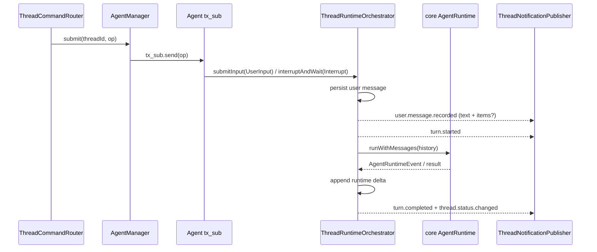

# thread

## 目录职责

`thread/` 负责 `/api/thread` 内部的 thread 生命周期路由：创建、恢复、列出、删除 thread，把运行期 `Op` 转交给 Agent，并把通知、审计事件和消息写回持久化。

本目录不持有 WebSocket，也不创建 LLM client、MCP client 或 platform adapter；这些依赖由 `server/` 注入。

## 文件

| 文件 | 职责 |
|------|------|
| `ThreadCommandRouter.ts` | 处理 `ThreadCommand` 路由，把 `ClientResponse` 包装为 `client_response` Op，调用 `AgentManager` / persistence，并把生命周期 notification 推给 publisher |
| `ThreadInputQueue.ts` | thread-local FIFO input item 队列；当前生产路径承载 idle user input 的 session 唤醒，类型上为后续 response item / 子 agent 通信预留 |
| `ThreadNotificationPublisher.ts` | 维护 `connection -> subscribed threadIds` 的分发表；thread 级消息按 `threadId` 定向，非 thread 级 notification 广播 |
| `ThreadRuntimeOrchestrator.ts` | Agent 内部 ReAct turn 执行器：记录输入、唤醒 runtime、drain queued input、转译通知、处理中断与错误；thread 输入临界区由 `async-mutex` 管理 |
| `ThreadPersistence.ts` | `@handagent/thread-store` 的唯一直接封装：创建 / 删除 / 读取 / 列出 thread，把用户消息、runtime delta、审计事件和 runtime notification 写成 rollout items，并恢复重启前未完成的 turn |

## 运行期输入

`op.submit` 是公开 `/api/thread` 的唯一运行期输入命令。`payload.op` 只表示运行期操作，不替代 thread 生命周期命令：`thread.start` / `thread.resume` / `thread.list` / `thread.delete` / `workspace.list` 仍保持独立。

`thread.start` 创建 thread 后注册持久 Agent；`op.submit(UserInput)` 和 `op.submit(Interrupt)` 都交给 `AgentManager` 查找对应 Agent，并通过 Agent 的 `tx_sub` 发送。router 不再判断 running 后拒绝普通用户输入。

每个 thread 进程内最多一个 active run，晚到 runtime event 必须通过 generation 检查后才能发布或落盘。运行期 follow-up 是否排队是 Agent 内部职责，不再暴露为 router 的 `thread_running` 错误。

## 关键机制

### 命令入口

- `thread.start`：创建 thread，并在当前 `/api/thread` socket 上建立该 thread 的通知路由。
- `thread.resume`：恢复既有 thread，并返回 `thread.snapshot`。
- `thread.list`：返回 `thread.listed`。
- `thread.delete`：删除指定 thread；若该 thread 正在运行，先中断再删。
- `op.submit`：运行期输入入口；`UserInput` 记录用户输入并唤醒 Agent，`Interrupt` 中断当前运行。
- `workspace.list`：读取 workspace 注册表，并在当前连接返回 `workspace.listed`；未配置 registry 时返回 `thread.error(workspace_registry_not_configured)`。

### `workspace.listed` 是连接级响应

- `workspace.listed` 对应 `workspace.list` 命令，不带 `threadId`，只发给发起命令的连接。
- payload 当前包含 `id`、`name`、`rootPath`，用于 ThreadWindow 展示和选择用户已注册 workspace。

### `thread.snapshot` 是打开入口

- 用户打开历史 thread，或初始 prompt 建立 thread 后需要拉取初始状态时，React 发送 `thread.resume(threadId)`。
- `thread.resume` 的结果是 `thread.snapshot`，携带当前 `messages` 与 `status`。
- `thread.snapshot` 里的 user message 现在还会保留可选 `inputItems`，让 ThreadWindow 在恢复历史 thread 时继续按 image / skill / text_selection / text 的结构渲染用户输入。
- 如果 thread 当前未运行，router 会在返回 snapshot 前尝试恢复重启前的半截 turn，避免历史只停在 user message。

### 连接与通知分发

- `ThreadNotificationPublisher` 维护 `connectionId -> subscribed threadIds`，但不持有 socket；发送函数由 `server/attachThreadSocketHandlers` 注入。
- `ThreadNotificationPublisher` 可接收一个 observer，把每个 `ThreadNotification` / `ServerRequest` 旁路交给 `AgentActivityPublisher`。`ServerRequest` 现在来自 Agent `rx_event` 的 `server.request`，不再由 socket bridge 直接发送。observer 发送失败会在 activity 层被隔离，不改变 `/api/thread` 的订阅分发。
- 同一条 React `/api/thread` socket 可以同时接收多个 thread 的通知。
- 带 `threadId` 的 notification / server request 按 thread 定向；不带 `threadId` 的全局 notification 广播给所有连接。
- 当前协议不承诺显式 unsubscribe；右侧当前展示哪个 thread 是 React 本地页面编排状态，不会单独通知 server。

### active turn 与 append-only 写回

- runtime 回调落通知或持久化前都要检查当前 generation；被中断或超时清理的旧 run 的晚到 delta / tool result / error 不得污染当前状态。
- runtime 结果通过 `persistRunDelta` 追加 generated messages、`turn_context` 审计和已推送的 `event_msg` notification，避免覆盖运行期间已有消息。
- `persistUserInput()` 在保存用户输入时同时落盘扁平 `content` 与结构化 `inputItems`；`user.message.recorded` live 通知也带同一份 `items?`，保证 live UI 与 snapshot round-trip 一致。
- 每轮 runtime 使用稳定输入快照；后续若接入内部 response item / 子 agent 通信，active run 准备阶段收到的内部队列项只进入后续 follow-up，不会被当前 runtime 和 follow-up 重复处理。

### 中断与重启恢复

- `op.submit(Interrupt)` 结束后，notification 侧应收敛为 `turn.completed(status: "interrupted")` 与 `thread.status.changed(value: "interrupted")`。
- 中断会先清理 active pending input；`interruptAndWait` 通过 idle waiter 等待 active run 自然清理，并与超时 race。若 stubborn runtime 清理超时，orchestrator 会关闭旧 session，并把 timeout 等待期间已经持久化的新输入重放到新 session，避免用户输入丢失。
- 若 agent-server 在 turn 运行中重启，`ThreadPersistence` 会在下一次 `thread.resume` 前修复残缺记录：优先复用已有 error 事件，否则补一个明确的恢复失败痕迹。

## 状态边界

- `ThreadCommandRouter`：只处理命令路由、thread 是否存在校验、Agent 注册 / 转发、删除前关闭 Agent。
- `ThreadRuntimeOrchestrator`：只管理 Agent 内部 active run，不直接掌握 socket，也不作为公开输入入口。
- `ThreadInputQueue`：只负责队列和等待者，不做持久化、不判断运行状态。
- `ThreadPersistence`：本目录唯一直接持有 `@handagent/thread-store` 的类；同时负责 user attachment 入库、rollout item 写入、conversation snapshot 转换和残缺 turn 恢复。
- `ThreadNotificationPublisher`：只负责连接与 thread 维度的消息分发，不做业务判断。

## 编辑约束

- 新增 thread / turn 命令分支优先落在 `ThreadCommandRouter.ts`。
- runtime event 到 notification / 审计事件的翻译归 `protocol/MessageTranslator.ts`。
- 需要 request-response 的能力优先判断是否属于 Agent `rx_event(server.request)` / `tx_sub(client_response)`；跨进程呈现仍是 `/api/thread` 的 `ServerRequest` / `ClientResponse`，不要误挂到 `/api/dynamic-tools`。
- 本文件只记录当前输入入口 `op.submit` 及其路由语义。
