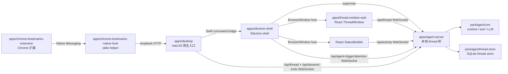

# apps

## 目录职责

`apps` 层负责可执行产品入口与用户交互壳层，不承载跨平台业务规则。

当前包含五个可执行单元和两个 Web / 扩展前端包：

- [desktop/desktop.md](/Users/mu9/proj/handAgent/apps/desktop/desktop.md) —— macOS 原生入口（Swift / SwiftUI），负责 PromptPanel、Settings、热键、焦点恢复、host dynamic tools 和 Electron 生命周期。
- [electron-shell/electron-shell.md](/Users/mu9/proj/handAgent/apps/electron-shell/electron-shell.md) —— Electron UI shell，监督 agent-server，承载 Electron ThreadWindow 和 React StatusBubble。
- [thread-window-web/thread-window-web.md](/Users/mu9/proj/handAgent/apps/thread-window-web/thread-window-web.md) —— React ThreadWindow 前端，由 Electron `BrowserWindow` 承载。
- [agent-server/agent-server.md](/Users/mu9/proj/handAgent/apps/agent-server/agent-server.md) —— 本地 WebSocket thread 桥（Node / TypeScript），由 electron-shell 监督。
- [chrome-bookmarks-extension/chrome-bookmarks-extension.md](/Users/mu9/proj/handAgent/apps/chrome-bookmarks-extension/chrome-bookmarks-extension.md) —— Chrome MV3 扩展，监听 `chrome.bookmarks.onCreated` 并通过 Native Messaging 转发 URL 书签新增事件；连接后还会上报当前收藏夹文件夹树快照。
- [chrome-bookmarks-native-host/chrome-bookmarks-native-host.md](/Users/mu9/proj/handAgent/apps/chrome-bookmarks-native-host/chrome-bookmarks-native-host.md) —— Chrome Native Messaging stdio helper，把扩展 hello、文件夹树快照和书签新增消息转发给 Swift desktop 的本地 Chrome Bookmarks bridge。

## 在整体架构中的位置

## 本层核心流转

### 1. 宿主唤起

- 全局热键由 `KeyboardShortcuts` 库监听（命名表见 [Hotkey](/Users/mu9/proj/handAgent/apps/desktop/Sources/AppServices/Hotkey/hotkey.md)），事件转发给 `AppCoordinator`。
- `PromptPanelController` 负责打开输入面板、聚焦输入框、采集选区附件、提交 prompt。

### 2. Thread 交互

- Electron main 在 agent-server ready 后主动预热隐藏 `BrowserWindow`；PromptPanel show/toggle 不触发 ThreadWindow 预热。
- 用户提交 prompt 后，Swift 通过窄口径 `/api/thread` client 发送带默认 `dynamicTools` 的 `thread.start`，收到 `thread.started.threadId` 后发送首轮 `op.submit(UserInput)`，再通过 command bridge 让 Electron open/focus 对应 React ThreadWindow。
- 打开历史和聚焦仍分别发送 `thread_window.open_history` / `thread_window.focus`。
- 用户在 Swift Settings 修改主题后，Swift 通过 command bridge 发送 `theme.changed`，Electron 保存当前 host theme 并广播给 ThreadWindow 与 ActivityWindow renderer。
- React ThreadWindow 的预热 `/api/thread?acceptServerRequests=1` 连接会收到 Swift 或 React 创建 thread 的 `thread.started` 广播，并作为 permission / workspace 等交互式请求 owner；用户打开历史时发送 `thread.resume`，后续 composer 追问统一发送 `op.submit(UserInput)`，运行态停止发送 `op.submit(Interrupt)`。
- React ThreadWindow 负责 `ThreadCommand` / `ClientResponse` 编码、`ThreadNotification` / `ServerRequest` 接收，以及历史、后台 thread 状态缓存、当前右侧展示 thread、消息、请求面板和 composer 状态；`ClientResponse` 到 Agent `client_response` Op 的转换由 app-server 负责。
- ThreadWindow 左侧历史列表通过 thread 协议读取 `~/.spotAgent/threads.sqlite` 派生的历史摘要，用于搜索、预览、恢复和删除持久化 thread。

### 3. Host Dynamic Tools

- Swift desktop 作为默认 dynamic tool provider 连接 `/api/dynamic-tools`，用 `provider_hello` 注册 `host_macos.*` 工具。
- `thread.start.payload.dynamicTools` 保存 thread 创建时允许的动态工具候选；LLM 调用 `use_tools` 后，agent-server 将 builtin workspace/file tools、MCP tools 与 dynamic tools 一起暴露。
- LLM 调用 `host_macos.screen_capture` 等 dynamic tool 时，agent-server 按 `clientId` 转发给 Swift provider，Swift 复用 `MacPlatformProvider` 执行并回写 `tool_call_response`。

### 4. 状态反馈

- Electron ActivityWindow 承载 React StatusBubble；renderer 订阅 `/api/activity`，接收 agent-server 派生的 `AgentActivityEvent`。
- Electron 气泡点击时只请求 Electron main 聚焦已有 ThreadWindow；无法聚焦时不回告 Swift，也不打开 PromptPanel。
- Electron main 还订阅 `/api/agent-trigger/attention`，接收后台 trigger 的 `AgentTriggerAttention` 事件，在命中权限、工作区选择或失败时引导用户注意。
- Swift 不订阅 `/api/activity`，也不把完整 ThreadWindow thread 缓存、消息或历史同步到 Swift 状态。

## 本层关键 DTO

- `PromptAttachmentResult`（5 case：textSelection / selectionError / textToken / imageRegion / noAttachment）
- `UserInput` / `InputItem` / `Op`
- `ThreadCommand` / `ThreadNotification` / `ServerRequest` / `ClientResponse`
- `AgentActivityEvent`
- `AgentTriggerFireRequest` / `AgentTriggerFireResult` / `AgentTriggerAttention`
- `DynamicToolSpec` / `DynamicToolProviderMessage`

## 模块边界

- 宿主层不负责编排 LLM/tool 循环。
- `agent-server` 不负责宿主 UI；只用 `~/.spotAgent/settings.json` 与 desktop 交换配置，不直接读宿主进程状态。
- Runtime、tool、dynamic tool 与协议抽象统一下沉到 `packages/core`；macOS 原生实现留在 Swift host dynamic tools。
