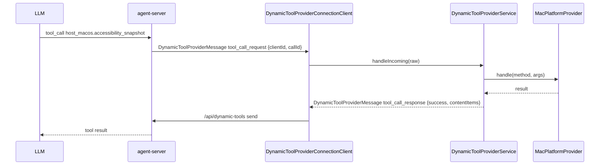

# Host Dynamic Tools

`DynamicToolProviderService` 是桌面 App 进程内的 host / plugin dynamic tool 请求处理器。`DynamicToolProviderConnectionClient` 建立到 `ws://127.0.0.1:4317/api/dynamic-tools` 的独立 WebSocket，连接成功后发送 `channel: "dynamic_tools"` 的 `provider_hello`，并把收到的 `tool_call_request` 分派给 `DynamicToolProviderService`。`host_macos.*` 调用进入 `MacPlatformProvider`；plugin namespace 调用进入 `PluginDynamicToolManager`，由 Swift 管理 plugin 生命周期与进程调用，再把 `tool_call_response` 通过 `/api/dynamic-tools` 回到 agent-server。

设计关键：

- **独立连接，独立语义**：dynamic tool provider 只使用 `/api/dynamic-tools`，不与 React ThreadWindow 的 `/api/thread` 共享 WebSocket。
- **provider 注入**：`MacPlatformProvider` 实现 macOS 原生能力；UI 层只关心 service 生命周期，不直接调用 provider。
- **官方 plugin 安装**：`BuiltinPluginInstaller` 在生产 `AppServices.defaultRuntime` 创建 `PluginDynamicToolManager` 前，把官方 AX、screenshot、app/window、Context History 和 Automation runtime manifest 写入或修复到 `~/.spotAgent/plugins`；已有 manifest 的 `enabled` 用户选择会保留。
- **plugin 生命周期归属**：`PluginDynamicToolManager` 扫描 `~/.spotAgent/plugins/<id>/plugin.json`。enabled 的 `alwaysOn` plugin 在 reload 后由 Swift 启动并保留，tool 调用走常驻进程 stdin/stdout RPC；`onDemand` / `toolsOnly` plugin 在对应 tool 被调用前由 Swift 确保启动并沿用一次性执行路径。agent-server 只看到 `clientId = swift-host` 的 dynamic tool spec，不读取 plugin binary，也不 spawn plugin 进程。
- **plugin manifest**：manifest 版本为 `1`，字段包括 `id`、`title`、`description`、`lifecycle`、`kind`、`enabled`、`command`、`args`、`provides`、`requires`、`dataDirectoryName` 和 `tools`。旧 manifest 没有 `kind` / `enabled` 时按 `dynamicTool` / `true` 处理。plugin tool 的 `namespace/name` 只能使用 ASCII 字母、数字、`_`、`-`，且不能占用 `host_macos` namespace。
- **官方 Context History / Automation**：AX、screenshot、app/window 原子 plugin 默认启用；`handagent-context-history` 与 `handagent-automation-runtime` 默认关闭。启用后才会暴露 `context_history.*` 或 `automation.*` dynamic tools。
- **能力分级**：clipboard / app / window / screen 已落地（`NSPasteboard` / `NSWorkspace.runningApplications` / `CGWindowListCopyWindowInfo` / `ScreenCaptureKit SCScreenshotManager`）；`host_macos.ocr_read` 走 Vision 文本识别；`host_macos.accessibility_snapshot` / `host_macos.accessibility_action` 走 Accessibility API。`app.list` 是 provider 内部方法，对外暴露为 `host_macos.app_list`。
- **权限边界**：`host_macos.screen_capture` 依赖「屏幕录制」权限，枚举内容失败时返回 `permission_denied` 并提示到系统设置授权。Accessibility 能力调用前用 `AXIsProcessTrustedWithOptions(false)` 检查，不主动弹系统权限框；未授权时返回 `permission_denied`，提示用户到「系统设置 → 隐私与安全性 → 辅助功能」允许 HandAgent。
- **上下文边界**：`host_macos.ocr_read` 只处理 tool 入参里的 `imageBase64`，不会默认读取屏幕、剪贴板或文件；需要先由用户主动提供图片或由 LLM 显式调用 `host_macos.screen_capture` 获得图片后再传入。
- **Accessibility 快照限制**：快照返回 `role` / `label` / `title` / `value` / `description` / `frame` / `elementId` / `children`，默认限制深度与子节点数量，上限为 `maxDepth=6`、`maxChildren=50`，避免一次返回巨大无障碍树。
- **Accessibility 动作限制**：`host_macos.accessibility_action` 支持 `press`、`click`、`set_value`。元素定位优先使用快照返回的 `elementId`，格式为 `pid:<pid>;path:<childIndex.childIndex>`；`click` 先尝试 AX press，不支持时再按元素 frame 中心点发送鼠标事件。
- **重连归属**：断线与自动重连由 `/api/dynamic-tools` 的 `AppServerConnection` 负责；重连成功后 `DynamicToolProviderConnectionClient` 会立即发送 `provider_hello`。

调用链：

文件：

- `MacHostDynamicTools.swift`：定义默认 `clientId = swift-host`、`namespace = host_macos`、tool specs、旧 provider method 映射和 `DynamicToolProviderService`。
- `PluginDynamicTools.swift`：定义官方 plugin installer、plugin manifest 解析、lifecycle manager、plugin tool executor 和 `PluginDynamicToolManager`。
- `MacPlatformProvider.swift`：实际能力实现；新增 macOS 能力时在此扩展。
- [builtin-plugins](/Users/mu9/proj/handAgent/apps/builtin-plugins/builtin-plugins.md)：官方 Swift plugin 可执行 target 与可测试核心。

## 编辑此目录的约束

- 新增平台能力时先扩 `MacPlatformProvider.handle(method:args:)` 的分派与解析，再同步 `MacHostDynamicTools.toolSpecs` 与 core dynamic tool 协议文档。
- 新增 plugin manifest 字段或 lifecycle 时，同步更新 `PluginManifestStore`、`PluginDynamicToolsTests` 和 `docs/manual-qa.md`。
- 不要把 dynamic tool provider RPC 混入 `/api/thread`；Swift 宿主只在 `/api/dynamic-tools` 处理 `channel: "dynamic_tools"` 的 provider 消息。
- 需要真实系统权限的行为不放进自动化测试主路径，实机步骤维护到 `docs/manual-qa.md`。
