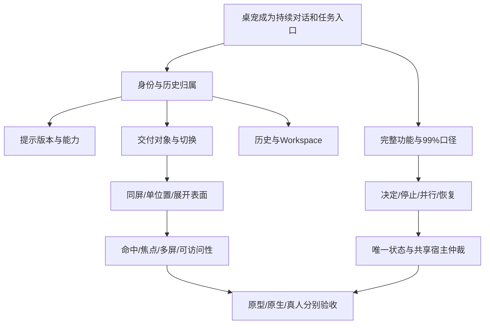

# 分轮设计质询与取舍

本轮遵从用户“不提问、自主讨论”的要求：使用 grill-with-docs 的设计树方法，由产品研究、平台/HCI、代码审计与主设计相互质询。下列“推荐”是有理由的默认方案，不冒充用户逐项确认。完整反例及验收门槛见[独立质询](./challenge-review.md)。

## 设计树

## 第一轮：先决定谁在和用户工作

| 问题 | 考虑过的分支 | 推荐及理由 | 什么证据会改变决定 |
| --- | --- | --- | --- |
| 桌宠是皮肤还是身份？ | 同一助手换皮；稳定档案；每宠独立 App | 稳定档案。不同工作提示与独立历史是用户明确目标，窗口与后端不用复制。 | 用户后来明确只要视觉换肤，才退化为一个身份。 |
| 一段 Thread 能否随切宠换主人？ | 改 petId；共享群聊；唯一主人+转交 | 唯一主人，转交另建 Thread。保证历史、请求和人设来源可追溯。 | 真正多人共享讨论需单独建群聊语义，不借 UI 切换实现。 |
| 一宠是否等于一 Workspace？ | 一对一；宠物为项目容器；正交组合 | 正交组合，Workspace 可选。日常问答不要求建文件夹，同一项目可找不同伙伴。 | 若用户研究显示长期仅固定搭配，可优化默认值，但不改变底层关系。 |
| 要不要先做自动记忆？ | 所有历史全注入；检索记忆；当前Thread+明确偏好 | 初版保持显式范围，先做好历史找回。记录、记忆、文件根是不同能力。 | 有可衡量的跨会话需求后再设计来源、作用域与删除规则。 |
| 改人设影响旧任务吗？ | 全局热替换；每轮最新；创建快照 | 创建快照，新对话用新版本；旧对话可明确带摘要转入新版本。 | 长期会话频繁修改人设的实测需求可触发下一轮的显式版本事件设计。 |

## 第二轮：身份确定后，决定输入与连续性

| 问题 | 考虑过的分支 | 推荐及理由 | 验证重点 |
| --- | --- | --- | --- |
| 点宠是否直接可聊？ | 仍走 PromptPanel；有历史才回复；空态直接聊 | 空态直接聊，沿用已有紧凑方案。否则每次请求体验仍绕回其他入口。 | 冷启动、创建失败、未发送草稿。 |
| drop 到哪一段对话？ | 全部追加；全部新建；本体新建/面板追加 | 保留 Issue #1 两区域语义，加上明确接收宠名字。 | 交错 hover、同皮肤、多文件与延迟解析。 |
| 松手后还要点发送吗？ | 先暂存；自动 inspect | 主要 drop 自动 inspect。产品原型最初建议暂存，质询后因改变既有已授权体验而撤回。 | 接收与读取状态分开；执行建议仍需后续明确输入。 |
| 什么时候固定接收者？ | hover时；读完时；最终drop时 | 文件在 drop 时固定；语音在录音开始固定；文本在明确编辑的上下文中绑定。 | A→B松手→C切换后仍归B，IME不误发送。 |
| 后台消息可接管当前吗？ | 最新创建/更新接管；只明确导航 | 只用户导航改变选择，未读与待决定另显。现代码的全局 latest 正是要替换的路径。 | AgentTrigger、新Thread、旧任务完成、重连交错。 |
| 切模式是否暂停隐藏宠？ | 暂停隐藏者；只改展示 | 只改展示。否则单位置模式会失去用户要求的独立任务连续性。 | 后台运行/请求/草稿不变且仍可发现。 |

## 第三轮：连续任务决定表面与系统边界

| 问题 | 推荐 | 代价与应对 |
| --- | --- | --- |
| 默认 A、B 还是 C？ | A 就地对话，按需吸收 C 的固定阅读；B 留可选交付布局。 | A 需要明确展开入口；C 不能滑回全局聊天室；以相同任务比较后再修订。 |
| 三只是否都完整展示？ | 是；与单位置模式同等支持，默认展开一个，允许固定多个面板。 | 多宠占空间，提供独立大小/位置与显示方式，而不是删掉其中两个完整角色。 |
| 210px 能装99%吗？ | 不能一直装。它是扫读层，长文、权限、历史显式展开仍属于此宠同一Thread。 | 区分“宠物可展开”与“原ThreadWindow必经”，统计分别验收。 |
| 全屏透明画布是否最简单？ | 暂不作为默认。先比较每宠小窗与相邻群组窗口。 | 多窗口也有内存/窗口管理成本，原生实验和能耗数据决定最终粒度。 |
| 焦点跟随 hover 吗？ | 不跟随；点击/键盘意图聚焦，hover只预览。 | 输入法、还原前台窗口须原生验证，CSS或JS focus不足以证明。 |
| 两位可否同时控制桌面？ | 可并行计算，前台操作必须共享资源仲裁。 | 等待与取消需要产品表达；重新取得资源后重新观察，不能用旧坐标。 |
| 角色人格可否改变权限？ | 不可。工具限制由后端执行，Permission 与OS权限保持真实范围。 | 全局always文案较长，只在相关选择处说明，不把所有动作加确认。 |

## 第四轮：用失败场景检查99%是否成立

| 反例 | 收敛决定 | 尚需证据 |
| --- | --- | --- |
| 隐藏宠60秒内没得到权限答复 | 显示待决定与有效期；超时历史仍可达，但旧回执失效，重新检查再请求。 | 多窗口竞争、超时、重启与拒绝路径。 |
| Stop只停动画或当前Turn，队列立刻续跑 | 当前Thread停止必须暂停队列；宿主取消有真实确认；外部已完成效果不被抹去。 | 新队列暂停语义、Dynamic Tool cancel、实际产物。 |
| 详情窗未预热导致宠物不能用 | 服务健康、pet可用、可选详情窗各自独立。 | 禁用/破坏 ThreadWindow 后完整走通核心用例。 |
| 99%通过排除设置和失败得到 | 先固定分母，记录所有失败/回退；完全在pet面与无需ThreadWindow分别统计。 | 覆盖矩阵、任务样本、长期使用，不用截图换算成功率。 |
| 同皮肤、静音、减少动画后分不清 | 名称、归属、状态文本持续可见；全键盘入口。 | 同皮肤误投试验、VoiceOver和系统大文本。 |
| 两宠保存同名文稿都说成功 | 写入前置版本/资源协调，冲突明确；结果链接真实产物。 | 并行写入、人工修改、重试与后端故障。 |

设计树中的产品默认值已经给出；尚未解决的是效果与平台证据，不要求用户替我们查事实。展示密度、动画负担、用户是否真的按角色分工及99%实际比例都属于后续实验，不能由研究者的偏好提前定为事实。
