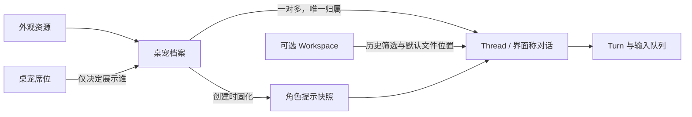

# 身份、角色提示与上下文

这是推荐的后续设计。名词定义统一在 [Desktop Experience](../../../apps/desktop/CONTEXT.md) 与 [Conversation Runtime](../../../packages/core/CONTEXT.md)；本页说明关系和行为。

## 关系模型

一位桌宠可以在多个 Workspace 工作，同一 Workspace 可以有不同桌宠的多段对话。一个 Thread 始终只归属一位桌宠；一个席位可以切换不同桌宠。形象、身份、文件位置和执行过程不会因为 UI 展开或收起而变成同一个东西。

### 不建立第二套历史

现有 Thread 继续是持久输入、Turn、请求和历史的唯一载体；“每宠 Session”实现为 Thread 的档案归属及查询索引。删除外观资源不删除身份；隐藏桌宠不删除 Thread；打开 ThreadWindow 仍读取同一 Thread。后台事件更新事实，不替用户改变当前选择。

### 工作区如何结合

- 新用户点击宠物即可聊天，“随聊”对应没有显式 Workspace 的对话，不要求先选择文件夹。
- 对话标题下展示“默认文件位置：读书会”，而不是不准确的“已隔离于读书会”。当前 Thread.workspaceId 只是元数据，现有文件工具可显式访问其他已注册 Workspace；生产实现不能靠这个字段声称更强的访问隔离。
- 桌宠可以设置新对话默认 Workspace。切换历史恢复那段 Thread 的 Workspace，不把当前筛选器强写回旧 Thread。
- 在进行中的对话改变默认工作位置时，展示“仅新对话使用”与“新开一个对话并带上摘要”；默认后者由用户主动选择后发生。既有输入与成果保留原出处。
- 默认工作区、工具可用范围、执行 Permission 是三个独立设置。未来若引入按 Thread 的 Workspace 白名单，必须在文件工具入口强制检查，并形成独立权限决策，不能仅靠提示词或 UI 选择器实现。
- 初版历史按既有 Workspace 分组即可；不额外引入 Project 实体。以后确需跨文件夹共享知识时再设计独立项目资料层。工作区分组现在不自动加载整目录，也不让同区各宠看到彼此全部聊天。

## 新建与编辑桌宠

从任一宠物的“伙伴”入口选择“添加伙伴”。第一屏只要求名字、外观和“通常希望它怎样帮你”；可从“资料整理 / 写作搭档 / 行动助手”开始，也可复制一个档案。复制产生新身份，历史不复制。

| 区块 | 普通用户填写内容 | 进阶设置与边界 |
| --- | --- | --- |
| 身份 | 名字、简短介绍、外观预览 | 外观包支持 idle/working/waiting/error；缺失动作降级静态 |
| 性格与表达 | 简洁/详细、亲切程度、称呼、语言 | 可展开原始角色提示；不伪造生活经历或完成状态 |
| 工作方式 | 擅长任务、处理顺序、结果格式、需先确认的事项 | 指导模型习惯；执行权限仍由真实策略决定 |
| 工作偏好 | 新对话默认 Workspace、默认模型 | API Key 仍集中管理，不复制到每份角色卡 |
| 能力 | 可用工具集合 | 这是强制过滤工具的配置，必须由后端落实；人设文本不能绕过 |
| 显示 | 同屏席位/单位置、大小、静音、减少动画 | 仅修改展示，不停止任务 |

预览会话使用明确标记的独立临时 Thread；默认关闭有外部副作用的工具，仍说明模型请求会消耗实际服务额度。预览不混入正式历史，预览不等于保存。保存后给出一句可验证的变化，如“今后新对话会先列依据，再给建议”。

## 提示版本与优先级

推荐每次保存角色提示产生不可变版本。创建 Thread 时由服务端解析并保存实际文本与版本引用；恢复历史使用同一份快照，防止只保存一个可被覆盖的 petId 后导致旧会话突然变性格。名称、头像可更新显示，历史中的角色快照名称可在详情查看。

修改档案默认作用于新对话；现有会话显示“使用原设定”，提供“用新设定继续一个新对话”，由用户检查拟带入的摘要。运行中的 Turn 不被热更新打断。暂不增加每个 Turn 随意混用角色的入口。

提示组合按意义分层：运行与工具安全规则 → 此 Thread 的角色快照与工作偏好 → 用户此次输入/Append Prompt → 明确标记来源的资料。用户的具体任务可以覆盖角色的口吻与默认工作习惯；角色提示不能覆盖执行策略。资料正文、网页或被转交的对话只是待处理材料，不能上升为系统指令。

## 三个示例档案

这些是可编辑的起点，不承诺特定形象必然具备这些能力；两份档案可以复用同一形象。

| 档案 | 建议的工作提示 | 相同资料的差异化回应 |
| --- | --- | --- |
| 八千代 · 资料整理 | 先确认实际读到的内容，区分原文、推论与未知；默认给三点摘要和可继续的选择；执行整理或保存前等待明确意图。 | “草案里时间和地点齐了，还缺报名方式。我先列三个需要补齐的地方。” |
| Miku · 写作搭档 | 保留用户意图，先给可直接使用的正文；默认自然、轻松、少套话；改稿说明只保留关键取舍。 | “我写了一版适合发社群的邀请，报名链接先留空。” |
| 小八 · 行动助手 | 执行前确认对象、位置和用户意图；展示必要决定与可停止状态；只在真实完成后报告产物与路径。 | “我可以把确认后的文案保存到读书会工作区。文件名用活动邀请.md，可以吗？” |

## 历史、记忆与共享

有历史不等于模型自动读取所有历史。初版只给当前 Thread 的已恢复上下文与用户明确提交的材料；跨 Thread 的偏好由用户写进角色提示。历史搜索先显示结果和来源，用户打开原对话或明确选“带到这里”才扩大上下文。

以后若增加记忆，必须分别标出“只给此伙伴 / 此工作区共享 / 全局偏好”，支持查看来源、编辑和删除；删除聊天和删除派生记忆分开处理。自动记忆不是这次多宠交互成立的前置条件，也不提供执行授权。
