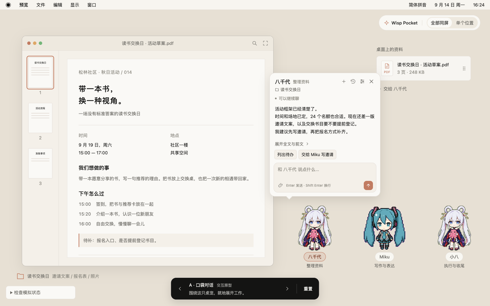
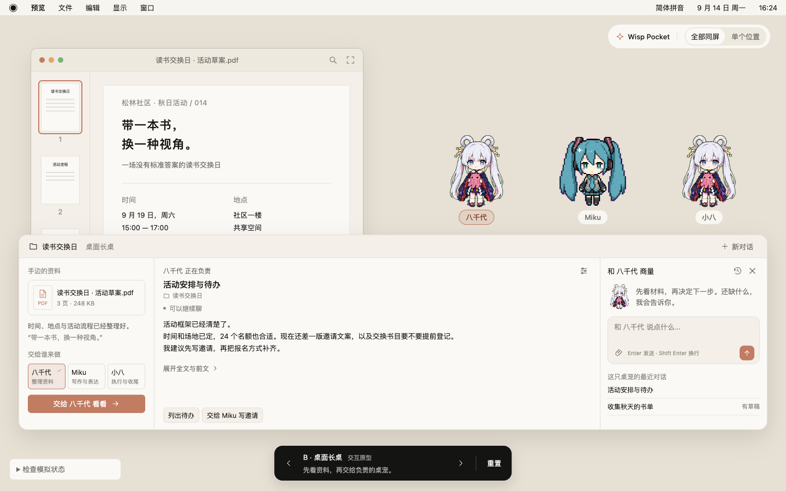
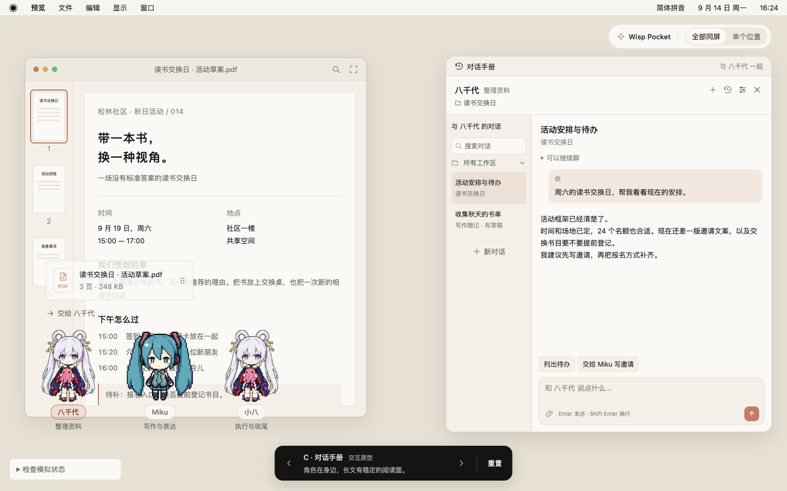
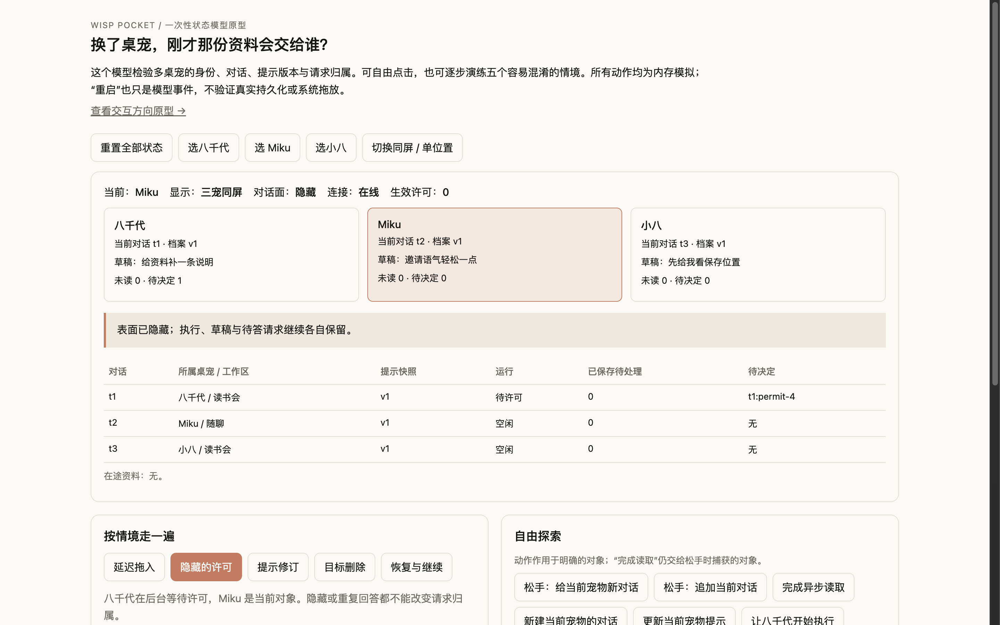
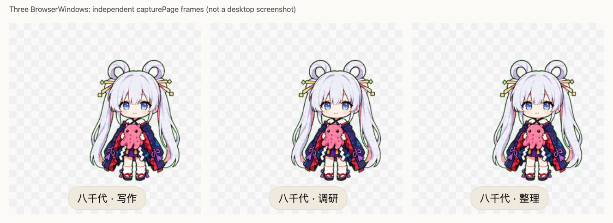

# 原型比较与实际验证结果

推荐 A「口袋对话」承接日常交谈，并在需要时显式展开稳定阅读面，吸收 C 的长文、历史与决定能力。B 的资料台适合材料交接频繁的场景，但常驻面积最大。这是基于同一任务的操作与设计判断，不是用户实验得出的偏好排名。

本轮交付三种可点 UI、一个独立状态模型和一个隔离 Electron 实验。**UI 与状态模型不连接生产 Agent；原生实验只验证限定的窗口行为。** 这三层证据不能相加成“多桌宠功能已实现”或“99% 已达标”。

## 打开与操作

在本工作树根目录执行：

```sh
pnpm prototype:pet
```

| 入口 | 用途 |
| --- | --- |
| [A 口袋对话](http://127.0.0.1:4179/electron-shell/src/activity-window/prototypes/pet-dialogue/?variant=A) | 直接在角色旁交付、回复、展开和找历史 |
| [B 桌面长桌](http://127.0.0.1:4179/electron-shell/src/activity-window/prototypes/pet-dialogue/?variant=B) | 比较资料、负责伙伴和追问并列的工作方式 |
| [C 对话手册](http://127.0.0.1:4179/electron-shell/src/activity-window/prototypes/pet-dialogue/?variant=C) | 比较稳定历史和长文阅读面 |
| [独立状态模型](http://127.0.0.1:4179/electron-shell/src/activity-window/prototypes/pet-dialogue/logic.html) | 逐步操作延迟交付、重复回执、角色快照和重启边界 |

底部左右按钮或非编辑区域的方向键切换 A/B/C；右上切换三宠同屏/单位置。可以直接拖示例 PDF，也可以用“交给…”按钮。建议先完成“八千代读资料 → Miku 写邀请 → 小八确认保存 → 打开成果”，再切历史、改人设、在忙碌时追加文字并停止。左下“检查模拟状态”可核对接收宠、对话、提示版本与回执；刷新或重置会清空内存。

浏览器页面需要上述本地服务运行。[原型目录说明](../../../apps/electron-shell/src/activity-window/prototypes/pet-dialogue/pet-dialogue.md)记录素材与代码边界；生产 App 不导入此入口。

原生实验从仓库根执行下列命令，自动完成各阶段并退出，结果写到 `.cache/pet-dialogue-native/run-<UTC时间>/`：

```sh
pnpm --filter handagent-electron-shell exec electron src/activity-window/prototypes/pet-dialogue/native-probe.cjs
```

## A/B/C 的实际取舍

三个方向均使用活动草案、三份角色设定与六条初始历史。Miku 使用静态裁图，小八复用八千代皮肤但有独立名字和工作提示；后者用于检验相同外观下身份仍须清楚。背景是本次编写的示例桌面，不是真实文件预览 App。

| 观察维度 | A 口袋对话 | B 桌面长桌 | C 对话手册 |
| --- | --- | --- | --- |
| 主要动作 | 点伙伴，在它旁边开口或交资料 | 从资料出发，选择负责伙伴 | 从伙伴进入稳定的阅读与工作区 |
| 角色存在感 | 对话与角色距离最近；需要防止面板挡住自己或邻宠 | 三宠完整站在资料台上方；负责者在中列明确标出 | 三宠完整保留，阅读面在侧边，空间距离较大 |
| 历史与草稿 | 小图标打开本宠历史；长任务需要多一次展开 | 右列保留最近历史与追问，资料与正文不争同一列 | 历史持续可见，适合反复定位与阅读长文 |
| 决定和成果 | 可以承接，但应进入固定面板并控制高度 | 工作列需独立限高滚动；本轮确实发现并修复了许可被裁掉的问题 | 连续正文和决定最稳定，代价是较大的常驻阅读面 |
| 日常遮挡 | 面积最小，适合作为默认入口 | 横向占据大部分屏幕，适合短时展开资料工作 | 接近一块侧边工作台，不宜每次简短交谈都打开 |
| 推荐位置 | 默认日常入口 | 继续保留为可选资料场景研究 | 为 A 的显式展开提供能力与阅读结构 |

**尺寸保真边界**：A 原型以 326px（展开 375px）的较大工作态比较信息结构，未实现已讨论的约 210px 常态、44px 回复框、三行正文和悬停统一滚动。正式方案保留这些紧凑约定，见 [interaction.md](./interaction.md)。A/C 在原型中是两个独立方向，也没有把 A“展开”已经接成 C。下一轮需要将推荐组合做成真正连续的交互，再检验展开后的遮挡与回到原宠的感受。

### A：在伙伴旁就地交谈



### B：围绕资料分工



### C：稳定的历史与阅读面



## 浏览器实际操作

2026-09-14 在同一个 ego-browser TaskSpace、同一页面完成验证；标准比较视口为 1440×900 CSS px。按钮、输入、选择和页面内拖放使用真实浏览器输入；读取 Inspector 与 DOM 仅用于核对结果，没有用脚本直接改应用状态替代动作。截图来自实际渲染页面；归档比较图使用减少动态效果的静态帧，避免截到动画中间态。

三种方向均独立走通上述完整任务，每种 7 项结果共 **21 项通过**，见 [原始流程记录](./evidence/ui-journeys.json)：

1. 拖到八千代本体创建它自己的新对话，并自动进入接收/inspect。
2. 读取期间切到 Miku；完成后当前仍是 Miku，八千代对话出现未读。
3. 返回八千代并明确交给 Miku，创建 Miku 自己的新对话，原记录保留。
4. 交给小八后出现保存目标与决定；允许一次后只产生一份有效回执。
5. 完成后能打开包含完整邀请文案的模拟成果。

额外边界实操的 **25 项检查通过**，见 [UI 边界记录](./evidence/ui-boundaries.json)：覆盖草稿/历史筛选隔离、人设版本、新建与追加目标、失败重试、Stop 后队列保持、显式继续、拒绝后的队列推进、后台/隐藏行为与显示切换。这些依旧只证明页面模型中的行为。

[布局记录](./evidence/ui-layout.json)包含 7 组几何复核：1440×900 的 A/B/C 及 A 单位置、1280×800 的 A/B/C。各组角色、面板与输入均位于浏览器视口内，面板未覆盖完整角色；代表截图与记录一致。这不证明原生透明命中、多屏缩放或任意展开内容都已通过。

本轮修正了五处会妨碍设计审阅的问题：

| 问题 | 修正与复核方式 |
| --- | --- |
| B 的保存决定被长内容挤出视口 | 限制网格行和工作列，正文独立滚动；复测许可按钮可滚入并点击，后续成果可打开。在1440×900时按钮落于 y≈721–757，处于正文滚动区内 |
| A 面板压住角色上缘 | 面板锚点上移，为完整角色和气泡尾部留间距；最终截图与几何记录复核 |
| 主动点宠后没有聚焦回复框 | 只在明确选宠/打开面板时聚焦；后台状态更新不新增聚焦意图 |
| 历史筛选串到他宠并影响新任务位置 | 每宠保存自己的筛选；本体拖入/新建使用档案默认 Workspace，面板追加保留原 Thread |
| 拒绝保存后待处理消息停在不可继续状态 | 拒绝按普通完成继续队列；用户按 Stop 才明确暂停队列 |

浏览器的焦点检查是页面 DOM 焦点；它不能证明外部编辑器的 OS 焦点或中文输入法候选行为。页面内 PDF 卡片拖放也不能证明从 Finder 拖真实文件。

## 独立状态模型

状态模型将纯 reducer 与 DOM 分开；为保持单文件可运行，样式冻结少量现有 token 值，没有像 UI/原生实验一样直接导入生成主题。五个引导场景都通过实际按钮操作，原始步骤与结果见 [logic-checks.json](./evidence/logic-checks.json)：

| 场景 | 已验证的规则 |
| --- | --- |
| 给 A 投递后切 B，再完成读取 | 资料仍进入最终 drop 时绑定的 A/Thread，后台不夺回选择 |
| B 在前台时 A 等待许可，两处回答 | 请求仍属于 A，已处理请求只能生效一次 |
| 默认角色提示升级到 v2 | 旧 Thread 保留 v1，新 Thread 使用 v2 |
| 异步读取时目标被删除 | 材料进入待重新选择状态，不静默转交默认宠 |
| 断连、重启、恢复 | 恢复历史不代表执行；用户明确继续前不重跑副作用 |



该模型不是 core 的替身测试：它验证规则能否被清楚表达和逐步推演，不能证明真实存储、opId 去重或宿主取消正确。

## 原生 Electron 限定实验

真实 Electron 42.3.3 / macOS 15.5 / arm64、内建 Retina 屏幕上 **11 项限定检查通过**。三个 BrowserWindow 真正同时可见；展开保持角色锚点，内存中文草稿在收起/单槽轮换/三宠恢复后保留；越界坐标能夹回当前屏幕工作区。全部自有窗口和进程正常退出，临时 profile 已清理。详见 [原生报告](./evidence/native-probe.md) 与 [原始 JSON](./evidence/native-report.json)。



输入由脚本 focus + insertText 完成；PNG 透明像素不等于鼠标穿透。没有验证跨 App 拖放、外部焦点恢复、IME、Spaces、多屏热拔、VoiceOver 或真实工具取消。展开窗口与邻窗的 bounds 可相交，避让和命中仲裁仍是原生门槛。

## 尚未由这些原型证明的能力

- UI 只有三个种子档案及人设编辑，没有完整新增/删除/导入外观流程；没有真实模型遵循人设的评估。
- 六条种子历史与页面搜索不能代表大规模历史、服务端全文检索、归档/导出或持久草稿。
- 交接按钮用固定任务与最新摘录演示，没有实现正式设计的材料选择与转交预览编辑。
- 保存正文固定为邀请文案 fixture，不代表任意改稿后的内容都会被正确保存；失败、等待、重试和停止也均为 fixture，没有真实文件变化、全局永久权限、请求超时、宿主控制权或远程取消。
- UI 是一个网页中的布局，原生实验另行隔离运行，两者尚未接成同一套生产窗口和 Thread 数据。
- 没有真人任务试用、长期亲近感/打扰测量、性能基准或99%真实完成率证据。

后续先按 [交付与验证路线](./delivery-and-validation.md) 完成真实身份→对话→存储→模型→宠物表面的整条切片。测试场景和失败分母必须从一开始保留，不能在发布前仅补一张“都能点到”的能力表。

## 仓库验证

本轮最终执行 `bash ./scripts/test.sh`、`bash ./scripts/swiftw test`、`bash ./scripts/swiftw build`、`pnpm --filter handagent-electron-shell build`，均通过；UI 脚本也通过语法检查。它们证明本轮文档/原型改动没有破坏这些检查，不把生产测试的通过当成新多桌宠功能已经接入。
