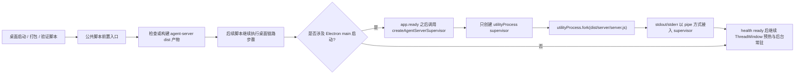
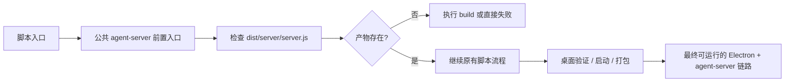
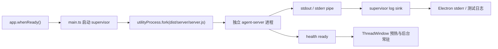

# agent-server 统一守护 Implementation Plan

## 桌面启动时，只允许 Electron main 在 `app.ready` 后通过 `utilityProcess` 拉起独立的 `agent-server` 进程

### Existing Flow Inventory
- `apps/electron-shell/src/main/main.ts` 负责 Electron main 组合根、`app.whenReady()` 后启动 supervisor、接收 Swift command、创建窗口。
- `apps/electron-shell/src/main/serverSupervisor/*` 已有 supervisor 抽象、entry 解析、`utilityProcess` supervisor、Node child fallback supervisor 和对应测试。
- `apps/electron-shell/src/main/electronShellRuntime.ts` 负责把 `agent_server.health` 转成 ThreadWindow 预热时机。
- `apps/agent-server/src/server/server.ts` 是 agent-server 组合根与本地服务入口。
- `scripts/test.sh`、`scripts/swiftw`、`scripts/package-app.sh` 当前分别串联桌面验证、Swift 入口与打包链路，但还没有统一前置 `agent-server` build 产物的公共步骤。

### Core structure
- 删除 `NodeAgentServerSupervisor` 作为正式运行路径的能力，只保留 `UtilityProcessAgentServerSupervisor`。
- `AgentServerSupervisorFactory` 只返回 `utility_process` supervisor；当 `apps/agent-server/dist/server/server.js` 缺失时，描述和报错要明确，但不再创建 fallback supervisor。
- `Electron main` 的启动序列必须保持在 `app.whenReady()` 之后才触发 `utilityProcess.fork()`。
- `UtilityProcessAgentServerSupervisor` 继续显式使用 `stdio: "pipe"`，保证 stdout / stderr 被 supervisor 接管。
- `apps/agent-server` 需要一个可稳定产出的 build 入口，以便 `dist/server/server.js` 成为唯一运行产物。
- `scripts/` 需要一个很薄的公共前置入口，用来统一检查或构建 `agent-server` 产物，避免每个脚本重复判断。

### Use case map

### Integration test need to create
- `apps/electron-shell/tests/serverSupervisor/agentServerSupervisorFactory.test.ts`
  - 现有用例要改成：当 `dist/server/server.js` 存在时返回 `utility_process` supervisor；当不存在时，只返回一个带 blocker 描述的结果，不再允许生成 Node fallback supervisor。
- `apps/electron-shell/tests/serverSupervisor/utilityProcessAgentServerSupervisor.test.ts`
  - 新增/调整用例：明确断言 `stdio: "pipe"`、`fork` 只在 `app.ready` 之后的启动路径中发生、stdout/stderr 继续经由 log sink 输出。
- `apps/electron-shell/tests/main/electronShellRuntime.test.ts`
  - 保持现有健康门控与预热语义，补一条用例证明 supervisor health 只在 ready 后驱动预热，不需要也不允许通过 fallback 维持运行。
- `scripts/package-app.test.sh`
  - 增加对 `agent-server` build 产物前置检查的覆盖，验证打包链路会在缺少 `dist/server/server.js` 时失败，而不是退回源码入口。
- `scripts/test.test.sh`
  - 增加对公共前置入口调用顺序的覆盖，验证桌面验证脚本会先准备 `agent-server` 产物。

### Implementation tasks
1. 收紧 `apps/electron-shell/src/main/serverSupervisor/agentServerSupervisorFactory.ts`，移除 Node fallback 选择。
2. 删除或隔离 `apps/electron-shell/src/main/serverSupervisor/nodeAgentServerSupervisor.ts` 的运行路径，只在测试或过渡辅助里保留必要断言。
3. 调整 `apps/electron-shell/src/main/serverSupervisor/agentServerEntry.ts`，让缺失产物只产生 blocker，不驱动 fallback。
4. 维持 `utilityProcessAgentServerSupervisor.ts` 的 `pipe` 日志收集和重启语义，并补齐单路径语义测试。
5. 让 `apps/agent-server` 拥有明确的 build 产物输出路径，供 Electron main 和打包脚本共同依赖。
6. 抽一个 `scripts/` 公共前置入口，并让 `test.sh`、`swiftw`、`package-app.sh` 复用它。
7. 更新 `apps/electron-shell` 与 `apps/agent-server` 对应目录文档，使“单路径、独立进程、app.ready 后拉起、pipe 日志”与代码一致。

## 运行时前置：`agent-server` build 产物必须先可用，脚本才能继续桌面链路

### Existing Flow Inventory
- `scripts/test.sh` 目前只是串联现有 test/build 命令。
- `scripts/swiftw` 只在 `run HandAgentDesktop` 分支准备 theme tokens、ThreadWindow Web build 和 Electron shell build。
- `scripts/package-app.sh` 已经会在缺少 ThreadWindow Web / Electron shell 产物时显式失败。
- `scripts/create-worktree.sh` 负责 worktree 初始化和基础环境验证，但不参与桌面运行产物准备。

### Core structure
- 一个薄的公共脚本函数或脚本文件，用来统一判断 `apps/agent-server/dist/server/server.js` 是否存在，不存在时触发 build 或直接失败，具体策略由脚本场景决定。
- `scripts/test.sh`、`scripts/swiftw`、`scripts/package-app.sh` 复用同一入口，而不是各自写一套 `agent-server` 判断。
- 打包或验证场景保持失败可见性，错误信息要直接指向缺失的 `agent-server` 产物。

### Use case map

### Integration test need to create
- `scripts/package-app.test.sh`：覆盖缺失 `agent-server` 产物时的失败路径。
- `scripts/test.test.sh`：覆盖公共前置入口被调用，且不会绕开 `agent-server` 产物校验。
- 如公共入口单独成脚本，新增对应 shell test，验证成功输出保持稳定、失败时打印缺失产物信息。

### Implementation tasks
1. 增加公共前置脚本或公共 shell 函数。
2. 让 `scripts/test.sh`、`scripts/swiftw`、`scripts/package-app.sh` 接入该入口。
3. 统一缺失产物报错文案，避免每个脚本自行拼接。
4. 补充脚本测试，锁定调用顺序和失败语义。

## agent-server 仍是独立进程，不内联到 Electron main

### Existing Flow Inventory
- `apps/electron-shell/src/main/serverSupervisor/utilityProcessAgentServerSupervisor.ts` 已经把 `utilityProcess` 当成可独立测试的 supervisor。
- `apps/electron-shell/src/main/main.ts` 已经在 `app.whenReady()` 后才开始 supervisor。
- Electron main 仍负责窗口生命周期、健康门控和 ThreadWindow 预热，但不承载 agent-server runtime 本体。

### Core structure
- `utilityProcess` 只表示 Electron main 拉起的独立子进程，行为上接近 `child_process.fork`，不是进程内模块。
- `app.ready` 是唯一合法启动时机。
- `stdout` / `stderr` 显式为 `pipe`，日志继续经 supervisor 统一接管。

### Use case map

### Integration test need to create
- `utilityProcessAgentServerSupervisor.test.ts`：锁定 `pipe`、fork 参数与输出接管。
- `electronShellRuntime.test.ts`：锁定 health ready 后预热，不通过 fallback 或提前启动破坏时序。

### Implementation tasks
1. 维持 `main.ts` 的 `app.whenReady()` 启动顺序。
2. 去掉任何会在 ready 前触发 agent-server 的代码路径。
3. 保留并验证 `pipe` 日志转发。

## Plan review
- 计划没有引入 spec 之外的新能力。
- 计划复用了现有 `serverSupervisor`、`electronShellRuntime`、`scripts/` 和 `agent-server` 的入口结构，没有重造一套新运行图。
- 需要确认的一点只有实现层面：`scripts/` 的公共前置入口最终是单独脚本还是共享 shell 函数，二者都符合 spec。
