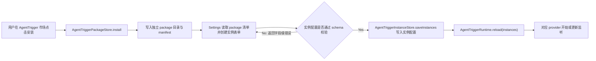
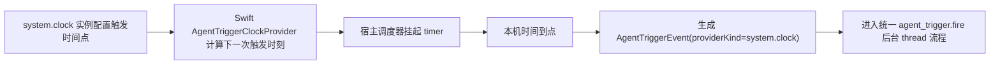
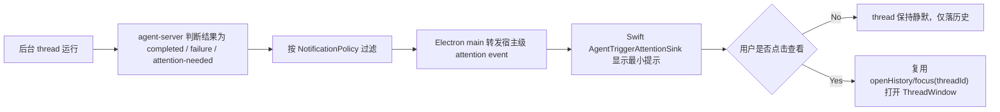
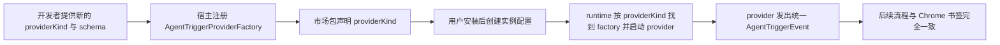

# AgentTrigger Implementation Plan

## Scope

这次实现是一个可交付的首个 `AgentTrigger` 平台切片，不是把所有自动化、市场分发、第三方运行时一次做完。

本计划覆盖：

- 独立于 PromptPanel action trigger 的 `AgentTrigger` 数据模型、安装模型、实例模型
- `AgentTrigger` 是独立产品能力，只是为避免命名冲突而改名；它和现有手动 trigger 没有任何功能或代码语义关系
- 用户从 Trigger 市场下载 package 后，为每个实例单独配置参数并独立生效
- Swift 宿主内的 `AgentTrigger` runtime 抽象与首批内置 provider：Chrome 书签文件夹、系统时间点
- Swift -> Electron -> agent-server 的后台启动链路
- 后台 thread 落库、历史可回看、默认静默、必要时提示
- 为后续开放第三方 provider 预留稳定接口

本计划暂不覆盖：

- 完整远程 Trigger 市场服务、账号体系、签名与分发治理
- 任意第三方二进制/脚本 provider 的沙箱执行与生命周期托管

补充约束：

- 第一版同时实现 `chrome.bookmarks` 与 `system.clock`，主要目的不是扩功能面，而是在实现期验证 `AgentTrigger` 抽象是否真的能承载不同类型的事件源。
- `chrome.bookmarks` 代表外部对象变化事件，`system.clock` 代表宿主内时间调度事件；两者都必须走通同一条平台链路。
- 本计划中的数据结构是实现起点，不是冻结契约。若在实现过程中发现 `PackageManifest`、`Instance`、`Event`、`FireRequest`、`Provider` 等结构不足以自然承载两类 Trigger，可以按需调整、拆分或扩展，但不能破坏本 spec 已确认的产品边界。
- 首版只做两个内置 trigger，不代表功能收敛；它们的目的就是验证同一套抽象能否同时承载“浏览器书签变化”和“定时任务”两种完全不同的事件源。

## Folder Inventory

- `apps/desktop/Sources/AppServices/`
  - 新增 `AgentTrigger` 运行时、配置存储、provider 注册与宿主启动管理
- `apps/desktop/Sources/Settings/`
  - 新增 AgentTrigger 市场/实例配置 UI，与现有 Append Prompt 完全分开
- `apps/desktop/Sources/Coordinator/`
  - 只负责启动/停止 AgentTrigger runtime 与必要的提示动作，不接入 PromptPanel 提交流程
- `apps/desktop/TestsSwift/`
  - 覆盖安装、参数配置、运行时派发、必要提示
- `apps/electron-shell/src/main/`
  - 新增 `agent_trigger.fire` 命令和转发到 agent-server 的 host-only 通道
- `apps/electron-shell/tests/`
  - 覆盖新 command 协议、ack 和转发失败路径
- `apps/agent-server/src/server/`
  - 新增非 UI 的后台启动入口，供 Electron main 一次性触发
- `apps/agent-server/src/thread/`
  - 复用现有 thread/turn 持久化与 AgentManager 流程，补后台启动编排
- `apps/agent-server/tests/`
  - 覆盖后台启动 thread、落库、历史恢复、失败提示条件
- `packages/core/src/protocol/`
  - 新增 Electron/agent-server 共享的 AgentTrigger 启动 DTO；不修改现有 `/api/thread` React 协议语义

## Install And Configure AgentTrigger use case

### Existing Flow Inventory

- 现有 Settings 只管理模型、Append Prompt、MCP、权限、快捷键、workspace，没有自动化触发模型。
- 现有 `~/.spotAgent/plugins/*/plugin.json` 只服务 PromptPanel action manifest，语义不能复用给 `AgentTrigger`。
- 现有 Swift 宿主已经是配置文件代理层，适合继续承载 Trigger 市场、实例配置与 provider 生命周期。
- 现有手动 trigger 仍然保留原语义，但它与 `AgentTrigger` 完全没有产品或代码依赖关系。

### Core structure

`AgentTrigger` 第一版需要先把“包”和“实例”分开：

```ts
type AgentTriggerPackageManifest = {
  version: 1;
  id: string;
  title: string;
  description: string;
  providerKind: string;
  configSchema: AgentTriggerConfigSchema;
  defaultPromptTemplate: string;
  defaultDeliveryPolicy: DeliveryPolicy;
  defaultNotificationPolicy: NotificationPolicy;
};

type AgentTriggerInstance = {
  id: string;
  packageId: string;
  title: string;
  enabled: boolean;
  config: Record<string, unknown>;
  promptTemplate: string;
  deliveryPolicy: DeliveryPolicy;
  notificationPolicy: NotificationPolicy;
};
```

```swift
protocol AgentTriggerPackageStore {
    func listInstalledPackages() throws -> [AgentTriggerPackageManifest]
    func install(_ package: AgentTriggerPackageManifest, files: [URL]) throws
}

protocol AgentTriggerInstanceStore {
    func loadInstances() throws -> [AgentTriggerInstance]
    func saveInstances(_ instances: [AgentTriggerInstance]) throws
}
```

- `configSchema`、`config`、`promptTemplate` 组成每个 Trigger 实例的动态参数面；第一版先用 `chrome.bookmarks` 和 `system.clock` 验证同一抽象可以承载不同配置形态
- 包描述“这个 Trigger 是什么、要配什么参数”
- 实例描述“用户装了以后，这一份具体怎么跑”
- 动态参数必须是实例级别的，不是安装级别的全局配置；同一个 package 的不同实例可以有不同参数、不同 prompt 模板、不同通知策略
- 存储路径必须独立于 `~/.spotAgent/plugins/`，避免和现有 action manifest 混淆
- 设置页要新增独立 AgentTrigger 入口，至少包含市场列表、已安装包、实例配置三块
- 第一版内置的 package 类型至少两种：`chrome.bookmarks` 与 `system.clock`

### Use case map



- Integration test need to create when exceeding: `/Users/mu9/proj/handAgent/apps/desktop/TestsSwift/AgentTrigger/AgentTriggerSettingsFlowTests.swift`
- near-code description:
  - 准备一个 `chrome-bookmarks` package manifest 和一个 `system-clock` package manifest
  - `chrome.bookmarks` 用 `folderIds: string[]` 作为配置 schema
  - `system.clock` 用 `scheduleAt` / `timezone` 作为配置 schema，允许用户配置一个或多个触发点
  - 安装 package 后，Settings 可读到该包并允许创建实例
  - 未填必填字段时保存失败且保留草稿
  - 配置合法后实例持久化成功，并触发 runtime reload

## Fire Background Thread use case

### Existing Flow Inventory

- 现有首轮提交链路是 `PromptPanel -> Swift command -> Electron ThreadWindow -> React /api/thread -> thread.start + op.submit`。
- 这条链路强绑定 visible ThreadWindow、React socket 订阅和 PromptPanel 焦点 handoff，不适合后台自动触发。
- 现有 `agent-server` 的 `ThreadCommandRouter`、`AgentManager`、`ThreadRuntimeOrchestrator`、`ThreadPersistence` 已经能处理 `thread.start` 与 `op.submit(UserInput)`，这是应该复用的核心流。

### Core structure

后台触发需要新增一条宿主专用入口，而不是伪装成 React `/api/thread` 连接：

```ts
type AgentTriggerEvent = {
  triggerInstanceId: string;
  providerKind: string;
  occurredAt: string;
  summary: string;
  payload: Record<string, unknown>;
};

type AgentTriggerFireRequest = {
  triggerInstanceId: string;
  threadTitleHint: string | null;
  userInput: UserInput;
  notificationPolicy: NotificationPolicy;
  sourceEvent: AgentTriggerEvent;
};

type AgentTriggerFireResult = {
  threadId: string;
  acceptedAt: string;
};
```

```swift
protocol AgentTriggerProvider {
    var kind: String { get }
    func start(instances: [AgentTriggerInstance], emit: @escaping (AgentTriggerEvent) -> Void) throws
    func stop() throws
}
```

```ts
interface AgentTriggerLaunchService {
  fire(request: AgentTriggerFireRequest): Promise<AgentTriggerFireResult>;
}
```

- Swift runtime 负责监听 provider、把事件套用实例配置后生成 `UserInput.items`
- Swift 不直接连 `/api/thread`，而是发新的 Electron command：`agent_trigger.fire`
- Electron main 不唤起 ThreadWindow；它通过 host-only agent-server 启动入口把请求交给 `AgentTriggerLaunchService`
- `AgentTriggerLaunchService` 内部复用 `thread.start` + `op.submit(UserInput)` 语义，但不绑定任何 React 连接生命周期
- 系统时间 provider 直接由宿主调度器实现，使用本地 timer/clock 语义即可，不需要远程接口；它是当前架构下最自然的定时任务切入点

### Use case map



```mermaid
flowchart LR
    A["Chrome 书签 provider 或 system.clock provider 发出 AgentTriggerEvent"] --> B["Swift AgentTriggerRuntime 匹配实例并渲染 PromptTemplate"]
    B --> C["生成 AgentTriggerFireRequest(userInput/items)"]
    C --> D["Electron command: agent_trigger.fire"]
    D --> E["Electron main AgentTrigger client"]
    E --> F["agent-server AgentTriggerLaunchService.fire"]
    F --> G["ThreadCommandRouter/AgentManager 创建 thread 并提交 UserInput"]
    G --> H["ThreadPersistence 落库 user.message / assistant / tool / turn"]
    H --> I["thread 历史可在后续 thread.resume 中查看"]
```

- Integration test need to create when exceeding: `/Users/mu9/proj/handAgent/apps/agent-server/tests/agent-trigger/AgentTriggerLaunchService.test.ts`
- near-code description:
  - 构造一个 `AgentTriggerFireRequest`，包含 Chrome 书签事件与生成好的 `UserInput.items`
  - 调 `AgentTriggerLaunchService.fire`
  - 断言返回 `threadId`
  - 再从 `ThreadPersistence`/`thread.resume` 读取，确认 user message、thread 状态和后续 assistant 结果都已落库
  - 断言过程中没有任何 ThreadWindow open/focus side effect

## System Clock Scheduling use case

### Existing Flow Inventory

- 当前桌面端已经有长期存活的 Swift 宿主进程，适合作为本地时间调度器宿主。
- 当前代码里没有独立的业务级定时任务抽象，但已有大量主线程/测试可注入 scheduler 模式，可延续“可注入时间源/调度器”的测试策略。
- 相比远程事件源，系统时间 Trigger 不依赖浏览器或外部 API，是当前架构最容易稳定落地的第二个内置 provider。

### Core structure

```swift
protocol AgentTriggerClock {
    var now: Date { get }
    func schedule(at date: Date, _ callback: @escaping @MainActor () -> Void) -> AnyCancellableLike
}

struct SystemClockTriggerConfig {
    let scheduleAt: [ClockSchedulePoint]
    let timezoneIdentifier: String
}
```

```ts
type ClockSchedulePoint = {
  hour: number;
  minute: number;
};
```

- `system.clock` provider 负责把实例配置翻译成下一次触发时刻
- runtime reload、系统唤醒、时间跨日后，都要重新计算下一次触发点
- 同一个实例允许配置多个触发点，但每个命中都产出同一种统一 `AgentTriggerEvent`

### Use case map



- Integration test need to create when exceeding: `/Users/mu9/proj/handAgent/apps/desktop/TestsSwift/AgentTrigger/SystemClockTriggerProviderTests.swift`
- near-code description:
  - 用 fake clock/fake scheduler 构造一个 `system.clock` 实例
  - 配置每天 `09:00` 触发
  - 推进时钟到 `08:59` 时不触发
  - 推进到 `09:00` 时发出一次 `AgentTriggerEvent`
  - 同一天内不重复触发；跨到下一天后重新排下一次

## Need-Attention And History Retrieval use case

### Existing Flow Inventory

- 现有 history 展示已经依赖 `thread.resume -> thread.snapshot`，这是后台 thread 结果可回看的现成入口。
- 现有 `/api/activity` 只服务轻量状态气泡，不带完整 thread 内容。
- 现有权限/workspace 提问只会发给 React ThreadWindow；后台 `AgentTrigger` 需要把“需要人工介入”升级成宿主可见提示，而不是静默悬空。

### Core structure

```ts
type NotificationPolicy = {
  mode: "silent" | "on_failure" | "on_attention";
};

type DeliveryPolicy = {
  persistThread: true;
  openThreadWindowOnStart: false;
};

type AgentTriggerAttention = {
  threadId: string;
  triggerInstanceId: string;
  reason: "permission" | "workspace" | "failure";
  message: string;
};
```

```swift
protocol AgentTriggerAttentionSink {
    func handle(_ attention: AgentTriggerAttention)
}
```

- 后台 thread 默认只落库，不自动打开 UI
- 当运行失败，或运行过程中命中需要用户响应的权限/workspace 条件时，agent-server 要产出“需要注意”的宿主级信号
- Swift 宿主消费该信号后，走最小提示；用户点击后才通过既有 `openHistory/focus(threadId)` 能力打开对应 thread

### Use case map



- Integration test need to create when exceeding: `/Users/mu9/proj/handAgent/apps/desktop/TestsSwift/AgentTrigger/AgentTriggerAttentionFlowTests.swift`
- near-code description:
  - 模拟一个后台 trigger thread 失败或请求人工介入
  - Swift attention sink 收到事件后只显示提示，不自动打开 ThreadWindow
  - 用户明确点击后才调用既有 focus/openHistory 路径

## Provider Abstraction use case

### Existing Flow Inventory

- 现有仓库没有“外部事件源 -> 统一自动化事件”的抽象。
- 现有 `PlatformBridge`、MCP、Append Prompt 都能提供参考，但它们分别属于平台 RPC、tool 执行、手动 prompt，不能直接当成 AgentTrigger provider runtime。
- 首版就要把 provider contract 设计成可供第三方开发者自行实现的稳定接口；不要求这一版完成插件沙箱或进程外托管，但接口不能绑定当前内置 provider。

### Core structure

为了给未来第三方开发者留接口，第一版就要把 provider contract 固定下来，但不在这一轮实现完整的第三方进程托管：

```ts
type AgentTriggerProviderDescriptor = {
  kind: string;
  displayName: string;
  configSchema: AgentTriggerConfigSchema;
};

interface AgentTriggerProviderFactory {
  descriptor(): AgentTriggerProviderDescriptor;
  createHostProvider(): AgentTriggerProvider;
}
```

- `providerKind` 是 package manifest 和宿主 provider 注册表之间的稳定键
- 首轮内置 `chrome.bookmarks` 与 `system.clock` 两种 provider，用来验证同一套 contract 能承载外部事件源和宿主定时器两类 Trigger
- 后续第三方 provider 可以复用同一份 descriptor / event / fire request 合约
- 如果未来要做 out-of-process provider SDK，应在这个 contract 外再加“进程桥/沙箱层”，而不是推翻实例、事件和 fire 模型

### Use case map



- Integration test need to create when exceeding: `/Users/mu9/proj/handAgent/apps/desktop/TestsSwift/AgentTrigger/AgentTriggerProviderRegistryTests.swift`
- near-code description:
  - 注册一个 fake provider factory
  - 安装引用该 `providerKind` 的 package
  - runtime reload 后应找到对应 factory 并启动 fake provider
  - fake provider 发出的事件应进入统一 fire 流程，而不是走特殊分支

## Self-Review

- 不复用 `~/.spotAgent/plugins/`、PromptPanel `ActionDefinition`、React `/api/thread` 连接来承载 `AgentTrigger`，因为它们分别绑定了错误的产品语义和 UI 生命周期。
- 后台触发复用现有 `UserInput -> AgentManager -> ThreadPersistence` 运行链，而不是新造第二套 agent 执行引擎。
- 第三方开发者“自由实现”的目标通过稳定 provider contract 先落模型；完整的第三方进程托管、签名和隔离单独作为后续增量，不挤进首个可交付切片。
