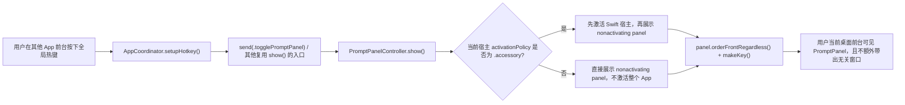

# PromptPanel 全局热键前台展示修复计划

## 后台宿主通过全局热键唤起 PromptPanel use case

### Existing Flow Inventory

- 真实入口已经存在，不新增新链路：
  - `AppCoordinator.setupHotkey()` 把 `KeyboardShortcuts.Name.showPromptPanel` 绑定到 `send(.togglePromptPanel)`。
  - `PromptCaptureCoordinator.captureSelectionAndShow()`、`captureRegionAndShow()` 会在用户主动采集后复用 `PromptPanelController.show()`。
  - `AppCoordinator.performActionShortcut(_:)` 会通过 `PromptPanelController.selectActionAndShow(_:)` 复用同一展示逻辑。
- 当前失败边界已经收敛在 `PromptPanelController.show()`：
  - 面板仍是 `.nonactivatingPanel`。
  - 当前只执行 `orderFrontRegardless()` 和 `makeKey()`。
  - 当 Swift 宿主仍处于 `.accessory` 且其他 App 在前台时，面板对象会被创建，但不会真正成为用户可见前台 UI。
- 现有可复用测试入口已经存在：
  - `apps/desktop/TestsSwift/PromptPanel/PromptPanelControllerTests.swift`
  - `apps/desktop/TestsSwift/Coordinator/AppCoordinatorTests.swift`
- 约束：
  - 不能回退到“每次 show 都 `NSApp.activate(ignoringOtherApps: true)`”，否则会重新引入“Settings 被一起带到前台”的已修回归。
  - 修复应统一覆盖 `showPromptPanel`、`captureSelection`、`captureRegion`、Action 全局快捷键等所有后台进入 PromptPanel 的入口，而不是只补 `togglePromptPanel` 一个 action。

### Core structure

- `PromptPanelController`
  - 继续负责 PromptPanel 展示语义。
  - 新增可注入的宿主激活依赖，至少要明确：
    - 当前宿主 `activationPolicy`
    - 需要时触发宿主激活的动作
- 目标行为 contract：
  - 若宿主当前为 `.accessory`，`show()` 在展示 `.nonactivatingPanel` 前先做最小必要的宿主激活，再展示面板。
  - 若宿主当前已经是 `.regular`，`show()` 不主动激活整个 App，避免把 Settings 等常规窗口一起带上来。
  - `selectActionAndShow(_:)`、capture 流程不新增独立展示分支，继续复用 `show()`。
- 测试 contract：
  - accessory 宿主下，`show()` 必须触发一次宿主激活动作。
  - regular 宿主下，`show()` 不触发宿主激活动作。
  - 现有“不主动激活整个 App”测试语义需要改为“regular 宿主不激活”，不再把 accessory 宿主也算进同一断言。

### Use case map

- loop 1
  - consumed structure：全局热键回调
  - consumer：`AppCoordinator.setupHotkey()` 注册的 handler
  - output：`Action.togglePromptPanel`
- loop 2
  - consumed structure：`Action.togglePromptPanel` / `captureSelectionAndShow()` / `selectActionAndShow(_:)`
  - consumer：`PromptPanelController.show()`
  - output：按当前宿主状态决定是否先激活宿主
- loop 3
  - consumed structure：宿主激活策略与激活动作
  - consumer：`PromptPanelController` 内部展示语义
  - output：真正可见的 PromptPanel 前台窗口

### Integration test

- 先补 `apps/desktop/TestsSwift/PromptPanel/PromptPanelControllerTests.swift`
  - `testShowActivatesApplicationWhenHostUsesAccessoryPolicy`
  - `testShowDoesNotActivateApplicationWhenHostUsesRegularPolicy`
- 保留并复用现有 `PromptPanelController` 展示/隐藏回归，不单独为 `captureSelection`、Action 快捷键复制一套展示测试；这些入口只要继续复用 `show()` 即可。
- 如实现需要在 Coordinator 层补保护，再补 `AppCoordinatorTests` 验证不引入新的 ThreadWindow/Settings 副作用。

### Implementation tasks

1. 给 `PromptPanelController` 增加可测试的宿主激活依赖注入。
2. 先写 RED 测试，证明 accessory/regular 两种宿主状态下展示行为不同。
3. 在 `show()` 中实现“仅 accessory 时最小激活”的展示语义。
4. 跑 `PromptPanelControllerTests`、相关 `AppCoordinatorTests`、全量 Swift test 和 `swiftw build`。
5. 更新 `prompt-panel.md`、`docs/bugs.md`、`docs/manual-qa.md`，把 bug 条目迁移到待实机回归项。
