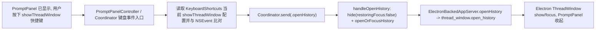

# ShowThreadWindow PromptPanel Handoff Implementation Plan

## PromptPanel 可见时触发 showThreadWindow use case

### Existing Flow Inventory
- 现有入口分两段：
  - 全局 `showPromptPanel` 走 `HotkeyRegistering` + KeyboardShortcuts Carbon 热键，直接回调 `Coordinator.send(.togglePromptPanel)`。
  - `showThreadWindow` 目前不是全局热键，而是 `AppCoordinator.setupHotkey()` 内的 `NSEvent.addLocalMonitorForEvents(matching: .keyUp)`。这要求 HandAgent 真正处于前台事件分发链中。
- `PromptPanelController.show()` 当前刻意不调用 `NSApp.activate(...)`，只 `orderFrontRegardless()` + `makeKey()`，这是为了解决“全局快捷键只唤起 PromptPanel，不把 Settings 一并带到前台”。
- `openHistory` 的 ThreadWindow 命令链已存在并被 live QA 直接用 Unix socket 验证为可用：`AppCoordinator.handleOpenHistory()` -> `ElectronThreadWindowLifecycle.openOrFocusHistory()` -> `ElectronBackedAppServer.openHistory()` -> `thread_window.open_history` -> `ThreadWindowPrewarmer.openHistory()`。
- PromptPanel -> ThreadWindow handoff 约束已在文档和代码中成立：`handleOpenHistory()` 先 `promptPanelController.hide(restoringFocus: false)`，再发送 open history command。当前缺的不是 handoff 顺序，而是“PromptPanel 可见时如何稳定收到 `showThreadWindow` 触发”。
- PromptPanel 自身已经有局部 `keyDown` monitor，只处理 ESC。这里是最接近 PromptPanel 可见场景的键盘事件入口。
- Settings 快捷键页已经把 `showThreadWindow` 作为可配置快捷键暴露给用户，存储继续走 KeyboardShortcuts UserDefaults；这部分不需要改协议和设置模型，只需要改监听消费路径。

### Core structure
需要澄清并约束的结构/接口：

- `PromptPanelControlling`
  - 新增一个由 Coordinator 注入的“应用内快捷键命中”回调，而不是让 PromptPanel 直接知道 ThreadWindow 细节。
  - 候选接口：
    ```swift
    var onAppShortcut: ((KeyboardShortcuts.Name) -> Void)? { get set }
    ```
    或更窄的：
    ```swift
    var onShowThreadWindow: (() -> Void)? { get set }
    ```
  - 目标是保持 Controller 只负责窗口/键盘事件采集，不直接做 thread 逻辑。

- `PromptPanelController`
  - 当前 `eventMonitor` 只监听 `.keyDown` 并吞 ESC。
  - 需要扩展为：在 PromptPanel 可见且 keyDown 来自本 panel 时，读取当前 `KeyboardShortcuts.getShortcut(for: .showThreadWindow)`，匹配成功后回调给 Coordinator，并吞掉事件。
  - 继续保留不激活整 App 的 show 语义，避免把 Settings 带前台的旧回归。

- `AppCoordinator.setupPromptPanel()` / `setupHotkey()`
  - `showThreadWindow` 不再只依赖全局 local monitor。
  - 新结构应支持双入口：
    1. HandAgent 真正前台时，现有 local monitor 仍可工作。
    2. PromptPanel 可见时，PromptPanel 自己也能识别同一快捷键并发出 `send(.openHistory)`。
  - 这样可以最小化改动，避免把 `showThreadWindow` 提升为真正全局 Carbon 热键，从而继续满足“不与系统 `⌘H` 冲突”的产品语义。

- 回归测试契约
  - 需要一组覆盖“PromptPanel 可见时命中 showThreadWindow shortcut -> Coordinator.send(.openHistory)”的 Swift 测试。
  - 现有 `PromptPanelControllerTests` / `AppCoordinatorTests` / `PromptPanelControllerTests/testShowDoesNotActivateWholeApplication` 是最近的复用面。

### Use case map


逐跳定义：
1. 触发输入结构：`NSEvent` keyDown/keyUp，包含 modifiers 与 keyCode。
   - 消费者：PromptPanelController 的局部 monitor，或 AppCoordinator 的现有 local monitor。
   - 能力要求：同一份 shortcut 配置匹配逻辑可复用，不因为 PromptPanel 未激活整 App 而丢事件。
2. 匹配结果：命中 `showThreadWindow`。
   - 消费者：Coordinator action 路由。
   - 输出：`send(.openHistory)`。
3. `openHistory` action。
   - 消费者：`AppCoordinator.handleOpenHistory()`。
   - 输出：`promptPanelController.hide(restoringFocus:false)` 副作用 + `threadWindowLifecycle.openOrFocusHistory(...)`。
4. ThreadWindow command。
   - 消费者：`ElectronThreadWindowLifecycle` / `ElectronBackedAppServer` / Electron runtime。
   - 输出：`command.ack ok` 与 `HandAgent ThreadWindow` 可见。
5. 最终可观察结果。
   - PromptPanel 不恢复旧前台应用。
   - `HandAgent ThreadWindow` 出现并保持可见。

- Integration test need to create when exceeding: `apps/desktop/TestsSwift/Coordinator/AppCoordinatorTests.swift`, `apps/desktop/TestsSwift/PromptPanel/PromptPanelControllerTests.swift`
- near-code description:
  1. `AppCoordinatorTests`: 构造 testing services + fake prompt panel controller，模拟“PromptPanel 当前可见且命中了 showThreadWindow shortcut”回调，断言 coordinator 先调用 `hide(restoringFocus:false)`，再通过 recording thread client 发送 `.openHistory`。
  2. `PromptPanelControllerTests`: 在 controller 已显示的场景下注入一个可配置的 app-scoped shortcut handler，发送匹配 `showThreadWindow` 的 key event，断言 handler 被触发、事件被吞掉；发送非匹配事件时不触发。
  3. 如现有测试 harness 更适合把 shortcut 匹配逻辑抽成小 helper，也应先由上述 use-case 级测试驱动，再做局部抽取。

### Implementation tasks
1. 在 `PromptPanelControlling` / `PromptPanelController` 增加 app-scoped shortcut 回调入口，并把当前 ESC-only key monitor 扩成“ESC + showThreadWindow shortcut”处理。
2. 在 `AppCoordinator.setupPromptPanel()` 把 `showThreadWindow` 意图注入 PromptPanel，使 PromptPanel 可见时能直接 `send(.openHistory)`。
3. 评估是否保留 `setupHotkey()` 中现有 local monitor：大概率保留，用于 Settings/宿主前台场景；如保留，抽一个共享 shortcut 解析 helper，避免两份匹配逻辑漂移。
4. 补 Swift 测试覆盖 PromptPanel 场景和 Coordinator handoff 场景。
5. 在 worktree 里跑目标测试、`bash ./scripts/swiftw build`，然后用 packaged/mock app 重新做 live QA：
   - 关闭 ThreadWindow，只剩 Activity。
   - 打开 PromptPanel。
   - 在 PromptPanel 可见时按 `showThreadWindow`。
   - 确认 `HandAgent ThreadWindow` 回来，且 PromptPanel 收起。
6. 修复完成后，把 `docs/bugs.md` 中该缺陷移回 `docs/manual-qa.md` 或 `docs/archive.md` 的正确位置，并立即单独提交。

## Self-Review
- 计划复用现有 `openHistory` 命令链，不新造第二条打开 ThreadWindow 的路径。
- 没把 `showThreadWindow` 升级为真正系统级全局热键，避免引入和 macOS `⌘H` 的产品语义冲突；先修“PromptPanel 可见时入口丢事件”这个已证实缺陷。
- 代码改动范围控制在 `Coordinator`、`PromptPanel` 和现有 Swift 测试，不碰 agent-server / Electron 协议。
