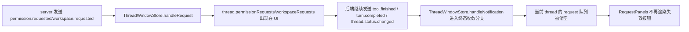

# ThreadWindow Request Lifecycle Fix Implementation Plan

## completed/idle 终态后，失效的 request panel 必须从当前 thread UI 清空

### Existing Flow Inventory
- `apps/thread-window-web/src/App.tsx` 负责把 `ServerRequest` 交给 `createThreadWindowStore.handleRequest()`，并在用户点击 `允许` / `拒绝` / workspace 选项时发送 `ClientResponse`，随后乐观调用 `resolvePermissionRequest()` / `resolveWorkspaceRequest()`。
- `apps/thread-window-web/src/store/threadWindowStore.ts` 是 request panel 的唯一状态源；`handleRequest()` 负责挂 request，`turn.completed` / `thread.status.changed` / `thread.error` 负责 run 终态收敛。
- `apps/thread-window-web/tests/threadWindowStore.test.ts` 已覆盖 request 挂载与显式 resolve，但还没覆盖“未显式 resolve 或自然 completed/idle 收敛后，旧 request 仍必须被 store 清空”的回归场景。
- `docs/bugs.md` 已记录 live QA 证据：`workspace.requested` 后，thread 即使走到 `tool.finished failed -> turn.completed completed -> thread.status.changed idle`，UI 仍残留旧 panel。

### Core structure
- `ThreadState.permissionRequests` / `workspaceRequests` 是 request panel 的唯一来源。
- `handleRequest(request)` 只负责追加 request；不能承担 request 生命周期结束的清理。
- 终态清理点必须放在 store 的 run 收敛分支，至少覆盖：
  - `turn.completed`
  - `thread.error`
  - `thread.status.changed` 到非 `running` 的状态
- 回归测试以 store 为真实入口：先挂 request，再送终态 notification，断言 request 队列被清空。

### Use case map

### Integration test need to create
- `apps/thread-window-web/tests/threadWindowStore.test.ts`
  - 用例 1：先挂 `permission.requested` + `workspace.requested`，再送 `turn.completed(status: completed)`，断言两类 request 都被清空，thread 状态变为 `idle`。
  - 用例 2：先挂 request，再送 `thread.status.changed(value: idle)`，断言 request 也被清空，覆盖 live QA 里 completed/idle 双事件链。

### Implementation tasks
1. 在 `threadWindowStore.test.ts` 先补上述终态清理回归用例。
2. 在 `threadWindowStore.ts` 增加局部 helper，统一清空单个 thread 的 request 队列。
3. 让 `turn.completed`、`thread.error`、`thread.status.changed` 的非 running 收敛分支调用该 helper。
4. 更新 `apps/thread-window-web/thread-window-web.md`，把 request panel 生命周期说明补到 store 状态章节。
5. 验证 `pnpm --filter handagent-thread-window-web exec vitest run tests/threadWindowStore.test.ts`、`pnpm --filter handagent-thread-window-web test`、`pnpm --filter handagent-thread-window-web build`。

## Plan review
- 范围只覆盖 ThreadWindow 前端 request 生命周期，不改 broker、协议或持久化。
- 复用了现有 store 与 store test 入口，没有新建额外状态流。
- 自动化保护直接对应 live QA 发现的 completed/idle 残留场景。
