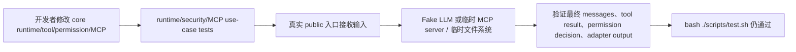
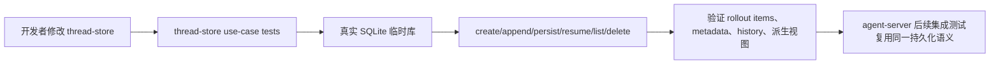
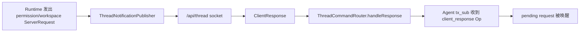
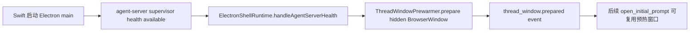
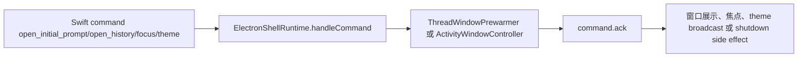
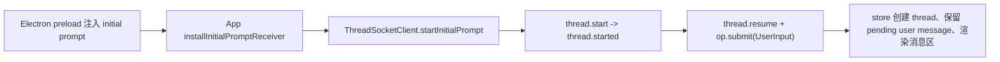
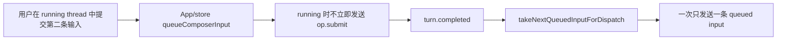

```mermaid
flowchart LR
    A["React /api/thread 发送 thread.start/op.submit"] --> B["attachThreadSocketHandlers"]
    B --> C["ThreadCommandRouter"]
    C --> D["AgentManager / ThreadRuntimeOrchestrator"]
    D --> E["AgentRuntime fake LLM/tool"]
    E --> F["ThreadNotificationPublisher"]
    F --> G["ThreadPersistence 写入 ThreadStore"]
    G --> H["socket 收到 thread notification，history 可恢复"]
```

# Use-Case Driven Test Consolidation Implementation Plan

## Scope

本计划只处理 TypeScript / React / Electron 测试体系收敛，不改产品行为。执行顺序按依赖链从底到顶：

本计划采用你选定的第一种拆分方式：按模块分阶段推进，每个阶段先补 use-case 集成测试，再删被覆盖的细碎 TDD 单测。

1. `packages/core` + `packages/thread-store`
2. `apps/agent-server`
3. `apps/electron-shell`
4. `apps/thread-window-web`

每个阶段都先建立或保留用例级集成测试，再删除被集成测试覆盖的实现细节单测。删除测试不是目标本身；目标是让剩余测试能从真实入口保护真实用例。

## Folder Inventory

- `packages/core/src/`：跨平台 runtime、tool、permission、workspace、LLM、MCP、protocol、blob、logging。
- `packages/core/tests/`：当前包含 runtime、tool、permission、workspace、LLM、MCP、protocol、blob、logging 的细粒度 Vitest 测试。
- `packages/thread-store/src/`：SQLite thread rollout 持久化、live writer、CurrentThread 语义和派生视图。
- `packages/thread-store/tests/`：当前用真实临时 SQLite 或 `:memory:` 覆盖生命周期和 package exports。
- `apps/agent-server/src/`：本地 `/api/thread`、`/api/activity`、`/api/platform` WebSocket bridge，AgentManager，runtime orchestration，notification，persistence，settings，MCP/actions。
- `apps/agent-server/tests/`：当前按内部类目录拆分，既有 socket handler 测试，也有 router、publisher、broker、registry 等实现细节单测。
- `apps/electron-shell/src/`：Electron main、Swift command bridge、server supervisor、ThreadWindow/ActivityWindow controller、preload、activity renderer。
- `apps/electron-shell/tests/`：当前大量 fake Electron object 测试，覆盖 main runtime、preload、supervisor、window controller、activity renderer。
- `apps/thread-window-web/src/`：React ThreadWindow、ThreadSocketClient、zustand store、协议 guard、native/theme config、历史侧栏、composer、请求面板、消息渲染。
- `apps/thread-window-web/tests/`：当前包含 socket client、store、协议、native config、组件和纯函数测试。
- `scripts/test.sh`：仓库 TypeScript/Web 全量验证入口；本计划完成后仍必须保持 `success`。

## Core And Thread Store Use Cases

### Existing Flow Inventory

- `AgentRuntime.runWithMessages` 是 core runtime 的最接近真实入口，已经能真实调用 `LLMClient`、`ToolRegistry`、permission、blob store 和 summarizer。
- `StdioMCPClient`、`StreamableHttpMCPClient`、`MCPToolAdapter` 是外部协议 adapter，适合保留少量协议级集成测试。
- `FilePermissionPolicy`、workspace registry、blob store、network logger 是真实文件系统边界，适合用临时目录验证行为。
- `ThreadStore` 和 `CurrentThread` 已经使用真实 SQLite 临时库，适合作为 thread 持久化集成测试底座。

### Core Structure

保留的测试入口应集中成这些测试组：

```ts
// packages/core/tests/runtime/runtime-use-cases.test.ts
AgentRuntime.runWithMessages(messages, options)

// packages/core/tests/mcp/mcp-use-cases.test.ts
StdioMCPClient.initialize/listTools/callTool/listPrompts/getPrompt/listResources/readResource
MCPToolAdapter.call

// packages/core/tests/security/security-use-cases.test.ts
FilePermissionPolicy.resolve
WorkspaceRegistry.list/register
builtin workspace/file tools with policy decisions

// packages/thread-store/tests/thread-store-use-cases.test.ts
ThreadStore.createThread/appendItems/persistThread/resumeThread/loadHistory/listThreads/deleteThread
CurrentThread.create/resume/append/persist/shutdown
```

删除或合并原则：

- 删除只验证单个 helper 返回值、重复覆盖同一 public contract、或需要大量 mock 内部私有状态的测试。
- 保留高风险边界单测：协议 DTO guard、外部 SDK adapter、文件权限策略、SQLite 事务/并发语义。
- `vercel-client.integration.test.ts` 继续作为显式 opt-in 网络集成测试，只由 `pnpm test:llm:integration` 运行。

### Use Case Map





### Integration Tests To Create Or Consolidate

- `packages/core/tests/runtime/runtime-use-cases.test.ts`
  - 覆盖系统 prompt 注入不落库、LLM streaming/final message、tool call 循环、permission request/answer、blob summary 应用。
  - 从现有 `agent-runtime.test.ts`、`agent-runner.test.ts`、`permission-runtime.test.ts` 中迁移高价值用例。
- `packages/core/tests/mcp/mcp-use-cases.test.ts`
  - 合并 `mcp-full-protocol.test.ts`、`mcp-tool-adapter.test.ts` 中真实协议路径。
  - 保留 transport-specific 小单测只覆盖 stdio/http 生命周期边界。
- `packages/core/tests/security/security-use-cases.test.ts`
  - 合并 workspace、permission、file builtin tool 主路径。
- `packages/thread-store/tests/thread-store-use-cases.test.ts`
  - 合并 lifecycle、live writer、CurrentThread 主路径，保留 package exports smoke。

### Implementation Tasks

1. 在 worktree 中先跑 `bash ./scripts/test.sh` 建立基线。
2. 新建或整理 core/thread-store 用例级测试文件，先让这些测试单独通过。
3. 删除被覆盖的 core/thread-store 细粒度测试文件。
4. 更新 `packages/core/core.md`、`packages/thread-store/thread-store.md` 中测试说明。
5. 验证：`pnpm exec vitest run packages/core/tests packages/thread-store/tests`，再跑 `bash ./scripts/test.sh`。

## Agent Server Use Cases

### Existing Flow Inventory

- `apps/agent-server/src/server/server.ts` 提供 `attachThreadSocketHandlers`、`attachActivitySocketHandlers`、`attachPlatformSocketHandlers` 和 `startServer`。
- `ThreadCommandRouter`、`AgentManager`、`ThreadRuntimeOrchestrator`、`ThreadNotificationPublisher`、`ThreadPersistence` 共同组成真实 `/api/thread` 用例链路。
- `AgentActivityPublisher` 从 `ThreadNotification` / `ServerRequest` 派生活动状态，是 `/api/activity` 的真实上游。
- `WebSocketPlatformBridge` 是 `/api/platform` 到 desktop platform provider 的真实边界。
- 现有 `server/server.test.ts` 已经部分从 socket handler 入口测试，比大多数内部类单测更接近目标。

### Core Structure

保留的测试入口应集中成这些测试组：

```ts
// apps/agent-server/tests/use-cases/thread-lifecycle.test.ts
attachThreadSocketHandlers + ThreadCommandRouter + AgentManager + ThreadRuntimeOrchestrator + ThreadPersistence

// apps/agent-server/tests/use-cases/request-response.test.ts
ServerRequest -> ClientResponse -> client_response Op

// apps/agent-server/tests/use-cases/activity-platform.test.ts
attachActivitySocketHandlers + AgentActivityPublisher
attachPlatformSocketHandlers + WebSocketPlatformBridge

// apps/agent-server/tests/use-cases/settings-actions.test.ts
SettingsBackedLLMClient + SettingsBackedToolRegistry + MCPServerRegistry + ThreadScopedToolRegistry
```

删除或合并原则：

- 删除仅断言 router 方法调用、publisher subscriber 数量、broker 队列细节、registry map 操作的重复单测。
- 保留少量边界单测：platform bridge token fencing/timeout、settings stamp 热加载、MCP/Computer Use client 配置解析。
- 所有保留测试必须能说明对应用户路径：启动 thread、提交输入、收到通知、等待用户回答、调用 platform 或 activity 订阅。

### Use Case Map





### Integration Tests To Create Or Consolidate

- `apps/agent-server/tests/use-cases/thread-lifecycle.test.ts`
  - 建 thread、提交 `UserInput`、fake LLM 返回 assistant、通知送达、ThreadStore 能恢复 history。
  - 覆盖删除/中断会关闭 agent 并清理 thread 级权限。
- `apps/agent-server/tests/use-cases/request-response.test.ts`
  - runtime/request broker 产出 permission/workspace request，socket 收到请求，response 回流为 `client_response` op。
- `apps/agent-server/tests/use-cases/activity-platform.test.ts`
  - activity 新连接先 snapshot，thread running/idle/error/request 改变时收到 changed。
  - platform hello 后 tool request 经 bridge 转发，旧 token 或断线不能污染新连接。
- `apps/agent-server/tests/use-cases/settings-actions.test.ts`
  - settings 改变后 LLM/tool registry 热加载；MCP 配置创建 client；thread 级 tool 激活状态隔离。

### Implementation Tasks

1. 在阶段开始前跑 `pnpm exec vitest run apps/agent-server/tests` 记录基线。
2. 建 `apps/agent-server/tests/use-cases/`，优先复用 `server.test.ts` 里的 socket harness。
3. 迁移高价值断言到 use-case 测试。
4. 删除被覆盖的 `agent/`、`thread/`、`activity/`、`protocol/`、`settings/`、`actions/` 内部细碎测试。
5. 更新 `apps/agent-server/tests/tests.md`，说明新的 use-case 组织方式。
6. 验证：`pnpm exec vitest run apps/agent-server/tests`，再跑 `bash ./scripts/test.sh`。

## Electron Shell Use Cases

### Existing Flow Inventory

- `ElectronShellRuntime` 处理 Swift command、agent-server health、ThreadWindow/ActivityWindow 编排。
- `ThreadWindowPrewarmer` 是 hidden preload、initial prompt、history、focus、theme sync 的真实 main 层入口。
- `ActivityWindowController` 和 activity renderer 共同承载 `/api/activity` 状态展示与 focusThread 回跳。
- `serverSupervisor` 负责 agent-server 进程管理；当前测试有大量 fake process/window 细节。
- `preload` 测试保护 contextIsolation 下暴露的 host API，属于高风险边界。

### Core Structure

保留的测试入口应集中成这些测试组：

```ts
// apps/electron-shell/tests/use-cases/desktop-startup.test.ts
supervisor health -> runtime -> ThreadWindow prewarm -> ready events

// apps/electron-shell/tests/use-cases/thread-window-commands.test.ts
Swift commands open_initial_prompt/open_history/focus/theme/shutdown

// apps/electron-shell/tests/use-cases/activity-window.test.ts
activity event parse/state + focusThread回跳，不唤起 Swift PromptPanel

// apps/electron-shell/tests/boundaries/preload-and-protocol.test.ts
preload globals + Swift command/event parser/encoder
```

删除或合并原则：

- 删除同一 command ack 的重复单测，合并成 command table 或 use-case 流程。
- 删除只验证 fake window 计数器局部细节、且不影响用户路径的测试。
- 保留 boundary 测试：preload 暴露面、Swift/Electron protocol parser、supervisor ready/restart/stop 关键语义。

### Use Case Map





### Integration Tests To Create Or Consolidate

- `apps/electron-shell/tests/use-cases/desktop-startup.test.ts`
  - health false 不预热，health true 预热并发 event，visible close 后按规则补预热。
- `apps/electron-shell/tests/use-cases/thread-window-commands.test.ts`
  - initial prompt 注入前不展示错误窗口，history 不注入 prompt，focus 无窗口时 ack false，theme 同步到 ThreadWindow 和 ActivityWindow。
- `apps/electron-shell/tests/use-cases/activity-window.test.ts`
  - `/api/activity` snapshot/changed 进入 state，点击有 thread 时 focus ThreadWindow，无可聚焦窗口时不请求 Swift PromptPanel。
- `apps/electron-shell/tests/boundaries/preload-and-protocol.test.ts`
  - 合并 preload 和 protocol 高风险 contract。

### Implementation Tasks

1. 在阶段开始前跑 `pnpm --filter handagent-electron-shell test`。
2. 建 `tests/use-cases/` 和必要的 `tests/boundaries/`。
3. 从 `electronShellRuntime.test.ts`、`threadWindowPrewarmer.test.ts`、`activitySocketClient.test.ts`、`activityState.test.ts` 迁移用户路径断言。
4. 合并 preload/protocol 边界测试，删除重复 fake object 细节测试。
5. 更新 `apps/electron-shell/tests/tests.md` 及子目录文档。
6. 验证：`pnpm --filter handagent-electron-shell test`，`pnpm --filter handagent-electron-shell build`，再跑 `bash ./scripts/test.sh`。

## Thread Window Web Use Cases

### Existing Flow Inventory

- `App.tsx` 创建 `ThreadSocketClient`，安装 initial prompt receiver，并连接 store 与 UI。
- `ThreadSocketClient` 是 `/api/thread` WebSocket 收发、排队和初始 prompt 流的真实入口。
- `createThreadWindowStore` 是 thread cache、history、messages、requests、workspace、composer queue 的真实状态源。
- `threadProtocol.ts` 是 Web 侧协议 guard 边界。
- 当前组件测试多为局部纯函数或 DOM 片段，应该向用户流收敛。

### Core Structure

保留的测试入口应集中成这些测试组：

```ts
// apps/thread-window-web/tests/use-cases/initial-prompt-flow.test.ts
native pending prompt -> ThreadSocketClient -> store -> UI state

// apps/thread-window-web/tests/use-cases/history-and-composer.test.ts
thread.list/workspace.list/thread.resume + composer queue/stop

// apps/thread-window-web/tests/use-cases/request-panels-and-messages.test.tsx
permission/workspace requested -> user response -> panel removed
structured user items/message rendering

// apps/thread-window-web/tests/boundaries/protocol-native-theme.test.ts
threadProtocol guard + nativeConfig + themeConfig
```

删除或合并原则：

- 删除只验证 `groupThreads`、`sidebarLayout`、scroll container class、单个 message bubble markup 的低风险局部测试，除非这些约束曾经造成明确产品 bug。
- 保留设计 token 测试，因为它保护生成产物和构建链路。
- 保留协议/native/theme 边界测试，因为 Electron preload 与 React 的 contract 需要稳定。

### Use Case Map





### Integration Tests To Create Or Consolidate

- `apps/thread-window-web/tests/use-cases/initial-prompt-flow.test.ts`
  - pending prompt flush、`thread.start`、`thread.started` 后 `thread.resume + op.submit`、store pending user message。
- `apps/thread-window-web/tests/use-cases/history-and-composer.test.ts`
  - socket open 发送 workspace/thread list，打开历史发送 resume，running 时 composer queue，停止发送 interrupt。
- `apps/thread-window-web/tests/use-cases/request-panels-and-messages.test.tsx`
  - permission/workspace requested 渲染面板，点击响应发 `ClientResponse` 并清理请求；结构化 user input items 渲染。
- `apps/thread-window-web/tests/boundaries/protocol-native-theme.test.ts`
  - 合并 thread protocol guard、native config、theme config。
- 保留 `tests/designTokens.test.ts`。

### Implementation Tasks

1. 在阶段开始前跑 `pnpm --filter handagent-thread-window-web test`。
2. 建 `tests/use-cases/` 和 `tests/boundaries/`。
3. 迁移 `threadSocketClient.test.ts`、`threadWindowStore.test.ts`、`nativeConfig.test.ts`、`themeConfig.test.ts`、`threadProtocol.test.ts`、`messageBubble.test.tsx` 的高价值断言。
4. 删除低价值纯函数/局部布局测试，或把确实重要的布局约束并入 use-case 测试。
5. 更新 `apps/thread-window-web/thread-window-web.md` 中测试说明。
6. 验证：`pnpm --filter handagent-thread-window-web test`，`pnpm --filter handagent-thread-window-web build`，再跑 `bash ./scripts/test.sh`。

## Cross-Phase Execution Rules

1. 按 AGENTS 要求，实际改代码前必须从主 checkout 执行 `bash ./scripts/create-worktree.sh use-case-test-consolidation [branch-name]`，并在 worktree 内使用脚本输出的 CodeGraph `projectPath`。
2. 每个阶段开始前跑该阶段最小基线；阶段结束后跑该阶段验证；全部阶段结束后跑 `bash ./scripts/test.sh`。
3. 每个阶段删除测试前，先确认新的 use-case 测试已经覆盖同一产品风险。
4. 每个阶段结束后更新对应测试文档和模块文档。
5. 全部完成后更新 `docs/manual-qa.md`，记录这次测试体系收敛后的人工 QA 关注点。

## Plan Review

- 本计划没有新增产品能力，也没有要求改变对外协议、桌面启动链路或 UI 行为。
- 计划复用现有 public entry points：`AgentRuntime`、`ThreadStore`、agent-server socket handlers、`ElectronShellRuntime`、`ThreadWindowPrewarmer`、`ThreadSocketClient` 和 ThreadWindow store。
- 计划按 spec 选择的依赖链拆成四个阶段，每个阶段都能独立验证。
- 允许保留少量高风险边界单测，符合 spec 中“不追求删除全部单测”的边界。
