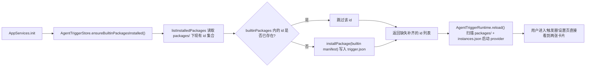
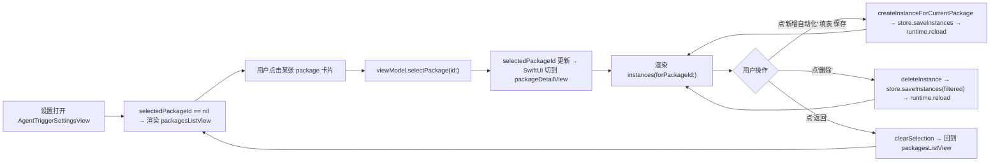

# 触发器设置重构实现计划

本计划落地 `docs/medium-powers/specs/2026-06-19-agenttrigger-settings-rework-spec.md`。

## Folder inventory

- `apps/desktop/Sources/AppServices/AgentTrigger/`
  - `AgentTriggerStore.swift`：新增 `ensureBuiltinPackagesInstalled()`、`deleteInstance(id:)`，并把内置 manifest 定义从 `AgentTriggerSettingsViewModel` 搬到这里（让启动期不依赖 UI 层）
- `apps/desktop/Sources/AppServices/`
  - `AppServices.swift`：在构造 `AgentTriggerRuntime` 之前调用 `agentTriggerStore.ensureBuiltinPackagesInstalled()`，使首次启动 reload 就能扫到内置包
- `apps/desktop/Sources/Settings/`
  - `AgentTriggerSettingsViewModel.swift`：去掉私有静态 manifest（已移到 store）；新增 `selectedPackageId`、`enterPackageDetail`/`exitPackageDetail`/`instances(for:)`/`deleteInstance(id:)`；`createInstance` 入参不再要求 caller 传 `packageId`（继承当前选中的 package）
  - `AgentTriggerSettingsView.swift`：拆为 `packagesListView`（一级）和 `packageDetailView`（二级），用 ViewModel 状态切换；二级直接按 `providerKind` 渲染对应字段；删除"类型"Picker；删除"安装内置 Trigger"按钮（保留作为"恢复内置触发器"的兜底）
  - `settings.md`：更新对 `AgentTriggerSettingsView` 的描述
- `apps/desktop/TestsSwift/AppServices/`
  - `AgentTriggerStoreTests.swift`：新增 ensure-builtin、delete-instance 行为
- `apps/desktop/TestsSwift/Settings/`
  - `AgentTriggerSettingsViewModelTests.swift`：补两级导航、删除自动化、多自动化 `createInstance`、空目录恢复入口测试
- `docs/manual-qa.md`：补本次手测条目

不动 `AgentTriggerRuntime`、`AgentTriggerProvider`、`agent_trigger.fire` 协议、`agent-triggers/` 文件协议，也不修 ThreadWindow/Electron 任何调用。

## Default Built-in Triggers use case

### Goal

桌面 App 第一次启动时，`~/.spotAgent/agent-triggers/packages/` 下默认存在 `chrome-bookmarks` 与 `system-clock` 两个 package，对应 `trigger.json`；用户进入"触发器"设置页直接看到两张已安装卡片，不需要点任何"安装"按钮。同时不能覆盖用户已修改/删除的 manifest——`ensureBuiltinPackagesInstalled` 必须幂等且只对缺失项写入。

### Existing Flow Inventory

- `AgentTriggerStore.installPackage(_:)` 已经把 manifest 写到 `~/.spotAgent/agent-triggers/packages/<id>/trigger.json`。本任务不新增写入路径，只新增"如果对应 `trigger.json` 缺失就写入内置"的入口。
- `AgentTriggerStore.listInstalledPackages()` 已经从同一目录读取所有 manifest；本任务复用它判断"是否已存在"。
- `AppServices.init` 构造 `AgentTriggerRuntime` 后立即 `try? self.agentTriggerRuntime.reload()`；新流程要让 ensure 发生在 reload 之前，使内置包对 reload 可见。
- 内置 manifest 字面值现在写在 `AgentTriggerSettingsViewModel.chromeBookmarksManifest` / `systemClockManifest` 私有静态属性里；启动期不能依赖 UI 层，需要把字面值搬到 store 模块。

### Core structure

```swift
@MainActor
final class AgentTriggerStore {
    /// 写入缺失的内置 package；已存在的 id 一律不动。返回新写入的 id 列表（便于测试断言）。
    @discardableResult
    func ensureBuiltinPackagesInstalled() -> [String]

    /// 当前内置 manifest 的快照；UI 的"恢复内置触发器"路径也共用这个来源。
    static var builtinPackages: [AgentTriggerPackageManifest] { get }
}
```

```swift
init(...) {
    ...
    self.agentTriggerStore = agentTriggerStore
    self.agentTriggerStore.ensureBuiltinPackagesInstalled()   // 新增；必须早于 reload
    self.agentTriggerRuntime = agentTriggerRuntime ?? AgentTriggerRuntime(...)
    try? self.agentTriggerRuntime.reload()
}
```

判断缺失的方式：先 `listInstalledPackages()` 取已有 id 集合，再对 `builtinPackages` 中 id 不在集合里的逐个 `installPackage(_)`。这样用户已经手动改过 `trigger.json` 的不会被覆盖；用户故意删了某个 builtin 后重启又会回来——这与 spec "首次启动直接可见" 一致；spec 用 case "用户在一级页面点'恢复内置触发器'" 处理 `packages/` 全空的极端情况，复用同一入口即可。

### Use case map



- Integration test need to create when exceeding: `apps/desktop/TestsSwift/AppServices/AgentTriggerStoreTests.swift`
- 近代码描述：
  1. `testEnsureBuiltinPackagesWritesMissingManifests`：临时 home → `AgentTriggerStore(homeDirectoryURL:)` → 调 `ensureBuiltinPackagesInstalled()` → 断言返回 `["chrome-bookmarks", "system-clock"]`，`listInstalledPackages().map(\.id)` 等同两项；再次调用返回空数组，文件未重写（用 `attributesOfItem` 取 modificationDate 比对）。
  2. `testEnsureBuiltinPackagesDoesNotOverrideUserEditedManifest`：先 `installPackage` 一份 `id == "system-clock"` 但 `title == "Custom Clock"` 的 manifest → 再调 `ensureBuiltinPackagesInstalled()` → 重新读取仍是 `Custom Clock`；缺失的 `chrome-bookmarks` 被写入。
  3. 复用现有 `TestFiles.makeTemporaryHomeDirectory` 工具。

### Implementation notes

- 把 ViewModel 里的 `chromeBookmarksManifest`/`systemClockManifest` 静态字面值搬到 `AgentTriggerStore.builtinPackages` 静态属性；ViewModel 不再持有它们，但 `installBuiltins()` 留作"恢复内置触发器"按钮入口，内部改成 `store.ensureBuiltinPackagesInstalled(); reload()`。
- `AgentTriggerStore` 当前是 `@MainActor`，启动期已经在 main actor 上构造，无需额外切线程。

## Two-Level Trigger Settings UI use case

### Goal

把 `AgentTriggerSettingsView` 改造成两级页面：

- 一级：标题"已安装的触发器" + 卡片列表（每个 package 一张卡，显示 `title`、`providerKind`、`description`、当前自动化条数）；卡片可点击进入二级；右上角放"恢复内置触发器"小按钮（仅在某个内置包缺失时高亮，否则按钮 disabled，文案统一）。
- 二级：顶部一行"返回 + 触发器标题 + 可选描述"；下方显示"自动化"分组——`AgentTriggerInstance[]`（按当前 packageId 过滤）；列表每行展示 `title` + `configSummary`，行右侧"删除"按钮；列表下方"新增自动化"折叠表单，按 `providerKind` 渲染对应字段；表单不再问"类型"。
- 表单字段：
  - `chrome.bookmarks` → 标题 + Folders（逗号分隔）
  - `system.clock` → 标题 + 时间点（逗号分隔，例 `09:00,21:00`） + 时区
  - 其他 providerKind → 显示"暂不支持自定义参数"提示，不渲染字段、不让保存。本计划不实现新的字段类型。
- 错误：保存失败时把 `saveErrorMessage` 渲染成 footer，与现有 settings 错误风格一致。

### Existing Flow Inventory

- `SettingsView.tabContent` 的 `case .agentTriggers:` 已经把 `AgentTriggerSettingsView(viewModel:)` 嵌进设置窗口；本次只改 view 内部，不动外面 tab 切换、不引入 NavigationStack（设置窗口固定 660×520，目前所有 tab 都是平铺，统一）。
- `SettingsListSection` / `SettingsRow` / `SettingsRowDivider` / `SettingsSection` / `SettingsFieldStyle` / `SettingsTextEditor` 已经覆盖现有视觉规范，本任务直接复用，不引入新 style 组件。
- ViewModel 已经拥有 `installedPackages` / `instances` / `saveErrorMessage` / `createInstance` / `installBuiltins`；本任务在它上面加导航状态、过滤器和删除入口。
- `AgentTriggerRuntime.reload()` 已经在 `createInstance` 成功后被调用；删除自动化也必须 reload，本计划在 `deleteInstance` 末尾复用同一 `try? runtime?.reload()` 路径。

### Core structure

```swift
@Observable
@MainActor
final class AgentTriggerSettingsViewModel {
    private(set) var installedPackages: [AgentTriggerPackageEntry]
    private(set) var instances: [AgentTriggerInstance]
    private(set) var saveErrorMessage: String?

    /// 二级页面状态。nil 表示一级列表；非 nil 表示进入对应 package 的详情页。
    private(set) var selectedPackageId: String?

    func selectPackage(id: String)
    func clearSelection()

    /// 详情页用：把 instances 按当前 packageId 过滤后给 view。
    func instances(forPackageId id: String) -> [AgentTriggerInstance]

    /// 新签名：不再让 caller 决定 packageId。
    @discardableResult
    func createInstanceForCurrentPackage(
        title: String,
        config: [String: AgentTriggerConfigValue]
    ) -> Bool

    @discardableResult
    func deleteInstance(id: String) -> Bool

    /// "恢复内置触发器"入口；内部 = ensureBuiltinPackagesInstalled + reload。
    func restoreBuiltinPackages()
}
```

```swift
struct AgentTriggerSettingsView: View {
    var body: some View {
        if let packageId = viewModel.selectedPackageId,
           let package = viewModel.installedPackages.first(where: { $0.id == packageId }) {
            packageDetailView(package: package)
        } else {
            packagesListView
        }
    }
}
```

`AgentTriggerStore.deleteInstance(id:)`：load → 过滤 → save。和现有 `saveInstances` 复用同一原子写。

### Use case map



- Integration test need to create when exceeding: `apps/desktop/TestsSwift/Settings/AgentTriggerSettingsViewModelTests.swift`
- 近代码描述（每条都用 `RecordingAgentTriggerRuntime` 计 reload 次数；用临时 home 隔离）：
  1. `testInitListsBuiltinPackagesWhenStorePreInstalled`：先 store.ensureBuiltinPackagesInstalled() → ViewModel(init) → 断言 `installedPackages.map(\.id) == ["chrome-bookmarks", "system-clock"]`，`selectedPackageId == nil`，`instances.isEmpty`。
  2. `testSelectingPackageEntersDetail`：`selectPackage(id: "chrome-bookmarks")` → `selectedPackageId == "chrome-bookmarks"`；`instances(forPackageId: "chrome-bookmarks").isEmpty`。
  3. `testCreateInstanceForCurrentPackagePersistsAndReloads`：进入详情 → `createInstanceForCurrentPackage(title: "English Reading", config: ["folderIds": .stringList(["english"])])` → 断言返回 true、`instances.count == 1`、`instances[0].packageId == "chrome-bookmarks"`、`runtime.reloadCount == 1`、磁盘 `instances.json` 已写入。
  4. `testCreateMultipleInstancesUnderSamePackage`：连续两次 `createInstanceForCurrentPackage` 不同 title/config → 断言 `instances(forPackageId:).count == 2`，runtime reload 两次。
  5. `testDeleteInstanceRemovesFromStoreAndReloads`：先创建一条 → `deleteInstance(id:)` → 断言 `instances(forPackageId:).isEmpty`，runtime reload 三次（含创建那次）。
  6. `testCreateInstanceFailsOnEmptyTitleWithoutTouchingStore`：`createInstanceForCurrentPackage(title: "  ", ...)` → false；`saveErrorMessage == "标题不能为空"`；`store.loadInstances().isEmpty`，runtime 没被 reload。
  7. `testCreateInstanceWithoutSelectedPackageFailsSafely`：未 selectPackage 直接 `createInstanceForCurrentPackage` → false；`saveErrorMessage == "未选中触发器"`；store 未变化。
  8. `testRestoreBuiltinPackagesRewritesMissingManifests`：手工删除 `chrome-bookmarks/trigger.json` → ViewModel(reload) → `installedPackages.count == 1` → `restoreBuiltinPackages()` → `installedPackages.count == 2`，runtime reload 一次。
  9. `testClearSelectionReturnsToList`：`selectPackage(id:)` → `clearSelection()` → `selectedPackageId == nil`。

### Implementation notes

- 一级 `packagesListView` 用 `SettingsListSection` 渲染卡片；卡片右侧用 `Image(systemName: "chevron.right")` 暗示进入二级。点击交互用 `Button { viewModel.selectPackage(id:) } label: { ... }.buttonStyle(.plain)`。
- 二级返回行用同款 `Button` + `Image(systemName: "chevron.left")`；保留现有 `theme.colors.accent` 风格与 `AppendPromptSettingsView` / `MCPSettingsView` 的"添加 / 取消 / 保存"按钮组一致。
- 表单 `providerKind` 分支字段渲染保留现有逗号解析逻辑（chromeBookmarks 的 folderIds、systemClock 的 scheduleAt/timezone 都是 stringList/string）；保存时仍走 `currentConfig() -> [String: AgentTriggerConfigValue]`。
- 切换 package 时清空表单 `@State`；通过 `.onChange(of: viewModel.selectedPackageId)` 重置本地 form state，避免在 chrome-bookmarks 二级输入的 folder 串到 system-clock。
- 错误 footer 与 ViewModel `saveErrorMessage` 复用 `errorFooter` 渲染；`saveErrorMessage` 在 `selectPackage` / `clearSelection` 时清空，避免跨页面残留。
- 删除自动化的"删除"按钮文案与 `AppendPromptSettingsView.promptRow` 同款（`Label("删除", systemImage: "trash")` + `theme.colors.error`），保持设置页风格一致。
- 现有"安装内置 Trigger"按钮换标签"恢复内置触发器"，仅当 `installedPackages.count < AgentTriggerStore.builtinPackages.count` 时启用；否则按钮 `.disabled(true)` 灰显。

## Self-review

1. 不重新发明轮子：内置 manifest 写入复用 `installPackage`；删除复用 `saveInstances`；UI 复用 `SettingsListSection` / `SettingsRow` 等组件；启动期 reload 复用现有 `try? agentTriggerRuntime.reload()` 入口。两级 UI 不引入 NavigationStack，避免和其他 settings tab 不一致。
2. 计划仅涵盖 spec 的 use cases：默认安装、两级 UI、自动化增删改、空 packages 恢复入口；未引入启用/禁用 toggle、复制实例、批量、新 provider——这些在 spec Non-Goals 已明确排除。
3. 沿用既有模式：ViewModel 仍是 `@Observable @MainActor` + `@ObservationIgnored` 依赖；store 写入仍是 atomic 文件；测试沿用 `TestFiles.makeTemporaryHomeDirectory` 与 `RecordingAgentTriggerRuntime`。`AgentTriggerSettingsView` 文件继续单文件结构（与其他 settings view 一致），不做拆分。

## Doc / QA hooks

- 修改 `apps/desktop/Sources/Settings/settings.md`，把 AgentTrigger 行的描述改为"两级（一级显示已安装触发器卡片，二级管理自动化）"。
- 在 `docs/manual-qa.md` 添加：进入设置→触发器，验证默认看到 Chrome Bookmarks / System Clock 两张卡片；点击进入二级；新增多条自动化；删除一条；返回列表。
- 实现完成后按 `CLAUDE.md` 的 "Spec 完成后的文档审核强制流程" 派一个 fork_context: false 的子 agent 复核 `<dir>.md` 与 spec/代码一致。
