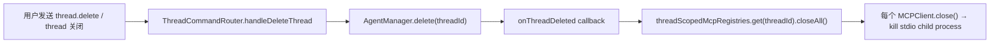
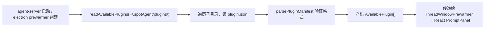
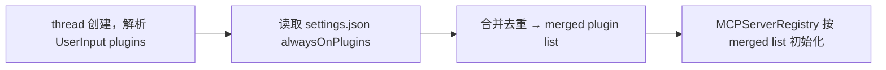

# Plugin System Implementation Plan

## UC1: 用户选择 plugin 并在对话中使用（含 UC3 多 plugin）

### Goal

用户在 PromptPanel 选择一个或多个 plugin 后，提交触发 thread 创建。agent-server 在 thread 创建时 spawn 对应 plugin binary 进程（MCP stdio），初始化连接、拉取 tools、注册到 thread 的 ToolRegistry，并将 plugin prompt 注入 system prompt。LLM 可调用 plugin tool，通过 MCP `tools/call` 执行。

### Existing Flow Inventory

1. **PromptPanel → Electron**：Swift `PromptPanelViewModel.submit()` 产出 `[PromptPanelComposerItem]`，经 `AppCoordinator` 发送 `thread_window.open_initial_prompt` command 给 Electron，payload 是 `InitialPromptPayload { clientRequestId, userInput: UserInput }`。
2. **UserInput → agent-server**：`UserInput { items: InputItem[] }`，其中 `SkillInputItem { type: "skill", id, actionId, title, prompt }` 传递 skill 信息。
3. **Thread 创建**：React 发 `thread.start` command → `ThreadCommandRouter.handleCreateThread` → `ThreadPersistence.createThread`。thread 创建后，首轮 `op.submit` 带 `UserInput`。
4. **MCP 管理**：`MCPServerRegistry`（server 级单例，lazy init）+ `ThreadScopedToolRegistry`（thread 级工具表）。`ThreadScopedToolRegistry.activate(threadId)` 时拉取全局 MCP tools。
5. **System prompt**：`AgentRuntime` 持有 `systemPromptSections: SystemPromptSection[]`，每轮 LLM 调用前 resolve 为 system messages。
6. **Skill prompt 注入**：当前 skill prompt 通过 `SkillInputItem.prompt` 作为用户消息的一部分进入 LLM（不是 system prompt），由 `MessageTranslator.composeUserInputContent` 处理。

### Core Structure

```typescript
// packages/core/src/mcp/MCPConfig.ts — 扩展 plugin manifest
export type PluginManifest = {
  id: string;
  title: string;
  description?: string;
  version: number;
  transport: "stdio";
  command: string;  // binary 相对路径或绝对路径
  args?: string[];
  env?: Record<string, string>;
  prompt?: string;  // 注入 system prompt 的提示词
};

// packages/core/src/protocol/Op.ts — 新增 PluginInputItem
export type PluginInputItem = {
  type: "plugin";
  id: string;
  pluginId: string;
  title: string;
  prompt?: string;
};

export type InputItem =
  | TextInputItem
  | ImageInputItem
  | SkillInputItem
  | PluginInputItem
  | TextSelectionInputItem;

// apps/agent-server/src/actions/MCPServerRegistry.ts — 改为 thread-scoped
// MCPServerRegistry 不再是全局单例，每个 thread 创建自己的实例
// 构造时接收 server configs（含全局 MCP + 选中 plugin），统一 initialize

export class MCPServerRegistry {
  constructor(options: {
    createClient: (serverId: string) => MCPClient;
    serverIds: string[];  // 新增：声明式传入需要初始化的 server 列表
  }) {}

  async initializeAll(): Promise<void>;  // 新增：启动所有声明的 server
  async listAllTools(): Promise<AgentTool[]>;  // 新增：合并所有 server tools
  pluginPrompts(): string[];  // 新增：返回所有 plugin 的 prompt 文本
  async closeAll(): Promise<void>;
}
```

```swift
// apps/desktop/Sources/PromptPanel/ActionDefinition.swift — 扩展
enum ActionSubmission: Equatable {
    case appendSkill
    case plugin  // 新增
}

struct ActionDefinition: Equatable, Identifiable {
    let id: String
    let trigger: String
    let title: String
    let description: String?
    let template: String
    let icons: [ActionIconDefinition]
    let defaultShortcut: KeyboardShortcuts.Shortcut?
    let submission: ActionSubmission
    let type: ActionType  // 新增：用于列表分栏

    enum ActionType: Equatable {
        case skill
        case plugin
    }
}
```

### Use case map



```mermaid
flowchart LR
    A["用户在 PromptPanel 选择 plugin<br/>→ PromptPanelComposerItem.plugin(PluginInputItem)"] --> B["Swift submit → Electron open_initial_prompt<br/>→ React 收到 InitialPromptPayload"]
    B --> C["React 发 thread.start + op.submit<br/>UserInput.items 包含 PluginInputItem"]
    C --> D["ThreadCommandRouter.handleCreateThread<br/>创建 thread"]
    D --> E["handleOpSubmit → 解析 UserInput.items 中的 plugin items<br/>→ 创建 thread-scoped MCPServerRegistry"]
    E --> F["MCPServerRegistry.initializeAll()<br/>spawn plugin binary，MCP initialize + tools/list"]
    F --> G["tools 注册到 ThreadScopedToolRegistry<br/>plugin prompts 注入 systemPromptSections"]
    G --> H["AgentRuntime.run 时 LLM 看到 plugin tools + prompt<br/>→ tools/call → MCPServerRegistry → plugin binary"]
    H --> I["tool result 返回 → LLM 继续推理"]
```

**Loop 1: PromptPanel → UserInput**
- Input: 用户选择 plugin action
- Consumer: `PromptPanelViewModel.submit()`
- 处理: 产出 `PromptPanelComposerItem.plugin(PluginInputItem)`，包含 pluginId、title、prompt
- Output: `UserInput { items: [..., PluginInputItem] }` 进入 `InitialPromptPayload`
- 需实现: Swift `ActionDefinition.plugin()` 工厂方法 + `PromptPanelComposerItem` 增加 `.plugin` case + electron `UserInput` schema 增加 `PluginInputItem`

**Loop 2: agent-server thread 创建 → MCP 进程启动**
- Input: `UserInput.items` 中的 `PluginInputItem[]`
- Consumer: agent-server 在 thread 首轮处理时（`ThreadRuntimeOrchestrator` 或 `server.ts` 组合根中）
- 处理: 根据 pluginId 查找 manifest → 创建 thread-scoped `MCPServerRegistry` 实例 → 调用 `initializeAll()` spawn 所有 plugin binary + 全局 MCP server
- Output: initialized `MCPServerRegistry` 绑定到 thread
- 需实现: `readPluginManifests(pluginsDir)` 函数、`MCPServerRegistry` 改造为声明式初始化、thread 创建时的 MCP 绑定逻辑

**Loop 3: tools 注册 + prompt 注入**
- Input: initialized `MCPServerRegistry`（含 plugin tools）
- Consumer: `ThreadScopedToolRegistry.activate(threadId)`
- 处理: 从 `MCPServerRegistry.listAllTools()` 获取所有 tool → 注册到 thread 的 `ToolRegistry`；从 `MCPServerRegistry.pluginPrompts()` 获取 prompt → 作为额外 `SystemPromptSection` 注入
- Output: thread 的 `AgentRuntime` 可看到所有 tools + plugin prompts
- 需实现: `ThreadScopedToolRegistry` 支持 thread-scoped MCP registry、`AgentRuntime` 支持动态 system prompt sections

**Loop 4: LLM 调用 plugin tool**
- Input: LLM 输出 tool_call（name = `mcp.<pluginId>.<toolName>`）
- Consumer: `AgentRuntime.handleToolCall` → `ToolRegistry.get(name)` → `MCPToolAdapter.call`
- 处理: `MCPToolAdapter` 调用 `MCPClient.callTool(name, args)` → stdin JSON-RPC 到 plugin binary
- Output: tool result 回到 LLM
- 需实现: 复用现有 `MCPToolAdapter` + `StdioMCPClient`，无需额外实现

**Integration test:** `apps/agent-server/tests/use-cases/plugin-lifecycle.test.ts`

```typescript
describe("plugin lifecycle", () => {
  // 准备一个 mock plugin binary（简单 MCP server：echo tool）
  // 构造 thread 创建流程，UserInput 包含 PluginInputItem
  // 验证：plugin binary 被 spawn、tools 注册到 thread、LLM 可调用 tool、tool result 返回
  // 验证：plugin prompt 出现在 system messages 中

  it("spawns plugin MCP server on thread start and registers tools", async () => {
    // 1. 创建 mock plugin manifest + binary（node script 实现 MCP protocol）
    // 2. startServer with plugin config
    // 3. 发送 thread.start + op.submit（含 PluginInputItem）
    // 4. 等待 thread running
    // 5. 验证 thread tool registry 包含 plugin tools
    // 6. 验证 system prompt 包含 plugin prompt
  });

  it("routes tool call to plugin binary via MCP protocol", async () => {
    // 1. 用 MockLLMClient 让 LLM 调用 plugin tool
    // 2. 验证 plugin binary 收到 tools/call
    // 3. 验证 tool result 返回到 runtime
  });

  it("supports multiple plugins in one thread", async () => {
    // UserInput 含 2 个 PluginInputItem
    // 验证 2 个 binary 都 spawn
    // 验证两个 plugin 的 tools 都注册
  });
});
```

---

## UC4: Thread 结束时清理 plugin 进程

### Goal

Thread 结束时（用户关闭、idle timeout、delete），该 thread 关联的所有 MCP 进程被 close/kill。

### Existing Flow Inventory

1. **Thread 删除**：`ThreadCommandRouter.handleDeleteThread` → `AgentManager.delete(threadId)` → `agent.close()`。
2. **当前 MCP 清理**：全局 `MCPServerRegistry.closeAll()` 只在 server 关闭时调用。
3. **Runtime 清理**：`runtimeByThread.delete(threadId)` 在 thread delete 时调用（`server.ts` 中 `onThreadDeleted` callback）。

### Core Structure

```typescript
// thread 删除/关闭时的清理钩子
// server.ts onThreadDeleted callback 扩展：
const onThreadDeleted = (threadId: string) => {
  runtimeByThread.delete(threadId);
  threadScopedMcpRegistries.get(threadId)?.closeAll();
  threadScopedMcpRegistries.delete(threadId);
};
```

### Use case map



- Input: thread 删除事件
- Consumer: `onThreadDeleted` callback
- 处理: 从 `threadScopedMcpRegistries` Map 取出该 thread 的 `MCPServerRegistry` → `closeAll()`
- Output: 所有 plugin child process 被 terminate
- 需实现: `threadScopedMcpRegistries: Map<string, MCPServerRegistry>` 在 server.ts 中维护

**Integration test:** 同 `plugin-lifecycle.test.ts`

```typescript
it("kills plugin processes when thread is deleted", async () => {
  // 1. 启动带 plugin 的 thread
  // 2. 验证 plugin process running
  // 3. 发送 thread.delete
  // 4. 验证 plugin process 已退出
});
```

---

## UC5: Plugin 开发者创建 plugin（发现与 manifest 解析）

### Goal

agent-server 启动时扫描 `~/.spotAgent/plugins/` 目录，解析每个 plugin 的 `plugin.json` manifest，验证格式，产出可用 plugin 列表供 PromptPanel 使用。

### Existing Flow Inventory

1. **现有 skill 发现**：electron `readAvailableSkillsFromPluginsDirectory(pluginsDirectoryURL)` 在 `apps/electron-shell/src/main/availableSkills.ts` 中实现，扫描 `~/.spotAgent/plugins/` 下的 `plugin.json`。
2. **传递给 ThreadWindow**：通过 `ThreadWindowPrewarmer` 的 `additionalArguments` 传递 `availableSkills` 给 renderer。

### Core Structure

```typescript
// packages/core/src/mcp/PluginManifest.ts — 新文件
export type PluginManifest = {
  id: string;
  version: number;
  title: string;
  description?: string;
  prompt?: string;
  transport: "stdio";
  command: string;
  args?: string[];
  env?: Record<string, string>;
};

export type AvailablePlugin = {
  pluginId: string;
  title: string;
  description?: string;
  prompt?: string;
  trigger: string;
  binaryPath: string;
  args?: string[];
  env?: Record<string, string>;
};

export function parsePluginManifest(data: unknown, pluginDir: string): PluginManifest | null;
export function readAvailablePlugins(pluginsDir: string): AvailablePlugin[];
```

### Use case map



- Input: `~/.spotAgent/plugins/` 目录
- Consumer: `readAvailablePlugins`
- 处理: 遍历子目录 → 读 `plugin.json` → zod schema 验证 → 解析 binary 路径
- Output: `AvailablePlugin[]`
- 需实现: `parsePluginManifest`（zod schema）+ `readAvailablePlugins`

**Integration test:** unit test 即可

```typescript
// packages/core/tests/mcp/plugin-manifest.test.ts
describe("parsePluginManifest", () => {
  it("parses valid manifest", () => { /* ... */ });
  it("rejects manifest without command", () => { /* ... */ });
  it("rejects manifest with version !== 1", () => { /* ... */ });
});
```

---

## UC2: 常驻 plugin 自动附加

### Goal

用户在设置页面标记某个 plugin 为"常驻触发"后，每次新建 thread 自动附加该 plugin（无需手动选择）。

### Existing Flow Inventory

1. **Settings 持久化**：`~/.spotAgent/settings.json` 由 Swift desktop 写入。
2. **agent-server 读 settings**：`SettingsBackedLLMClient` / `SettingsBackedToolRegistry` 从 settings.json 热加载。

### Core Structure

```typescript
// ~/.spotAgent/settings.json 新增字段
{
  "alwaysOnPlugins": ["screen-reader", "browser-control"]
}

// agent-server 在 thread 创建时合并用户选择的 plugins + alwaysOnPlugins
type ResolvedPluginsForThread = {
  fromUserSelection: string[];   // UserInput 中的 PluginInputItem
  fromAlwaysOn: string[];        // settings.json alwaysOnPlugins
  merged: AvailablePlugin[];     // 去重后的最终列表
};
```

### Use case map



- Input: UserInput 中的 plugin ids + settings.json `alwaysOnPlugins`
- Consumer: thread 创建时的 plugin 解析逻辑
- 处理: 合并、去重
- Output: 最终需要 spawn 的 plugin 列表
- 需实现: settings.json schema 扩展 + agent-server 读取 `alwaysOnPlugins` + 合并逻辑

**Integration test:** 在 `plugin-lifecycle.test.ts` 中追加

```typescript
it("auto-attaches always-on plugins without user selection", async () => {
  // 配置 alwaysOnPlugins = ["echo-plugin"]
  // 发送 thread.start + op.submit（不含 PluginInputItem）
  // 验证 echo-plugin 仍被 spawn 并注册 tools
});
```

---

## Swift PromptPanel 展示层（UC1 + UC2 前端联动）

### Goal

PromptPanel 按 skill / plugin 分栏展示 action 列表，plugin 使用和 skill 相同的 trigger/搜索/chip 交互。

### Existing Flow Inventory

1. **ActionDefinition.buildActions(from:)**：从 manifests 产出 enabled/disabled action 列表。
2. **PromptPanelViewModel.filteredActions**：使用 `ActionDefinition.filter` 过滤。
3. **appendSkill**：选中 action 后以 chip 形式追加到 composer items。

### Core Structure

见上方 `ActionDefinition` Swift 扩展。关键变更：

- `ActionSubmission` 增加 `.plugin`
- `ActionDefinition` 增加 `type: ActionType`（`.skill` / `.plugin`）
- `PromptPanelComposerItem` 增加 `.plugin(PluginInputItem)` case
- `buildActions` 同时解析 plugin manifest（新增 `buildPluginActions` 分支）
- `filteredActions` 改为按 type 分组返回，UI 分栏渲染

### Use case map

不单独写 integration test。Swift 侧的测试在 `PromptPanelViewModelTests.swift` 中扩展。

---

## 实现顺序

1. **UC5**（manifest 解析）→ 基础设施，其他 UC 依赖
2. **UC1**（核心链路：选择 → spawn → tool call）→ 主功能
3. **UC4**（thread 清理）→ 与 UC1 一起实现
4. **UC2**（常驻 plugin）→ 增量
5. **Swift PromptPanel**（前端展示）→ 可并行
