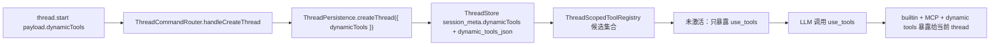
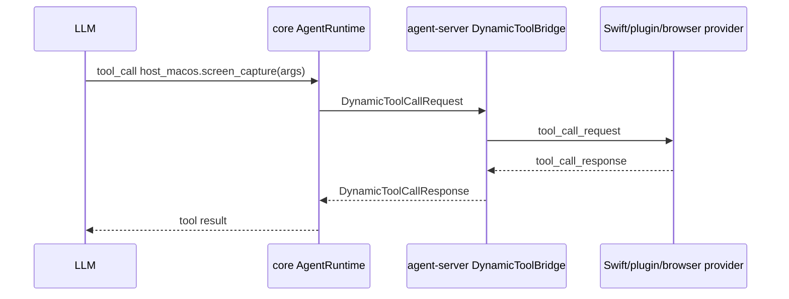
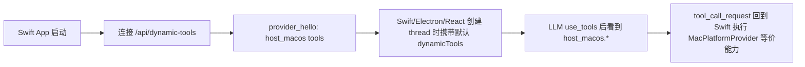
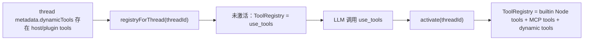

# Plugin System Implementation Plan

## UC1: Dynamic tool 数据模型与持久化

### Goal

将 `dynamicTools` 从 thread-store 雏形提升为 core 协议能力。thread 创建时可以携带 dynamic tool 候选集合；thread metadata 持久化该集合；runtime 在 `use_tools` 激活后把集合注册进当前 thread 的工具表。

### Existing Flow Inventory

1. `ThreadStartCommand.payload` 当前只有 `workspaceId`。
2. `packages/thread-store` 已有 `DynamicToolSpec`、`CreateThreadParams.dynamicTools`、`SessionMeta.dynamicTools` 和 `dynamic_tools_json` 存储字段。
3. `ThreadPersistence.createThread(preview?, workspaceId?)` 当前没有接收 dynamic tools。
4. `ThreadScopedToolRegistry` 当前负责 `use_tools` 懒加载、builtin tools 和全局 MCP tools。
5. core 还没有正式的 dynamic tool DTO、handler 或 request / response 协议。

### Core Structure

```typescript
// packages/core/src/protocol/DynamicTool.ts
export type DynamicToolSpec = {
  namespace?: string;
  name: string;
  description: string;
  inputSchema: Record<string, unknown>;
  deferLoading?: boolean; // 默认 false；为后续延迟加载策略预留
};

export type DynamicToolCallRequestPayload = {
  threadId: string;
  turnId: string;
  callId: string;
  namespace?: string;
  tool: string;
  arguments: unknown;
};

export type DynamicToolCallResponsePayload = {
  callId: string;
  success: boolean;
  contentItems: Array<
    | { type: "inputText"; text: string }
    | { type: "inputImage"; imageUrl: string }
  >;
};
```

`packages/thread-store` 不再维护自己的 `DynamicToolSpec` 形状，改为引用 core DTO，继续复用现有 `dynamic_tools_json` 存储列。

### Use case map



### Implementation loops

**Loop 1: core DTO**
- 新增 `packages/core/src/protocol/DynamicTool.ts`。
- `ThreadCommand.ts` 的 `ThreadStartCommand.payload` 增加 `dynamicTools?: DynamicToolSpec[]`。
- server Zod schema 校验 `dynamicTools`：`namespace/name` 只允许 ASCII 字母、数字、`_`、`-`；禁止空白、重复和保留 namespace。

**Loop 2: persistence**
- `ThreadPersistence.createThread` 接收对象参数：`{ preview?, workspaceId?, dynamicTools? }`。
- `ThreadCommandRouter.handleCreateThread` 把 command 中的 `dynamicTools` 传入 persistence。
- `packages/thread-store` 复用已有 `dynamic_tools_json`，补测试验证创建、持久化、恢复后 `session_meta.dynamicTools` 不丢失。

**Loop 3: tool registry**
- `ThreadScopedToolRegistry` 为每个 thread 保存 `dynamicTools` 候选集合。
- 未激活 thread 仍只暴露 `use_tools`。
- 调用 `use_tools` 后，registry 将 dynamic tools 包装为 `AgentTool` 并加入当前 thread 工具表。

### Tests

- `packages/core/tests/protocol/dynamic-tools.test.ts`：DTO 校验、重复 name / namespace 拒绝。
- `packages/thread-store/tests/thread-store-use-cases.test.ts`：`dynamicTools` 写入 `session_meta` 并恢复。
- `apps/agent-server/tests/thread/ThreadCommandRouter.test.ts`：`thread.start.payload.dynamicTools` 传入 persistence。
- `apps/agent-server/tests/actions/thread-scoped-tool-registry.test.ts`：未激活只见 `use_tools`，激活后可见 dynamic tools。

---

## UC2: Dynamic tool call request / response 路由

### Goal

core runtime 不直接执行 dynamic tool，而是发出 request，等待对应 provider 回 response。agent-server 负责把 request 转给 provider，并把 response 投回当前 runtime。

### Existing Flow Inventory

1. `AgentRuntime` 当前直接从 `ToolRegistry.get(name)` 取 `AgentTool.call()`。
2. `ServerRequest` / `ClientResponse` 已覆盖 permission / workspace 的 UI 回执，但不适合复用给 provider，因为 provider 不一定是 React ThreadWindow。
3. Codex dynamic tool 模型是：dynamic tool handler 发 request event，app-server 转为 provider request，provider response 回到 pending call。

### Core Structure

```typescript
export type DynamicToolProviderMessage =
  | {
      channel: "dynamic_tools";
      type: "provider_hello";
      providerId: string;
      tools: DynamicToolSpec[];
    }
  | {
      channel: "dynamic_tools";
      type: "tool_call_request";
      payload: DynamicToolCallRequestPayload;
    }
  | {
      channel: "dynamic_tools";
      type: "tool_call_response";
      payload: DynamicToolCallResponsePayload;
    };
```

生产通道使用新的 WebSocket：`/api/dynamic-tools`。该通道取代 `/api/platform`，并允许 Swift desktop、plugin host、浏览器扩展和开发者前端作为 provider 连接。

### Use case map



### Implementation loops

**Loop 1: dynamic tool adapter**
- 新增 core `DynamicToolAdapter`，把 `DynamicToolSpec` 包装成 `AgentTool`。
- `call()` 不直接执行能力，而是调用注入的 `DynamicToolBridge.call(payload)`。
- bridge 以 `threadId + toolCallId` 追踪 pending response，断连或超时返回可读错误。

**Loop 2: agent-server provider bridge**
- 新增 `apps/agent-server/src/bridges/WebSocketDynamicToolBridge.ts`。
- 新增 `/api/dynamic-tools` socket handler。
- 支持 provider hello、provider detach、tool call request、tool call response。
- 同一 tool spec 必须能定位到 provider；provider 断开后，该 provider 的 pending call 全部失败。

**Loop 3: runtime event / audit**
- dynamic tool call 开始和结束写入 thread audit event，至少包含 `toolName`、`arguments`、`status`、`durationMs`。
- 历史回放能看到 dynamic tool call request / response 的最终状态。

### Tests

- `packages/core/tests/runtime/dynamic-tool-runtime.test.ts`：LLM 调用 dynamic tool，bridge 收到 request，response 回灌后 runtime 继续。
- `apps/agent-server/tests/bridges/dynamic-tool-bridge.test.ts`：provider 注册、调用路由、断连失败、超时失败。
- `apps/agent-server/tests/use-cases/dynamic-tools.test.ts`：从 `thread.start.dynamicTools` 到 tool call response 的完整链路。

---

## UC3: 删除 `/api/platform` 并迁移默认 macOS tools

### Goal

删除专用 platform bridge。原先依赖 Swift/macOS 的平台工具改为 Swift 默认 dynamic tools，不再通过 `PlatformAdapter` / `RemotePlatformAdapter` 调用。

### Existing Flow Inventory

1. `/api/platform` 由 agent-server `attachPlatformSocketHandlers` 挂载。
2. Swift `PlatformBridgeConnectionClient` 连接 `/api/platform`，`PlatformBridgeService` 分发到 `MacPlatformProvider`。
3. core `RemotePlatformAdapter` 通过 `PlatformBridge.call()` 调用 `clipboard.read`、`screen.capture`、`accessibility.*` 等方法。
4. platform 类 builtin tools 依赖 `PlatformAdapter`。

### Migration target

Swift desktop 默认注册 `host_macos` namespace：

| Dynamic tool | 迁移来源 |
| --- | --- |
| `host_macos.clipboard_read` | `clipboard.read` |
| `host_macos.app_list` | `app.list` |
| `host_macos.app_frontmost` | `app.frontmost` |
| `host_macos.window_list` | `window.list` |
| `host_macos.screen_capture` | `screen.capture` |
| `host_macos.ocr_read` | `ocr.read` |
| `host_macos.accessibility_snapshot` | `accessibility.snapshot` |
| `host_macos.accessibility_action` | `accessibility.action` |

名称使用 dynamic tool 兼容的 `_` 风格；LLM 看到的是 namespace + tool，而不是点号 builtin name。

### Use case map



### Implementation loops

**Loop 1: Swift provider**
- 新增 Swift `DynamicToolProviderConnectionClient`，连接 `/api/dynamic-tools`。
- 复用现有 `MacPlatformProvider` 的能力实现，但输出 dynamic tool response。
- `PlatformBridgeConnectionClient`、`PlatformBridgeService`、`PlatformBridgeMessage` 和 `/api/platform` 挂载删除。

**Loop 2: default tools 传递**
- Swift 生成默认 `DynamicToolSpec[]`。
- Electron ThreadWindow preload config 增加 `defaultDynamicTools`，来源是 Swift host/provider 当前可用工具集合。
- `ElectronInitialPromptPayload` 增加 `dynamicTools`。
- Electron protocol 和 preload initial prompt payload 同步增加 `dynamicTools`。
- React `InitialPromptPayload` 增加 `dynamicTools`。
- `ThreadSocketClient.startInitialPrompt` 把 `prompt.dynamicTools` 写入 `thread.start.payload.dynamicTools`。
- ThreadWindow 新建空白 thread 和后台 AgentTrigger 创建 thread 也必须携带默认 host dynamic tools，避免入口不一致。

**Loop 3: remove platform abstractions**
- core 删除 `PlatformBridge`、`RemotePlatformAdapter` 和 platform 类 builtin 注册。
- `registerTools` 保留 workspace/file 类工具和不依赖 Swift 的 Node/core 工具。
- `packages/core/src/tools/tools.md`、`packages/core/src/platform/platform.md` 和上层架构文档同步更新。

### Tests

- Swift `DynamicToolProviderConnectionClientTests`：连接后发送 provider hello、收到 request 后回 response。
- Swift `MacHostDynamicToolsTests`：默认 tool specs 与 provider dispatch table 一致。
- Electron protocol tests：initial prompt payload 保留 `dynamicTools`。
- ThreadWindow initial prompt flow tests：`thread.start` 携带 `dynamicTools`。
- agent-server server tests：`/api/platform` 不再挂载，`/api/dynamic-tools` 可连接。

---

## UC4: Swift 控制 plugin 生命周期

### Goal

Plugin 进程生命周期归 Swift desktop 管理。agent-server 不读取 plugin binary、不 spawn plugin、不按 thread 清理 plugin 进程。

### Lifecycle model

| Plugin 类型 | 生命周期 owner | dynamic tools 进入方式 |
| --- | --- | --- |
| 默认 host tools | Swift App | 所有 Swift 宿主创建的 thread 默认携带 |
| 常驻 plugin | Swift App / plugin manager | App 启动或设置启用后运行，注册 tools；新 thread 默认携带 |
| 按需 tool plugin | Swift App / plugin manager | 用户选择或设置触发后启动，注册 tools；指定 thread 或后续新 thread 携带 |

### Manifest shape

```json
{
  "version": 1,
  "id": "screen-reader",
  "title": "Screen Reader",
  "description": "Read and act on visible UI",
  "lifecycle": "alwaysOn",
  "command": "bin/screen-reader",
  "args": [],
  "tools": [
    {
      "namespace": "screen_reader",
      "name": "snapshot",
      "description": "Read the current screen state",
      "inputSchema": { "type": "object", "properties": {} }
    }
  ]
}
```

`lifecycle` 初始支持：

- `alwaysOn`：App 启动或用户启用后持续运行。
- `onDemand`：用户选择或设置触发后启动。
- `toolsOnly`：不需要后台工作，只在被调用前由 Swift 确保可用。

### Implementation loops

**Loop 1: Swift plugin manager**
- 扫描 `~/.spotAgent/plugins/<id>/plugin.json`。
- 验证 manifest 并产出 action / settings 列表。
- 按 lifecycle 启动或停止 plugin。
- 将 plugin tools 合并进 Swift 可提供的 dynamic tool specs。

**Loop 2: provider dispatch**
- plugin tool call request 先到 Swift provider。
- Swift 根据 namespace/tool 路由到 host capability 或对应 plugin。
- plugin 的内部协议本期由 Swift 侧决定；agent-server 不感知。

**Loop 3: PromptPanel / Settings**
- PromptPanel 继续展示 skill / plugin action。
- 选择 plugin 不表示 agent-server spawn 进程，只表示该 thread 的 dynamicTools 候选集合追加对应 plugin tools 和 prompt。
- Settings 负责启用、禁用和 lifecycle 偏好。

### Tests

- Swift manifest parser tests。
- Swift plugin lifecycle manager tests：alwaysOn 启动、onDemand 延迟启动、禁用后停止。
- PromptPanel tests：选择 plugin 后 initial prompt 带对应 dynamic tools。

---

## UC5: `use_tools` 懒加载语义保持不变

### Goal

dynamic tools 默认进入 thread 候选集合，但不代表立即暴露给 LLM。未激活 thread 仍只暴露 `use_tools`，减少普通对话里的工具噪音。

### Use case map



### Implementation loops

- `ThreadScopedToolRegistry` 的激活状态继续作为唯一开关。
- `dynamicTools` 候选集合不受 `settings.tools.allowlist/denylist` 直接过滤；provider 自身是否启用由 Swift/plugin 设置控制。
- 激活后若某 provider 不在线，对应 dynamic tool 调用返回明确错误，而不是隐藏 tool spec。
- `use_tools` 返回文案更新，说明已启用的工具来源包括 host/plugin dynamic tools。

### Tests

- 未激活：`registry.list()` 只包含 `use_tools`。
- 激活：包含 host dynamic tools。
- provider 离线：tool call 返回 provider offline 错误并写入 audit event。

---

## 文档更新范围

- [handAgent.md](/Users/mu9/proj/handAgent/handAgent.md)：删除 `/api/platform` 架构描述，新增 `/api/dynamic-tools`。
- [apps/apps.md](/Users/mu9/proj/handAgent/apps/apps.md)：Swift 不再处理 platform bridge，改为 dynamic tool provider。
- [apps/desktop/desktop.md](/Users/mu9/proj/handAgent/apps/desktop/desktop.md)：新增 Swift host/plugin lifecycle 职责，删除 `/api/platform` 说明。
- [apps/agent-server/agent-server.md](/Users/mu9/proj/handAgent/apps/agent-server/agent-server.md)：新增 dynamic tools socket，删除 platform socket。
- [packages/core/core.md](/Users/mu9/proj/handAgent/packages/core/core.md) 与 [packages/core/src/src.md](/Users/mu9/proj/handAgent/packages/core/src/src.md)：说明 dynamic tool runtime 和 platform abstraction 删除。
- [packages/core/src/tools/tools.md](/Users/mu9/proj/handAgent/packages/core/src/tools/tools.md)：更新工具来源和 builtin tool 列表。
- [packages/core/src/platform/platform.md](/Users/mu9/proj/handAgent/packages/core/src/platform/platform.md)：实现时删除或改为历史迁移说明。
- [docs/manual-qa.md](/Users/mu9/proj/handAgent/docs/manual-qa.md)：实现完成后补 Swift host dynamic tools 和 plugin 生命周期手测步骤。

## 实现顺序

1. 定义 core `DynamicToolSpec` / request / response DTO，并接入 `thread.start.payload.dynamicTools`。
2. 打通 thread-store `dynamicTools` 持久化与恢复测试。
3. 实现 core `DynamicToolAdapter` 和 agent-server `WebSocketDynamicToolBridge`。
4. 保持 `use_tools` 懒加载语义，激活后注册 dynamic tools。
5. Swift 新增 host dynamic tool provider，并让所有 thread 创建入口携带默认 host dynamic tools。
6. 迁移 macOS 平台工具，删除 `/api/platform`。
7. Swift plugin manager 接管 plugin manifest、生命周期和 provider dispatch。
8. 更新架构文档和 manual QA。
