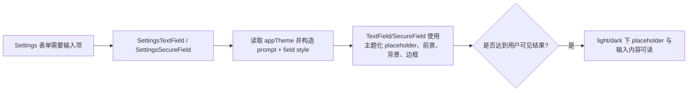
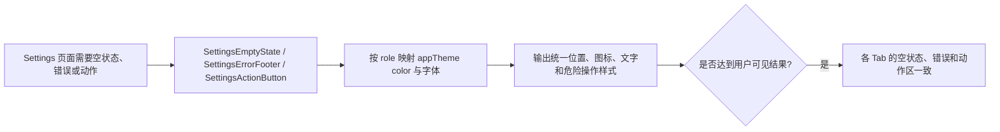
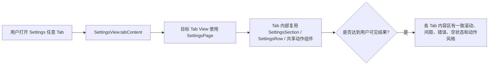
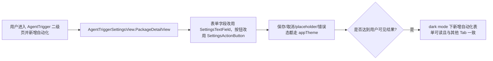
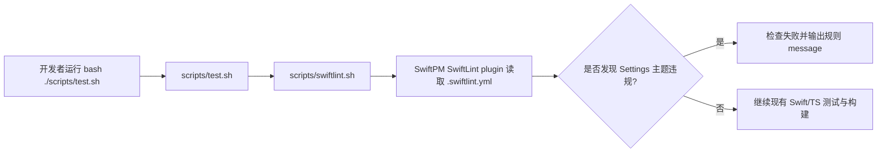
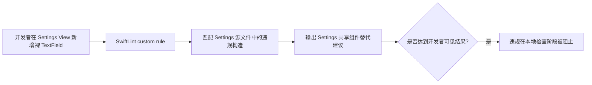
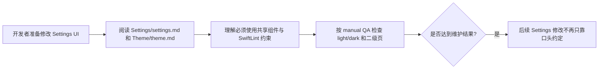

# Settings 风格与主题约束 Implementation Plan

Spec: [2026-06-19-settings-style-theme-spec.md](/Users/mu9/proj/handAgent/docs/medium-powers/specs/2026-06-19-settings-style-theme-spec.md)

> 后续 Common 组件层计划 [2026-06-20-desktop-common-ui-components.md](/Users/mu9/proj/handAgent/docs/medium-powers/plans/2026-06-20-desktop-common-ui-components.md) 已替代本计划中关于 `SettingsFieldStyle` 与 `TextField(prompt:)` 的实现细节。当前实现应以 `apps/desktop/Sources/Common/` 的通用组件和 overlay placeholder 为准。

## Scope And Folder Map

- `apps/desktop/Sources/Settings/`：Settings 容器、Tab 内容页、共享 Settings 样式组件。主要改动点。
- `apps/desktop/Sources/AppServices/AgentSettings/`：模型设置页被 `SettingsView` 嵌入，也必须迁移到 Settings 主题安全输入组件。
- `apps/desktop/Sources/Theme/`：继续作为 token 来源，不新增独立 UI 主题体系；只在需要时补文档，不直接编辑生成 token。
- `apps/desktop/TestsSwift/Settings/`：新增 Settings 样式/约束相关测试，验证共享组件语义和 lint 配置可维护性。
- `scripts/`：新增或扩展 SwiftLint 执行脚本，并接入现有验证入口。
- `Package.swift` / `.swiftlint.yml`：引入 SwiftLint SwiftPM 插件和 Settings 主题规则。
- `apps/desktop/Sources/Settings/settings.md`、`apps/desktop/Sources/Theme/theme.md`、`docs/manual-qa.md`：记录新增约束和手工验收项。

执行代码修改前，按仓库约定从主 checkout 创建 worktree：

```bash
bash ./scripts/create-worktree.sh settings-style-theme
```

后续 CodeGraph MCP 调用必须显式使用脚本输出的 worktree `projectPath`。初始化后先跑基线：

```bash
bash ./scripts/test.sh
bash ./scripts/swiftw build
```

## Theme-safe Settings controls

### Goal

补齐 Settings 专用共享组件，让输入框、文本编辑器、按钮、空状态、错误提示和页级容器统一消费 `@Environment(\.appTheme)`。修复暗色主题下 placeholder / 输入内容对比不足的问题，并让后续 Settings 页面不能靠裸控件绕过主题约束。

### Existing Flow Inventory

现有 Settings UI 已经复用 `SettingsSection`、`SettingsListSection`、`SettingsRow`、`SettingsSegmentedControl`、`SettingsFieldStyle`、`SettingsTextEditor`。这个用例应扩展 `SettingsStyles.swift`，不要新建第二套样式体系。

`AppTheme` 已通过 `ThemeEnvironment` 注入，`SettingsView` 根背景使用 `theme.colors.canvas`。计划继续复用该 flow，不新增 ViewModel，也不让 ViewModel 依赖 Theme。

当前问题点是多个页面直接调用 `TextField(...)`、`SecureField(...)`、`TextEditor(...)` 或裸 `Button(...)`，再叠加 `SettingsFieldStyle()`。`TextFieldStyle` 不能可靠控制 placeholder，因此需要 wrapper 组件接管 prompt。

### Core structure

在 `SettingsStyles.swift` 扩展这些组件，命名保持 Settings 前缀：

```swift
struct SettingsPage<Content: View>: View {
    @ViewBuilder let content: () -> Content
}

struct SettingsTextField: View {
    let placeholder: String
    @Binding var text: String
    var width: CGFloat?
}

struct SettingsSecureField: View {
    let placeholder: String
    @Binding var text: String
    var width: CGFloat?
}

struct SettingsActionButton: View {
    enum Role {
        case primary
        case secondary
        case destructive
    }

    let title: String
    let systemImage: String?
    let role: Role
    let action: () -> Void
}

struct SettingsEmptyState: View {
    let title: String
    let systemImage: String
    let reload: (() -> Void)?
}

struct SettingsErrorFooter: View {
    let message: String
}
```

`SettingsTextField` / `SettingsSecureField` 必须使用 `prompt: Text(placeholder).foregroundStyle(theme.colors.textSecondary)`，并复用或替代 `SettingsFieldStyle` 的背景、边框、字体、尺寸规则。

### Use case map





- Integration test need to create when exceeding: `/Users/mu9/proj/handAgent/apps/desktop/TestsSwift/Settings/SettingsStylesThemeTests.swift`

Near-code description:

```swift
@MainActor
func testSettingsActionButtonRolesExposeExpectedSemanticRoles() { ... }

@MainActor
func testSettingsTextFieldCanRenderWithLightAndDarkTheme() { ... }

@MainActor
func testSettingsEmptyStateAndErrorFooterRenderWithTheme() { ... }
```

SwiftUI 视觉颜色不做 RGB 精确断言。测试目标是让组件能在 `.environment(\.appTheme, .light)` 和 `.environment(\.appTheme, .dark)` 下实例化，并把 role / placeholder / message 这类语义输入稳定保留。实现阶段第一步先让这些测试存在并能失败或编译，再写生产组件。

> **For agentic workers:** REQUIRED SUB-SKILL: Use `medium-powers:subagent-driven-development` to make the test work.

## Migrate Settings tabs onto the shared structure

### Goal

把九个 Settings Tab 迁移到统一页级容器和共享控件。保持每个 Tab 的业务语义不变，只收敛页面结构、输入控件、空状态、错误展示、动作按钮和二级页样式。

### Existing Flow Inventory

`SettingsView.tabContent` 是所有 Tab 的入口。各 Tab 已经把持久化行为封装在 ViewModel 或 store 中，本计划不改数据流。

现有页面分三类：

- 单表单页：`AgentSettingsView`、`AppearanceSettingsView`、`ShortcutSettingsView`
- 列表管理页：`ToolSettingsView`、`AppendPromptSettingsView`、`MCPSettingsView`、`PermissionRulesView`、`WorkspaceSettingsView`
- 主从/二级页：`AgentTriggerSettingsView`

迁移应复用这些既有 View 和 ViewModel，不新增路由或新的 Settings navigation model。

### Core structure

迁移规则：

```swift
// 所有 Settings 内容页
SettingsPage {
    ...
}

// 所有表单输入
SettingsTextField(...)
SettingsSecureField(...)
SettingsTextEditor(...)

// 所有错误
SettingsErrorFooter(message: error)

// 所有空状态
SettingsEmptyState(title: ..., systemImage: ..., reload: ...)

// 所有普通/次要/危险动作
SettingsActionButton(title: ..., systemImage: ..., role: ..., action: ...)
```

保留 `SettingsRow` 的左 label / 右 control 结构。保留 `SettingsListSection` 的列表分隔逻辑。`SettingsTabBar` 暂不重做交互模型。

### Use case map





- Integration test need to create when exceeding: `/Users/mu9/proj/handAgent/apps/desktop/TestsSwift/Settings/SettingsStyleMigrationTests.swift`

Near-code description:

```swift
func testSettingsSourceDoesNotUseBareInputsOutsideSharedStyles() throws {
    let files = SwiftSourceFiles.settingsAndEmbeddedAgentSettings
    XCTAssertNoMatch(files.excluding("SettingsStyles.swift"), #"\\bTextField\\("#)
    XCTAssertNoMatch(files.excluding("SettingsStyles.swift"), #"\\bSecureField\\("#)
    XCTAssertNoMatch(files.excluding("SettingsStyles.swift"), #"\\bTextEditor\\("#)
}

func testSettingsSourceDoesNotUseHardcodedColorsOutsideSharedStyles() throws {
    XCTAssertNoMatch(files.excluding("SettingsStyles.swift"), #"Color\\.(white|black|gray|red|blue|green)"#)
}
```

这些测试是 SwiftLint 之前的本地防线，避免只靠外部 plugin 才能发现主题绕过。实现阶段先创建测试并确认当前代码会暴露裸控件，再迁移调用点。

> **For agentic workers:** REQUIRED SUB-SKILL: Use `medium-powers:subagent-driven-development` to make the test work.

## SwiftLint static guardrail

### Goal

引入 SwiftLint 作为 Swift UI 静态约束入口，把 Settings 主题规则接入提交前检查。规则应阻止 Settings View 中新增裸输入控件、裸动作按钮、硬编码颜色和绕过 `appTheme` 的常见样式。

### Existing Flow Inventory

当前仓库没有 SwiftLint。Swift 入口是 SwiftPM 的 `Package.swift`，Swift 命令统一通过 `scripts/swiftw` 封装缓存路径，提交前检查包括 `bash ./scripts/test.sh`、`bash ./scripts/swiftw test`、`bash ./scripts/swiftw build`。

该用例应扩展现有脚本入口，不要求开发者单独安装 Homebrew 版 SwiftLint。由于项目是 SwiftPM，SwiftLint 依赖应通过 SwiftPM plugin 接入。

### Core structure

建议结构：

```swift
// Package.swift
.package(url: "https://github.com/SimplyDanny/SwiftLintPlugins", from: "0.63.3")
```

`0.63.3` 是计划编写时通过 upstream tag 查询得到的最新稳定 tag。实施时如果 SwiftPM 解析失败，应先检查该插件仓库 release/tag，而不是改用开发机全局 SwiftLint。

```yaml
# .swiftlint.yml
included:
  - apps/desktop/Sources/Settings
  - apps/desktop/Sources/AppServices/AgentSettings

custom_rules:
  settings_no_bare_textfield:
    included: ".*(Settings|AgentSettings).*View\\.swift"
    regex: "\\b(TextField|SecureField|TextEditor)\\("
    message: "Settings UI must use SettingsTextField, SettingsSecureField, or SettingsTextEditor."
    severity: error
```

实际规则需要允许 `SettingsStyles.swift` 内部封装使用原生控件。若 SwiftLint custom rule 的 include/exclude 粒度不能表达该白名单，则脚本层用 `--config` 范围或单独源扫描测试补足。

新增脚本：

```bash
bash ./scripts/swiftlint.sh
```

该脚本通过 SwiftPM plugin 执行 SwiftLint，并被 `scripts/test.sh` 调用。`scripts/swiftw.test.sh` 或新增脚本测试需要验证 test 入口会调用 SwiftLint。

### Use case map





- Integration test need to create when exceeding: `/Users/mu9/proj/handAgent/scripts/swiftlint.test.sh`

Near-code description:

```bash
# 构造临时 checkout，复制 scripts/swiftlint.sh 与 .swiftlint.yml
# 用 fake swift 记录调用
# 断言 scripts/swiftlint.sh 通过 swift package plugin swiftlint 触发 SwiftLint plugin
# 断言失败时输出透传，不吞掉 lint message
```

- Integration test need to extend when exceeding: `/Users/mu9/proj/handAgent/scripts/test.test.sh`

Near-code description:

```bash
# fake scripts/swiftlint.sh
# 断言 scripts/test.sh 在其他测试前或 Swift 相关检查前调用 swiftlint.sh
```

> **For agentic workers:** REQUIRED SUB-SKILL: Use `medium-powers:subagent-driven-development` to make the test work.

## Documentation and manual QA

### Goal

把 Settings 主题组件和 SwiftLint 约束写入仓库文档，并补充 manual QA，避免以后实现者只记得视觉统一，忘记 dark mode / placeholder / 二级页验证。

### Existing Flow Inventory

`apps/desktop/Sources/Settings/settings.md` 已记录 Settings 模块边界和测试约束。`apps/desktop/Sources/Theme/theme.md` 已记录 theme token 是 SwiftUI 原生 UI 的主入口。`docs/manual-qa.md` 已收集手工验收场景。

该用例只扩展这些文档，不新增文档树层级。

### Core structure

文档更新内容：

- `settings.md`：新增“Settings UI 必须使用共享主题组件”和“SwiftLint 会约束裸控件/硬编码颜色”。
- `theme.md`：新增 Settings 对 token 的消费边界，说明 `SettingsStyles.swift` 是 Settings 主题封装层。
- `docs/manual-qa.md`：新增 Settings light/dark 手工检查项，覆盖表单 placeholder、错误、disabled、danger、AgentTrigger 二级新增自动化。

### Use case map



- Integration test need to create when exceeding: `/Users/mu9/proj/handAgent/apps/desktop/TestsSwift/Settings/SettingsDocumentationTests.swift`

Near-code description:

```swift
func testSettingsDocsMentionThemeSafeComponentsAndSwiftLint() throws {
    assertFile("apps/desktop/Sources/Settings/settings.md", contains: "SwiftLint")
    assertFile("apps/desktop/Sources/Settings/settings.md", contains: "SettingsTextField")
    assertFile("apps/desktop/Sources/Theme/theme.md", contains: "SettingsStyles")
    assertFile("docs/manual-qa.md", contains: "Settings")
    assertFile("docs/manual-qa.md", contains: "dark")
}
```

> **For agentic workers:** REQUIRED SUB-SKILL: Use `medium-powers:subagent-driven-development` to make the test work.

## Execution Order

1. Create worktree with `bash ./scripts/create-worktree.sh settings-style-theme`.
2. Run baseline `bash ./scripts/test.sh` and `bash ./scripts/swiftw build`.
3. Add failing/semantics tests for Settings shared components.
4. Implement `SettingsPage`, theme-safe inputs, action button, empty state, error footer.
5. Add source-scan tests for forbidden Settings UI constructs.
6. Migrate `AgentSettingsView`, `AppendPromptSettingsView`, `MCPSettingsView`, `AgentTriggerSettingsView`, `WorkspaceSettingsView`, `PermissionRulesView`, `AppearanceSettingsView`, `ToolSettingsView`, and `ShortcutSettingsView` where applicable.
7. Add SwiftLint SwiftPM plugin, `.swiftlint.yml`, `scripts/swiftlint.sh`, and script tests.
8. Wire SwiftLint into `scripts/test.sh`.
9. Update `settings.md`, `theme.md`, and `docs/manual-qa.md`.
10. Run `bash ./scripts/test.sh`, `bash ./scripts/swiftw test`, and `bash ./scripts/swiftw build`.
11. Dispatch a documentation audit subagent for spec completion review before commit, per repository workflow.
12. Commit all implementation, tests, docs, and manual QA updates.

## Self-Review Notes

- This plan extends existing Settings and Theme flows; it does not create a new Settings navigation model.
- SwiftLint is a constraint tool, not a UI framework replacement.
- The plan avoids changing config file formats or ViewModel semantics.
- The only intentionally broad source scan is scoped to Settings and embedded `AgentSettingsView`.
- Top Tab Bar visual redesign remains out of scope, matching the spec non-goal.
