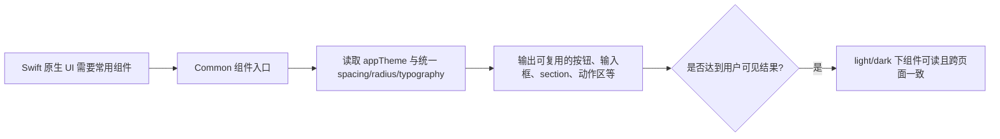
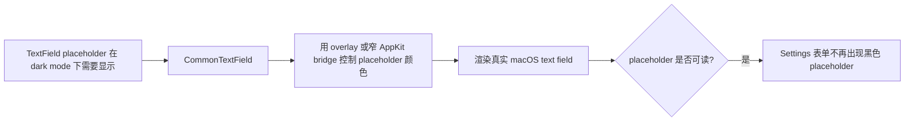
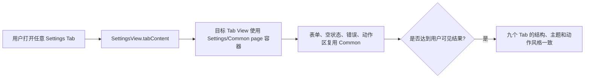
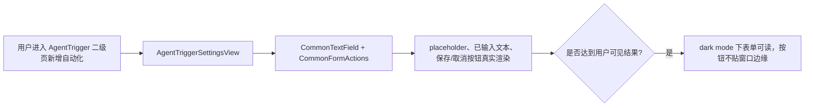
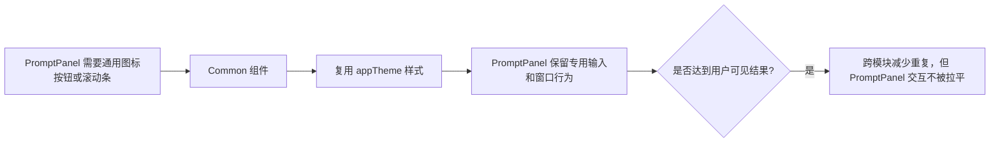
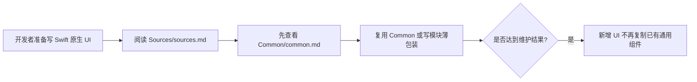
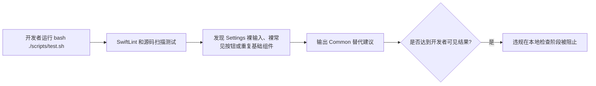

# Desktop Common UI Components Implementation Plan

Spec: [2026-06-19-settings-style-theme-spec.md](/Users/mu9/proj/handAgent/docs/medium-powers/specs/2026-06-19-settings-style-theme-spec.md)

## Scope And Folder Map

- `apps/desktop/Sources/Common/`：新增桌面 SwiftUI 通用组件目录，承载跨 Settings / PromptPanel 可复用的前端组件与样式封装。
- `apps/desktop/Sources/Common/common.md`：新增 Common 目录文档，说明组件职责、命名边界和使用优先级。
- `apps/desktop/Sources/sources.md`：作为 `Common/` 父级文档，新增目录索引，并明确 Swift 原生 UI 应优先查找 Common 组件，不要重复造轮子。
- `apps/desktop/Sources/Settings/`：把 Settings 专用组件收敛为 Common 组件的薄包装或直接迁移到 Common；修复 AgentTrigger 新增自动化的 placeholder 和动作区布局。
- `apps/desktop/Sources/PromptPanel/`：只抽取与 Settings 共用的基础控件或样式；PromptPanel 专用窗口布局、输入交互和 action row 行为不强行迁移。
- `apps/desktop/Sources/Shared/`：评估现有 `OverlayScrollbar` 是否迁入 Common。若迁移成本低且语义是 UI 组件，则移入 Common；否则在文档中说明 Shared 仍保留跨模块底层辅助。
- `apps/desktop/Sources/Theme/`：继续作为 token 来源，不新增第三方主题库。
- `apps/desktop/TestsSwift/Common/`：新增 Common 组件渲染和语义测试。
- `apps/desktop/TestsSwift/Settings/`：扩展 Settings 迁移约束，验证 Settings 不再重复实现 Common 已覆盖的组件。
- `.swiftlint.yml` / `scripts/`：扩展已有 Settings 主题 guardrail，覆盖裸按钮、裸输入和 Common 使用约束。
- `docs/manual-qa.md`：补充 Settings / Common 视觉手工验收项。

执行代码修改前，按仓库约定从主 checkout 创建 worktree：

```bash
bash ./scripts/create-worktree.sh desktop-common-ui-components
```

后续 CodeGraph MCP 调用必须显式使用脚本输出的 worktree `projectPath`。初始化后先跑基线：

```bash
bash ./scripts/test.sh
bash ./scripts/swiftw build
```

## Build the Common component layer

### Goal

新增 `apps/desktop/Sources/Common/`，把当前 Settings / PromptPanel 已经重复或容易出主题问题的常用 UI 能力沉淀为内部组件层。它不是外部 design system，也不是完整 Chakra 克隆；只解决当前产品里反复出现的前端组件。

### Existing Flow Inventory

当前已有三类可复用基础：

- `SettingsStyles.swift`：Settings 页面、section、row、divider、segmented、field、text editor、action button、empty state、error footer。
- `PromptPanelStyles.swift` / `PromptPanelView.swift`：PromptPanel 容器、icon button、trigger pill、action row 和局部 chip 样式。
- `ThemeModifiers.swift` / `OverlayScrollbar.swift`：跨模块使用的 `borderedCard` 和 overlay scrollbar。

新 flow 应复用 `AppTheme`、`ThemeEnvironment`、`borderedCard`、`overlayScrollbar`，不要新建主题来源。Common 组件只负责 UI 呈现，不持有配置 store、不引入 ViewModel、不处理 Settings 数据写入。

### Core structure

建议新增这些 Common 组件，命名用 `Common` 前缀避免和模块私有类型冲突：

```swift
struct CommonPage<Content: View>: View
struct CommonSection<Content: View>: View
struct CommonSectionHeader: View
struct CommonRow<Control: View>: View
struct CommonDivider: View

struct CommonTextField: View
struct CommonSecureField: View
struct CommonTextEditor: View

struct CommonActionButton: View {
    enum Role { case primary, secondary, destructive }
}

struct CommonIconButton: View
struct CommonFormActions<Leading: View, Trailing: View>: View
struct CommonEmptyState: View
struct CommonErrorFooter: View
struct CommonSegmentedControl<Option: Identifiable & Equatable>: View
```

`CommonTextField` / `CommonSecureField` 不能只依赖 `TextField(prompt:)` 的 foregroundStyle。实现时必须解决 macOS dark mode 下 placeholder 真实渲染不可读的问题；优先用 SwiftUI overlay placeholder，必要时用窄 AppKit bridge。

`CommonFormActions` 固定处理表单底部按钮对齐，避免每个页面手写 `HStack + Spacer`。默认规则是动作区和表单 control 列对齐；如果页面需要全宽动作区，必须显式传入参数。

Settings 里仍可保留：

```swift
typealias SettingsPage = CommonPage
typealias SettingsActionButton = CommonActionButton
```

或者保留同名薄包装。薄包装只表达 Settings 语义，不复制 Common 的绘制逻辑。

不保留没有产品必要性的历史差异。例如不同页面的“新增”“保存”“取消”按钮尺寸、图标、边距如果只是历史偶然差异，应按 Common 默认样式磨平。

### Use case map





- Integration test need to create when exceeding: `/Users/mu9/proj/handAgent/apps/desktop/TestsSwift/Common/CommonComponentsThemeTests.swift`

Near-code description:

```swift
@MainActor
func testCommonInputsRenderReadablePlaceholderInLightAndDarkTheme() { ... }

@MainActor
func testCommonActionButtonRolesRenderWithTheme() { ... }

@MainActor
func testCommonFormActionsKeepsButtonsInsideFormColumn() { ... }
```

测试不只创建 `NSHostingView`。至少要验证 placeholder 文本存在于自定义 overlay 结构中，或者用渲染快照检查 dark mode placeholder 区域不是近黑文本叠近黑背景。实现阶段如果像素测试不稳定，保留结构测试并把真实截图检查写入 manual QA。

> **For agentic workers:** REQUIRED SUB-SKILL: Use `medium-powers:subagent-driven-development` to make the test work.

## Migrate Settings onto Common without preserving accidental variants

### Goal

把 Settings 现有共享组件迁到 Common 之上，并修复当前发现的 AgentTrigger 新增自动化布局和主题问题。迁移目标是统一常见组件，而不是逐页保留所有历史视觉差异。

### Existing Flow Inventory

`SettingsView.tabContent` 是 Settings 九个 Tab 的入口。各 Tab 的数据写入已经由 ViewModel / store 完成，迁移不改数据模型和写入语义。

当前 Settings 组件集中在 `SettingsStyles.swift`，但已有问题：

- `SettingsTextField` 使用 `TextField(prompt:)`，macOS dark mode 下 placeholder 真实渲染不可靠。
- `AgentTriggerSettingsView` 仍直接使用 `ScrollView`，没有走统一 `SettingsPage` / Common page。
- 多处按钮仍是裸 `Button` 或局部 `.buttonStyle(.plain)`，位置和样式不统一。
- 表单底部动作区手写 `HStack + Spacer`，容易把按钮推到窗口边缘。

### Core structure

迁移规则：

```swift
// Settings 专用语义保留在 SettingsStyles.swift
struct SettingsRow<Control: View>: View {
    var body: some View {
        CommonRow(label, control: control)
    }
}

// 或直接 typealias
typealias SettingsTextField = CommonTextField
typealias SettingsActionButton = CommonActionButton
```

具体要求：

- `SettingsPage`、`SettingsSection`、`SettingsRow`、`SettingsRowDivider`、`SettingsSegmentedControl` 复用 Common。
- `SettingsTextField` / `SettingsSecureField` / `SettingsTextEditor` 复用 Common 的真实 placeholder 方案。
- `SettingsActionButton`、`SettingsEmptyState`、`SettingsErrorFooter` 复用 Common。
- AgentTrigger 新增自动化表单使用 `CommonFormActions` 或 `SettingsFormActions`，保存/取消按钮和输入控件列对齐。
- 列表行里的删除、编辑、刷新、新增等常见操作优先使用 Common button / icon button。确有 macOS 原生控件必要时，在代码附近保留短注释说明。
- 不为了兼容旧页面的偶然边距、偶然图标和局部按钮颜色复制新变体。

### Use case map





- Integration test need to extend when exceeding: `/Users/mu9/proj/handAgent/apps/desktop/TestsSwift/Settings/SettingsStyleMigrationTests.swift`

Near-code description:

```swift
func testSettingsSourceDoesNotUseBareInputsOutsideCommonAndSettingsWrappers() throws { ... }

func testSettingsSourceDoesNotUseBareButtonsForCommonActions() throws { ... }

func testSettingsPagesUseSettingsPageOrCommonPage() throws { ... }

func testAgentTriggerCreateFormUsesCommonFormActions() throws { ... }
```

源码扫描要避免当前 `pageUsages >= 0` 这种永远通过的断言。需要列出必须迁移的 Settings view 文件，并逐个断言使用 Common / Settings wrapper。

> **For agentic workers:** REQUIRED SUB-SKILL: Use `medium-powers:subagent-driven-development` to make the test work.

## Keep PromptPanel-specific UI specialized

### Goal

复用 PromptPanel 和 Settings 都需要的基础能力，但不把 PromptPanel 独有交互硬塞进 Common。

### Existing Flow Inventory

PromptPanel 是全局输入面板，包含 growing text view、attachment chip、settings icon、action rows、窗口控制和 hover 状态。它和 Settings 共享 `AppTheme`、`borderedCard`、`overlayScrollbar`，但交互密度和窗口定位都不同。

### Core structure

迁移边界：

- 可以迁入 Common：通用 icon button、通用 bordered surface、通用 overlay scrollbar 入口、通用 action button role 映射。
- 保留在 PromptPanel：`PromptPanelGrowingTextView`、PromptPanel 容器窗口布局、prompt attachment chip、action row 的搜索/选择交互。
- 如果 Common 提供 `CommonIconButton`，PromptPanel settings 按钮应优先复用它；如果复用会损失 PromptPanel hover 语义，则保留 `promptPanelIconButton` 并在文档说明。

### Use case map



- Integration test need to create/extend when exceeding: `/Users/mu9/proj/handAgent/apps/desktop/TestsSwift/Common/CommonUsageDocumentationTests.swift`

Near-code description:

```swift
func testPromptPanelKeepsDedicatedInputWhileUsingSharedBasicsWhereApplicable() throws { ... }
```

如果该测试只能形成脆弱源码扫描，优先用文档测试覆盖边界，不强行加无价值断言。

> **For agentic workers:** REQUIRED SUB-SKILL: Use `medium-powers:subagent-driven-development` to make the test work.

## Static guardrails and documentation

### Goal

让 Common 成为可发现、可执行的约束，而不是口头约定。

### Existing Flow Inventory

`.swiftlint.yml` 已经对 Settings 和 AgentSettings 启用裸输入、硬编码颜色规则。`apps/desktop/Sources/sources.md` 是 `Common/` 的父级文档，应新增目录索引和使用约束。`Settings/settings.md` 已记录 Settings UI 必须使用共享主题组件，需要更新为 Common 优先。

### Core structure

文档更新：

- `apps/desktop/Sources/sources.md`：新增 `Common/` 行；在边界中写明 Swift 原生 UI 常见组件优先复用 Common，不要在 Settings / PromptPanel 重复造轮子。
- `apps/desktop/Sources/Common/common.md`：列直接子文件和组件职责，说明哪些内容属于 Common，哪些仍应留在模块内。
- `apps/desktop/Sources/Settings/settings.md`：把“Settings UI 必须使用共享主题组件”改成“优先使用 Common，SettingsStyles 只做薄包装或 Settings 特有语义”。
- `apps/desktop/Sources/PromptPanel/prompt-panel.md`：说明 PromptPanel 可复用 Common 基础控件，但专用输入和窗口交互保留在 PromptPanel。
- `docs/manual-qa.md`：加入 Common/Settings light/dark 检查，覆盖 placeholder、禁用态、错误态、危险操作、AgentTrigger 二级页动作区。

SwiftLint / source scan 更新：

- Settings 目录禁止裸 `TextField` / `SecureField` / `TextEditor`，允许 Common 内部实现。
- Settings 常见动作禁止裸 `Button("保存")`、`Button("取消")`、`Button("删除")`、`Button("新增...")` 等，要求使用 Common / Settings action button。
- 禁止 Settings 重新定义 Common 已覆盖的基础组件绘制逻辑。
- 不把 PromptPanel 专用样式纳入同样强的 lint，避免误伤专用交互。

### Use case map





- Integration test need to create/extend when exceeding: `/Users/mu9/proj/handAgent/apps/desktop/TestsSwift/Common/CommonDocumentationTests.swift`

Near-code description:

```swift
func testSourcesDocsIndexCommonAndDiscourageDuplicateComponents() throws { ... }
func testCommonDocsListDirectChildrenAndComponentBoundary() throws { ... }
func testSettingsDocsPreferCommonWrappers() throws { ... }
```

- Integration test need to extend when exceeding: `/Users/mu9/proj/handAgent/scripts/swiftlint.test.sh`

Near-code description:

```bash
# 验证 Settings 违规样例中的裸输入、裸常见按钮、硬编码颜色会失败
# 验证 Common 目录内部实现不会被误拦
```

> **For agentic workers:** REQUIRED SUB-SKILL: Use `medium-powers:subagent-driven-development` to make the test work.

## Execution Order

1. Create worktree with `bash ./scripts/create-worktree.sh desktop-common-ui-components`.
2. Run baseline `bash ./scripts/test.sh` and `bash ./scripts/swiftw build`.
3. Add Common component tests and documentation tests first.
4. Create `apps/desktop/Sources/Common/` and `common.md`.
5. Move or recreate only the needed shared components in Common: page, section, row, divider, text input, text editor, action button, icon button, form actions, empty state, error footer, segmented control.
6. Fix `CommonTextField` / `CommonSecureField` placeholder rendering with a macOS-reliable implementation.
7. Refactor `SettingsStyles.swift` into thin wrappers or typealiases over Common.
8. Migrate Settings pages, especially AgentTrigger create form, to Common/Settings wrappers and `CommonFormActions`.
9. Evaluate PromptPanel basics for Common reuse; keep PromptPanel-specific behavior local.
10. Extend SwiftLint/source-scan guardrails for naked common actions and duplicate component patterns.
11. Update `sources.md`, `Common/common.md`, `Settings/settings.md`, `PromptPanel/prompt-panel.md`, and `docs/manual-qa.md`.
12. Run `bash ./scripts/test.sh`, `bash ./scripts/swiftw test`, and `bash ./scripts/swiftw build`.

## Self-Review Notes

- This plan does not introduce a third-party Swift UI library.
- This plan does not attempt to build a full design system. It only covers controls already present or currently causing theme/layout risk.
- This plan intentionally allows accidental historical Settings differences to be removed instead of preserved.
- PromptPanel remains allowed to keep specialized UI when Common would flatten behavior incorrectly.
