# Chrome Bookmarks Extension Trigger Implementation Plan

## 新增收藏触发后台 session

### Goal
实现 spec 中的首版 Chrome Bookmarks 扩展触发器：用户在 Chrome 把 URL 书签新增到已配置 folder 后，HandAgent 通过 Chrome 扩展事件创建一个新的后台 session。首版只处理 `chrome.bookmarks.onCreated` 的 URL 书签新增事件，不做收藏夹展示、跳转或管理。

### Existing Flow Inventory
本功能必须复用现有 AgentTrigger 后台启动链路，不新增 agent-server 启动入口。

- `apps/desktop/Sources/AppServices/AgentTrigger/AgentTriggerRuntime.swift` 已按 provider kind 启动 provider，并把 `AgentTriggerEvent` 渲染为 `ElectronAgentTriggerFirePayload`。
- `apps/desktop/Sources/AppServices/ElectronShell/ElectronBackedAppServer.swift` 已把 Swift `agent_trigger.fire` command 交给 Electron main。
- `apps/electron-shell/src/main/main.ts` 已把 `agent_trigger.fire` payload POST 到 `POST /api/agent-trigger/fire`。
- `apps/agent-server/src/thread/AgentTriggerLaunchService.ts` 已创建 thread、注册 Agent、提交首轮 `UserInput`。
- `AgentTriggerInstance` 已有 `promptTemplate` 字段；需要开放设置页编辑并扩展模板变量，不应新增重复的 `prompt` 字段。
- 当前 `ChromeBookmarksAgentTriggerProvider` 是文件轮询实现；本计划将它替换为扩展事件驱动 provider。文件轮询不作为首版 fallback。
- Codex Chrome browser-use 的本地模式可作为通信参考：MV3 service worker 声明 `nativeMessaging`，通过 `chrome.runtime.connectNative(hostName)` 连接本机 host；Chrome Native Messaging Host manifest 用 `allowed_origins` 绑定扩展 ID。

需要新增的最近似现有流：

- Chrome 扩展事件进入 Swift desktop：新增一个 Swift 本地事件入口，由 native host helper 转发事件。Chrome Native Messaging 会启动 stdio 进程，不能直接把 GUI App 本体作为 host。
- Swift provider 消费事件：新增 `ChromeBookmarksExtensionAgentTriggerProvider` 或改造现有 `ChromeBookmarksAgentTriggerProvider`，让 provider 订阅本地事件入口而不是轮询 Chrome `Bookmarks` 文件。

### Core structure
新增结构应保持三层边界清晰。

#### Chrome extension
位置建议：`apps/chrome-bookmarks-extension/`

首版 manifest：

```json
{
  "manifest_version": 3,
  "name": "HandAgent Chrome Bookmarks",
  "permissions": ["bookmarks", "nativeMessaging", "storage"],
  "background": { "service_worker": "background.js" }
}
```

扩展事件 DTO：

```ts
type ChromeBookmarksExtensionMessage =
  | {
      type: "handagent.bookmarks.hello";
      protocolVersion: 1;
      extensionVersion: string;
      extensionInstanceId: string;
      profileId: string;
      sentAt: string;
    }
  | {
      type: "handagent.bookmarks.created";
      protocolVersion: 1;
      eventId: string;
      bookmarkId: string;
      parentId: string;
      title: string;
      url: string;
      profileId: string;
      occurredAt: string;
    };
```

扩展职责：

- 在 service worker 启动时建立 `chrome.runtime.connectNative("com.handagent.chrome_bookmarks")` 长连接。
- 监听 `chrome.bookmarks.onCreated`。
- 只转发带 `url` 且有 `parentId` 的新增书签。
- 断开后按固定短延迟重连，并把连接状态写入 `chrome.storage.local` 供后续设置页诊断使用。
- 不在扩展内读取 HandAgent trigger 实例配置；folder 命中判断放在 Swift provider，避免扩展与 `~/.spotAgent/agent-triggers/instances.json` 耦合。

#### Native Messaging host helper
位置建议：`apps/chrome-bookmarks-native-host/`

SwiftPM 新增一个独立 executable product，例如：

```swift
.executable(name: "HandAgentChromeBookmarksNativeHost", targets: ["HandAgentChromeBookmarksNativeHost"])
```

host manifest 写入位置：

```text
~/Library/Application Support/Google/Chrome/NativeMessagingHosts/com.handagent.chrome_bookmarks.json
```

manifest 内容由 HandAgent desktop 安装或修复：

```json
{
  "name": "com.handagent.chrome_bookmarks",
  "description": "HandAgent Chrome bookmarks native messaging host",
  "path": "/absolute/path/to/HandAgentChromeBookmarksNativeHost",
  "type": "stdio",
  "allowed_origins": ["chrome-extension://<handagent-extension-id>/"]
}
```

host helper 职责：

- 实现 Chrome Native Messaging 的 4 字节 little-endian 长度前缀 JSON framing。
- 从 stdin 读取扩展消息，校验 `protocolVersion` 和 `type`。
- 读取 Swift desktop 写入的本地 bridge 配置：

```swift
struct ChromeBookmarksBridgeEndpoint: Codable, Equatable {
    let protocolVersion: Int
    let host: String
    let port: Int
    let token: String
    let updatedAt: String
}
```

配置文件路径：

```text
~/.spotAgent/agent-triggers/chrome-bookmarks-extension/bridge.json
```

- 把扩展消息转发到 Swift desktop 的本地 loopback 事件入口，并带上 `token`。
- 如果 Swift desktop 未运行或 token 无效，helper 返回结构化错误给扩展；不直接调用 agent-server，不直接读取 trigger instances，不直接创建 session。

#### Swift desktop bridge and provider
新增 Swift 服务：

```swift
struct ChromeBookmarksExtensionEvent: Codable, Equatable {
    let type: String
    let protocolVersion: Int
    let eventId: String?
    let bookmarkId: String?
    let parentId: String?
    let title: String?
    let url: String?
    let profileId: String
    let occurredAt: String
}

protocol ChromeBookmarksExtensionEventSource: AnyObject {
    func start(_ handler: @escaping (ChromeBookmarksExtensionEvent) -> Void) throws
    func stop() throws
}

final class ChromeBookmarksExtensionBridgeServer: ChromeBookmarksExtensionEventSource {
    func start(_ handler: @escaping (ChromeBookmarksExtensionEvent) -> Void) throws
    func stop() throws
}
```

`ChromeBookmarksExtensionBridgeServer` 使用本机 loopback listener，启动时生成随机 token 并写入 `bridge.json`。它只接收本机 helper 转发的事件，校验 token 后把事件推给 provider。

Provider 改造：

```swift
final class ChromeBookmarksAgentTriggerProvider: AgentTriggerProvider {
    init(eventSource: any ChromeBookmarksExtensionEventSource = ChromeBookmarksExtensionBridgeServer())
}
```

provider 规则：

- `start(instances:emit:)` 订阅 event source，并保存 enabled instances。
- 收到 `handagent.bookmarks.created` 后，只处理 `url`、`parentId`、`title` 都有效的事件。
- 对每个 enabled instance，读取 `instance.folderIds`，若包含 `event.parentId`，emit 一个 `AgentTriggerEvent`。
- payload 必须包含：

```swift
[
  "url": .string(event.url),
  "title": .string(event.title),
  "folderId": .string(event.parentId),
  "bookmarkId": .string(event.bookmarkId),
  "profileId": .string(event.profileId)
]
```

模板渲染扩展：

```swift
private func renderPromptTemplate(
    _ template: String,
    event: AgentTriggerEvent,
    instance: AgentTriggerInstance
) -> String
```

除现有 `{{summary}}` / `{{providerKind}}` / `{{triggerInstanceId}}` 外，支持 payload 字段模板：

- `{{url}}`
- `{{title}}`
- `{{folderId}}`
- `{{bookmarkId}}`
- `{{profileId}}`

Settings 改造：

```swift
func createInstanceForCurrentPackage(
    title: String,
    config: [String: AgentTriggerConfigValue],
    promptTemplate: String
) -> Bool
```

- Chrome Bookmarks 新增表单显示“提示词”多行输入，默认值来自 `manifest.defaultPromptTemplate`。
- 保存时 trim 后写入 `AgentTriggerInstance.promptTemplate`。
- 空提示词应报错，不创建实例。

### Use case map

```mermaid
flowchart LR
    A["Chrome onCreated 事件：bookmark id、parentId、title、url"] --> B["扩展 background.js"]
    B --> C["过滤非 URL 书签，组装 handagent.bookmarks.created"]
    C --> D["chrome.runtime.connectNative 长连接"]
    D --> E["HandAgentChromeBookmarksNativeHost stdio helper"]
    E --> F["读取 bridge.json 后转发到 Swift loopback bridge"]
    F --> G["ChromeBookmarksAgentTriggerProvider"]
    G --> H{"parentId 是否命中实例 folderIds"}
    H -- "否" --> I["忽略，不创建 session"]
    H -- "是" --> J["emit AgentTriggerEvent(url/title/folderId/profileId)"]
    J --> K["AgentTriggerRuntime.renderPromptTemplate"]
    K --> L["ElectronAgentTriggerFirePayload"]
    L --> M["Electron main agent_trigger.fire"]
    M --> N["agent-server POST /api/agent-trigger/fire"]
    N --> O["AgentTriggerLaunchService 创建后台 thread 并提交 UserInput"]
```


### Integration test need to create
实现时第一步必须先补可运行测试，再写生产代码。

#### `/Users/mu9/proj/handAgent/apps/desktop/TestsSwift/AppServices/ChromeBookmarksAgentTriggerProviderTests.swift`
替换当前文件轮询语义，新增事件源 fake。

近代码描述：

```swift
func testEmitsEventWhenExtensionCreatesBookmarkInConfiguredFolder() throws {
    let source = FakeChromeBookmarksExtensionEventSource()
    let provider = ChromeBookmarksAgentTriggerProvider(eventSource: source)
    let instance = AgentTriggerInstance(
        id: "bookmark-review",
        config: ["folderIds": .stringList(["folder-a"])],
        promptTemplate: "Read {{url}}"
    )

    try provider.start(instances: [instance]) { events.append($0) }
    source.send(.created(parentId: "folder-a", title: "OpenAI", url: "https://openai.com", profileId: "Default"))

    XCTAssertEqual(events.count, 1)
    XCTAssertEqual(events[0].payload["url"], .string("https://openai.com"))
    XCTAssertEqual(events[0].payload["folderId"], .string("folder-a"))
}
```

同组还要覆盖：

- `testIgnoresCreatedBookmarkOutsideConfiguredFolder`
- `testIgnoresCreatedFolderWithoutURL`
- `testStopDetachesFromEventSource`

#### `/Users/mu9/proj/handAgent/apps/desktop/TestsSwift/AppServices/AgentTriggerRuntimeTests.swift`
覆盖 prompt 渲染到 `ElectronAgentTriggerFirePayload`。

近代码描述：

```swift
func testRendersBookmarkPayloadFieldsIntoPromptTemplate() throws {
    let provider = RecordingAgentTriggerProvider(kind: "chrome.bookmarks")
    let runtime = AgentTriggerRuntime(... emit: { payloads.append($0) })
    try runtime.reload()

    provider.emit(
      AgentTriggerEvent(
        triggerInstanceId: "bookmark-review",
        providerKind: "chrome.bookmarks",
        summary: "Bookmarked OpenAI",
        payload: [
          "url": .string("https://openai.com"),
          "title": .string("OpenAI"),
          "folderId": .string("folder-a")
        ]
      )
    )

    XCTAssertEqual(payloads[0].userInput.items[0].text, "Read OpenAI at https://openai.com from folder-a")
}
```

这个测试要求 `RecordingAgentTriggerProvider` 能保存 `emit` closure，供测试主动发送 provider event。

#### `/Users/mu9/proj/handAgent/apps/desktop/TestsSwift/Settings/AgentTriggerSettingsViewModelTests.swift`
覆盖实例级提示词输入。

近代码描述：

```swift
func testCreateChromeBookmarkInstancePersistsCustomPromptTemplate() throws {
    viewModel.selectPackage(id: "chrome-bookmarks")

    let didCreate = viewModel.createInstanceForCurrentPackage(
        title: "English Reading",
        config: ["folderIds": .stringList(["english"])],
        promptTemplate: "Summarize {{title}} at {{url}}"
    )

    XCTAssertTrue(didCreate)
    XCTAssertEqual(store.loadInstances()[0].promptTemplate, "Summarize {{title}} at {{url}}")
}
```

同组还要覆盖空提示词失败。

#### `/Users/mu9/proj/handAgent/apps/chrome-bookmarks-extension/background.test.ts`
新增 pnpm workspace package `handagent-chrome-bookmarks-extension`，用 Vitest 测试扩展 service worker 纯逻辑。Chrome API 外围用 fake 注入。

近代码描述：

```ts
it("forwards URL bookmark creation through native port", () => {
  const port = new FakeNativePort();
  const runtime = createBackgroundRuntime({ chrome: fakeChrome, now, randomUUID });

  runtime.handleBookmarkCreated("bookmark-1", {
    id: "bookmark-1",
    parentId: "folder-a",
    title: "OpenAI",
    url: "https://openai.com",
  });

  expect(port.messages).toContainEqual({
    type: "handagent.bookmarks.created",
    protocolVersion: 1,
    bookmarkId: "bookmark-1",
    parentId: "folder-a",
    title: "OpenAI",
    url: "https://openai.com",
    profileId: expect.any(String),
  });
});
```

同组还要覆盖：

- 非 URL bookmark 不转发。
- native port 断开后会尝试重连。
- hello 消息包含 `extensionInstanceId` 和 `profileId`。

#### `/Users/mu9/proj/handAgent/apps/chrome-bookmarks-native-host/Tests/NativeMessagingCodecTests.swift`
如果新增 Swift native host target，同时抽出可测试 codec target，覆盖 Chrome Native Messaging framing。

近代码描述：

```swift
func testDecodesLittleEndianLengthPrefixedMessage() throws
func testEncodesLittleEndianLengthPrefixedResponse() throws
func testRejectsUnsupportedProtocolVersion()
```

#### `/Users/mu9/proj/handAgent/apps/agent-server/tests/use-cases/thread-lifecycle.test.ts`
保留现有 `fires agent trigger requests through the background launch service` 测试；本功能不应新增 agent-server API。最多扩展该测试断言 `sourceEvent.payload.url` 可作为普通 metadata 进入 request schema，不改变 launch service 行为。

### Implementation tasks
1. 新增 Chrome extension package：`apps/chrome-bookmarks-extension`，实现 manifest、background runtime、build/test scripts，并把 package 加入 `pnpm-workspace.yaml` 与 `scripts/test.sh`。
2. 新增 Native Messaging host helper：SwiftPM 增加 `HandAgentChromeBookmarksNativeHost` executable 和可测 codec/core target；实现 stdio framing、消息校验、读取 `bridge.json`、转发到 Swift loopback bridge。
3. 新增 Swift desktop bridge：`ChromeBookmarksExtensionBridgeServer` 启动 loopback listener，写入 endpoint/token 到 `~/.spotAgent/agent-triggers/chrome-bookmarks-extension/bridge.json`，接收 helper 事件并隔离无效 token。
4. 替换 Chrome Bookmarks provider：移除定时轮询与 `Bookmarks` 文件指纹逻辑，改为消费 `ChromeBookmarksExtensionEventSource`；按 folder ID 命中实例后 emit 包含 URL 的 `AgentTriggerEvent`。
5. 扩展 prompt 模板渲染：让 `AgentTriggerRuntime` 支持 payload key 模板，至少覆盖 `url/title/folderId/bookmarkId/profileId`。
6. 更新 Settings：Chrome Bookmarks 新增自动化表单增加提示词输入，ViewModel `createInstanceForCurrentPackage` 接受 `promptTemplate`，保存到现有 `AgentTriggerInstance.promptTemplate`。
7. 增加安装/状态诊断：启动期确保 native host manifest 存在且 `allowed_origins` 匹配 HandAgent 扩展 ID；设置页能显示扩展/native host 未连接状态。首版只显示不可用，不做自动打开 Chrome Web Store。
8. 更新文档：`apps/apps.md` 增加 Chrome extension 入口；新增 `apps/chrome-bookmarks-extension/chrome-bookmarks-extension.md`、`apps/chrome-bookmarks-native-host/chrome-bookmarks-native-host.md`；更新 `apps/desktop/Sources/AppServices/app-services.md`、`apps/desktop/Sources/Settings/settings.md`、`docs/manual-qa.md`。

### Verification
实现完成后必须运行：

```bash
bash ./scripts/test.sh
bash ./scripts/swiftw test
bash ./scripts/swiftw build
```

涉及真实 Chrome 扩展安装和 Native Messaging manifest，需要追加手工 QA：

- 安装/启用 HandAgent Chrome extension。
- 启动 HandAgent，确认 Native Messaging Host manifest 写入正确。
- 在 Chrome 收藏一个 URL 到配置的 folder。
- 确认产生新的后台 thread，首条 user input 包含实例提示词渲染后的 URL。
- 收藏到未配置 folder 时不触发。

### Plan self-review
- 本计划复用现有 `AgentTriggerRuntime -> Electron agent_trigger.fire -> agent-server /api/agent-trigger/fire -> AgentTriggerLaunchService`，没有新增 session 启动 API。
- 本计划没有把收藏夹展示、跳转或管理带入首版范围。
- 本计划没有把辅助功能或文件轮询作为主监听路径。
- `promptTemplate` 已存在，计划只开放编辑并扩展模板变量，没有新增重复字段。
- 由于 Chrome Native Messaging host 是 stdio executable，计划引入独立 helper，而不是让 Chrome 启动 GUI App。
