# Chrome Bookmarks 文件夹选择 Implementation Plan

## App 设置页选择监听文件夹

### Goal

在已有 Chrome Bookmarks trigger 基础上，移除用户手动输入文件夹名称/ID 的配置方式。App 设置页展示 Chrome 收藏夹文件夹树，用户只看到文件夹名称、层级和内部数量，保存时仍写入内部 folder id，从而修复“文件夹名称被当作 id 保存”的问题。

### Existing Flow Inventory

- 扩展已经通过 `chrome.bookmarks.onCreated` 广播 URL 书签新增事件。
- Native Messaging helper 已把扩展消息转发到 Swift `ChromeBookmarksExtensionBridgeServer`。
- `ChromeBookmarksAgentTriggerProvider` 已按事件 `parentId` 和实例 `folderIds` 做命中判断。
- `AgentTriggerSettingsViewModel` 已创建 trigger 实例并保存 `folderIds`，但设置页仍让用户手填字符串。
- 当前 Native Messaging 连接是扩展主动发送消息到 App；Swift 不能主动直接调用 Chrome 扩展 API。文件夹树用扩展主动上报快照的方式进入 App，本次不改成长连接双向 RPC。

### Core structure

```swift
struct ChromeBookmarksFolderTreeNode: Codable, Equatable, Identifiable {
    let id: String
    let title: String
    let childCount: Int
    let children: [ChromeBookmarksFolderTreeNode]
}

struct ChromeBookmarksFolderTreeSnapshot: Codable, Equatable {
    let protocolVersion: Int
    let profileId: String
    let folders: [ChromeBookmarksFolderTreeNode]
    let updatedAt: String
}

struct ChromeBookmarksFolderTreeStore {
    func load() -> ChromeBookmarksFolderTreeSnapshot?
    func save(_ snapshot: ChromeBookmarksFolderTreeSnapshot) throws
}
```

扩展新增 `handagent.bookmarks.folderTreeSnapshot` 消息。该消息由 Native Messaging helper 解码并转发给 Swift bridge。Swift bridge 接收后写入本地快照文件，Settings ViewModel 从快照中读取可展示的文件夹树。

`AgentTriggerSettingsViewModel` 增加：

```swift
private(set) var chromeBookmarkFolders: [ChromeBookmarkFolderOption]
func reloadChromeBookmarkFolders()
func createChromeBookmarkInstance(title: String, folderIds: [String], promptTemplate: String?) -> Bool
func folderSummary(for instance: AgentTriggerInstance) -> String
```

其中 `ChromeBookmarkFolderOption` 用于 UI 展示树节点，只暴露名称、数量、层级和内部 id；UI 不渲染 id。

### Use case map

```mermaid
flowchart LR
    A["Chrome 扩展连接 native host"] --> B["扩展调用 chrome.bookmarks.getTree"]
    B --> C["构造 folderTreeSnapshot 消息"]
    C --> D["Native host 转发到 Swift bridge"]
    D --> E["Swift bridge 保存 folder tree 快照"]
    E --> F["Settings ViewModel 加载快照"]
    F --> G["Settings UI 展示树形 checkbox"]
    G --> H["用户选择文件夹并保存"]
    H --> I["AgentTrigger 实例保存真实 folderIds"]
    I --> J["后续 bookmark created 的 parentId 能命中 trigger"]
```



### Integration tests

- `apps/chrome-bookmarks-extension/tests/backgroundRuntime.test.ts`
  - `start()` 后扩展发送 `hello`，并发送 `folderTreeSnapshot`，只包含 folder 节点，显示数量来自 Chrome 节点子项数量。
- `apps/chrome-bookmarks-native-host/Tests/NativeMessagingCodecTests.swift`
  - codec 接受 `handagent.bookmarks.folderTreeSnapshot`，并能解码嵌套 folder tree。
- `apps/desktop/TestsSwift/AppServices/ChromeBookmarksExtensionBridgeServerTests.swift`
  - bridge 收到 folder tree snapshot 后写入本地快照文件。
- `apps/desktop/TestsSwift/Settings/AgentTriggerSettingsViewModelTests.swift`
  - ViewModel 从快照加载树选项。
  - 创建 Chrome Bookmarks 实例时保存选中的内部 folder id，并可用名称和数量生成展示摘要。

### Implementation tasks

1. 扩展：增加 folder tree DTO、`chrome.bookmarks.getTree()` 读取、folder-only tree 构造和启动时快照发送。
2. Native host：允许并解码 `handagent.bookmarks.folderTreeSnapshot`。
3. Swift AppServices：增加 folder tree DTO/store，bridge 接收 snapshot 时保存。
4. Settings ViewModel：加载 folder tree，提供 Chrome Bookmarks 专用创建入口和 folder summary。
5. Settings View：把 Chrome Bookmarks 的 `Folders` 文本输入替换为树形多选 UI，只显示名称和数量。
6. 文档：更新 extension、native-host、AppServices、Settings 和 manual QA。
