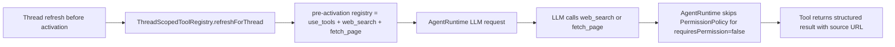
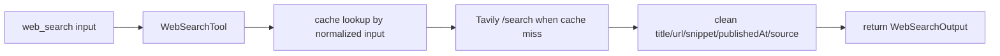
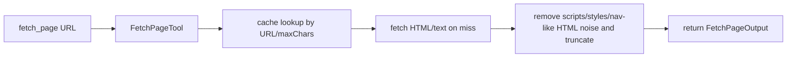

# Websearch Tool Implementation Plan

## Default websearch tools use case

### Goal

实现 `web_search` 与 `fetch_page`。它们在 thread 未激活时和 `use_tools` 一起暴露，激活后仍保持可用，并且调用时跳过普通 permission ask。

### Existing Flow Inventory

- `apps/agent-server/src/actions/ThreadScopedToolRegistry.ts` 维护 thread 级工具表：未激活默认只暴露 `use_tools`，激活后暴露 builtin + MCP + dynamic tools。
- `packages/core/src/tools/MetaToolUseTool.ts` 是唯一现有 pre-activation 工具。
- `packages/core/src/runtime/AgentRuntime.ts` 在 `handleToolCall` 中对 `use_tools` 做硬编码短路，跳过 `PermissionPolicy.check`。
- `packages/core/src/tools/defineTool.ts` 是 builtin tool 的 schema 与运行时校验工厂，可复用。

### Core structure

```ts
type WebSearchInput = {
  query: string;
  maxResults?: number;
  freshness?: "day" | "week" | "month" | "year" | "any";
  includeDomains?: string[];
  excludeDomains?: string[];
};

type WebSearchResult = {
  title: string;
  url: string;
  snippet: string;
  publishedAt?: string;
  source?: string;
};

type WebSearchOutput = {
  query: string;
  results: WebSearchResult[];
};

type FetchPageInput = {
  url: string;
  maxChars?: number;
};

type FetchPageOutput = {
  url: string;
  title?: string;
  content: string;
  source?: string;
  fetchedAt: string;
};
```

新增 core web 工具模块：

- `WebSearchTool.create(deps)`：调用 Tavily Search API，清洗结果并缓存。
- `FetchPageTool.create(deps)`：抓 URL，去脚本/样式/HTML 标签，压缩空白并截断。
- `WEBSEARCH_DEFAULT_TOOLS` 或工厂函数：供 agent-server 作为默认公开工具注入。

`AgentTool` 增加 `requiresPermission?: boolean`，默认 `true`。`web_search`、`fetch_page` 和 `use_tools` 设为 `false`；runtime 在普通 permission 分支前检查该字段。

### Use case map







### Integration tests to create

- `apps/agent-server/tests/thread/ThreadScopedToolRegistry.test.ts`：验证未激活 thread 默认暴露 `use_tools`、`web_search`、`fetch_page`；激活后仍包含 websearch 工具但不包含 `use_tools`。
- `packages/core/tests/tools/websearch-use-cases.test.ts`：用 fake fetch 覆盖 Tavily 请求字段、搜索结果结构化、缓存命中，以及 `fetch_page` 的正文清洗和缓存。
- `packages/core/tests/permission/security-use-cases.test.ts`：验证 `requiresPermission: false` 工具调用不触发 `PermissionPolicy.check`，并能完成 runtime tool flow。

### Implementation tasks

1. 扩展 `AgentTool` / `defineTool`，支持 `requiresPermission?: boolean`。
2. 新增 `WebSearchTool`、`FetchPageTool` 和共享缓存/清洗逻辑。
3. 在 `ThreadScopedToolRegistry` 中注入默认公开工具，生产组合根使用 websearch 工厂。
4. 在 `AgentRuntime` 中让 `requiresPermission === false` 跳过权限审批。
5. 更新工具、runtime、agent-server actions 文档和 `docs/manual-qa.md`。
