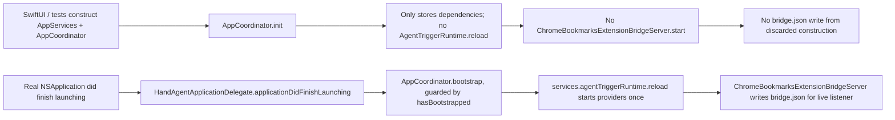

# AgentTrigger Bridge Endpoint 修复计划

## 避免构造期写入失效 bridge endpoint

### Goal

修复 Chrome Bookmarks AgentTrigger bridge endpoint 与实际监听端口不一致的问题。构造 `AppServices` / `AppCoordinator` 不应启动 AgentTrigger provider 或写 `bridge.json`；只有真实 app lifecycle 的 `bootstrap()` 才能启动 provider，并且 `bootstrap()` 必须幂等，避免重复启动覆盖当前 endpoint。

### Existing Flow Inventory

- `HandAgentApp` 创建 `AppCoordinator` 并交给 `HandAgentApplicationDelegate`。
- `AppCoordinator.bootstrap()` 已负责启动外观监听、PromptPanel 回调、热键和 app-server health。
- `AppServices.init` 当前会 `ensureBuiltinPackagesInstalled()`、安装 Chrome native host manifest，并立即 `agentTriggerRuntime.reload()`。
- `AgentTriggerRuntime.reload()` 会启动所有已安装 provider；Chrome provider 启动 `ChromeBookmarksExtensionBridgeServer` 并写 `~/.spotAgent/agent-triggers/chrome-bookmarks-extension/bridge.json`。
- Settings 只读取 `status.json` / `folders.json` / `bridge.json` 展示连接与表单状态，不应负责启动 bridge。

### Core Structure

- `AppCoordinator`
  - 新增 `hasBootstrapped: Bool`，`bootstrap()` 重复调用直接返回。
  - `init` 只保存依赖和构造 lifecycle，不执行 `bootstrap()`。
  - `bootstrap()` 中调用 `try? services.agentTriggerRuntime.reload()`，使 AgentTrigger provider 与其他应用启动副作用同属真实 lifecycle。
  - `shutdown()` 继续停止 app-server / window lifecycle；如有必要补充 AgentTrigger runtime stop 能力。
- `HandAgentApplicationDelegate`
  - `applicationDidFinishLaunching` 调用 `coordinator?.bootstrap()`。
  - termination 仍幂等调用 `coordinator?.shutdown()`。
- `AppServices`
  - 将 `agentTriggerRuntime` 的公开依赖类型收窄为 `AgentTriggerRuntimeReloading & AgentTriggerSubmitting`，生产实现仍用 `AgentTriggerRuntime`，测试可注入 recording runtime。
  - 保留内置 manifest ensure 和 native host manifest install。
  - 移除构造期 `agentTriggerRuntime.reload()`。

### Use Case Map

### Integration Tests

- `apps/desktop/TestsSwift/AppServices/AppServicesTests.swift`
  - Add a test that injects a recording `AgentTriggerRuntimeReloading & AgentTriggerSubmitting` into `AppServices(...)` and verifies construction does not call `reload()`.
- `apps/desktop/TestsSwift/Coordinator/AppCoordinatorTests.swift`
  - Add/update tests to verify `bootstrap()` calls `agentTriggerRuntime.reload()` exactly once even if called repeatedly.
  - Update the app-server start test to call `bootstrap()` explicitly.
- `apps/desktop/TestsSwift/HandAgentAppTests.swift`
  - Add/update a lifecycle test that `applicationDidFinishLaunching` bootstraps the coordinator and termination still shuts down once.

### Implementation Tasks

1. Add test doubles for recording AgentTrigger runtime reloads.
2. Write failing tests for constructor-no-reload and bootstrap-idempotent reload.
3. Move `agentTriggerRuntime.reload()` from `AppServices.init` to `AppCoordinator.bootstrap()`.
4. Remove automatic `bootstrap()` from `AppCoordinator.init`; call it from `HandAgentApplicationDelegate.applicationDidFinishLaunching`.
5. Run targeted Swift tests, then full verification.
