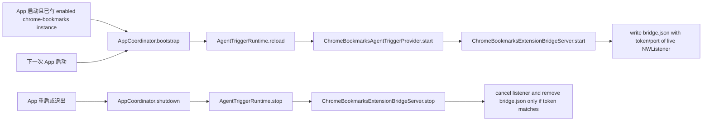

# AgentTrigger Bridge 重启 Endpoint 修复计划

## 已保存实例重启后 endpoint 仍指向 live listener

### Goal

修复 `AgentTrigger bridge endpoint 生命周期回归` 手工 QA 发现的重启缺陷：桌面 App 重启且已有 enabled Chrome Bookmarks 实例时，`bridge.json` 可能被改写到当前 HandAgentDesktop 没有监听的端口，导致 native host 读取当前 token 后无法连接。

### Existing Flow Inventory

- `HandAgentApplicationDelegate.applicationDidFinishLaunching` 调用 `AppCoordinator.bootstrap()`。
- `AppCoordinator.bootstrap()` 幂等调用 `services.agentTriggerRuntime.reload()`，并启动 app-server health。
- `AgentTriggerRuntime.reload()` 会停止当前 `activeProviders`，再为已安装 provider 创建并启动新 provider；Chrome Bookmarks provider 会启动 `ChromeBookmarksExtensionBridgeServer`。
- `ChromeBookmarksExtensionBridgeServer.start()` 等待 `NWListener` ready 后写入 `~/.spotAgent/agent-triggers/chrome-bookmarks-extension/bridge.json`。
- `AppCoordinator.shutdown()` 当前停止 appearance、hotkey、app-server 和窗口 lifecycle，但没有停止 AgentTrigger runtime。
- `ChromeBookmarksExtensionBridgeServer.stop()` 当前只 cancel listener 并清空内存状态，不会让自己写出的 `bridge.json` 失效。

### Core Structure

- `AgentTriggerRuntimeReloading`
  - 扩展为运行期 lifecycle 协议，新增 `stop() throws`。
  - `AgentTriggerRuntime.stop()` 停止所有 `activeProviders` 并清空字典。
  - `reload()` 复用 `stop()`，保持“先停旧 provider，再启动当前 installed provider”的语义。
- `AppCoordinator`
  - `shutdown()` 幂等停止 AgentTrigger runtime，保证 App 退出或重启时 Chrome bridge listener 不残留。
- `ChromeBookmarksExtensionBridgeServer`
  - `stop()` 取消 listener 时同步使当前实例写出的 `bridge.json` 失效，避免磁盘保留无 live listener 的 endpoint。
  - 删除 endpoint 必须校验 token 归属：只删除磁盘上 token 等于本实例 token 的文件，避免旧 listener 停止时误删新 listener 已写入的 endpoint。
  - `deinit` 调用同一 stop 路径，兜住短生命周期 server 释放但未显式 stop 的情况。

### Use Case Map

### Integration Tests

- `apps/desktop/TestsSwift/Coordinator/AppCoordinatorTests.swift`
  - 新增或扩展 lifecycle 测试：`bootstrap()` 后 `shutdown()` 必须调用 `agentTriggerRuntime.stop()` 一次，重复 shutdown 不重复停止。
- `apps/desktop/TestsSwift/AppServices/AgentTriggerRuntimeTests.swift`
  - 新增 runtime lifecycle 测试：`stop()` 会停止所有 active providers 并清空状态，随后 `reload()` 能重新启动当前 provider。
- `apps/desktop/TestsSwift/AppServices/ChromeBookmarksExtensionBridgeServerTests.swift`
  - 新增 endpoint 生命周期测试：`start()` 写出的 endpoint 可请求成功；`stop()` 后该 endpoint 文件被删除或不再存在。
  - 新增 token 归属测试：server A stop 时，如果磁盘 endpoint 已由 server B 的 token 覆盖，server A 不得删除 server B 的 endpoint。

### Implementation Tasks

1. 先写上述失败测试，确认当前实现缺少 runtime stop 与 endpoint 失效能力。
2. 扩展 AgentTrigger runtime lifecycle 协议与测试替身。
3. 在 `AppCoordinator.shutdown()` 中停止 AgentTrigger runtime，并保持 shutdown 幂等。
4. 为 `ChromeBookmarksExtensionBridgeServer.stop()` 增加 token 归属校验与 endpoint 清理；补充 `deinit` 兜底。
5. 更新 `app-services.md`、`coordinator.md`、`manual-qa.md` 中与 AgentTrigger lifecycle 相关的描述。
6. 运行 targeted Swift 测试，再运行 `bash ./scripts/test.sh`、`bash ./scripts/swiftw test`、`bash ./scripts/swiftw build`。
