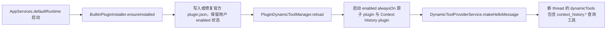
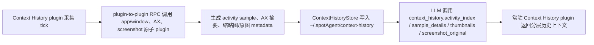

# Context History Plugin Implementation Plan
> 历史方案，已被 [Issue #4](https://github.com/Lixuhang987/Wisp-Pocket/issues/4) 替代。本文保留当时设计用于追溯；Context History 的 manifest、安装器、进程和 RPC 实施步骤不再是当前约束，也不能作为功能通过实机验证的证据。当前所有权与行为从 [Host Automation](../../../apps/host-automation/host-automation.md) 进入。

## 官方 Context History plugin 启用与采集闭环

### Goal

实现内置官方 Context History plugin 的第一条完整闭环：Swift desktop 在启动时安装或修复官方 plugin manifest；用户显式启用后，Swift desktop 启动 AX、screenshot、app/window 原子 plugin 与 always-on Context History plugin；Context History plugin 通过常驻 plugin RPC 执行采集，写入 `~/.spotAgent/context-history`，并把查询类 dynamic tools 暴露给新 thread。

### Existing Flow Inventory

- 复用 `apps/desktop/Sources/AppServices/PlatformBridge/PluginDynamicTools.swift` 的 manifest 扫描、dynamic tool spec 聚合、lifecycle 管理和 `/api/dynamic-tools` tool call 路由。
- 扩展 `PluginManifestStore`，让它支持官方 plugin 安装/修复与 `enabled` 状态。保留 `~/.spotAgent/plugins/<id>/plugin.json` 作为 manifest 入口。
- 扩展 `ProcessPluginLifecycleManager` 与 executor：`alwaysOn` plugin 的 tool 调用必须走已启动进程的 stdin/stdout RPC；`onDemand` / `toolsOnly` 可继续使用现有一次性执行路径。
- 新增内置 Swift plugin 可执行 target，位于 `apps/builtin-plugins/`，通过 `Package.swift` 随产品构建。
- 不修改 agent-server dynamic tools 路由；agent-server 仍只按 `clientId = swift-host` 转发。

### Core structure

```swift
enum PluginLifecycle: String {
    case alwaysOn
    case onDemand
    case toolsOnly
}

enum PluginKind: String {
    case dynamicTool
    case automation
    case atomicCapability
}

struct PluginManifestDefinition {
    let version: Int
    let id: String
    let title: String
    let description: String?
    let lifecycle: PluginLifecycle
    let kind: PluginKind
    let enabled: Bool
    let command: String
    let args: [String]
    let tools: [PluginToolDefinition]
    let provides: [String]
    let requires: [String]
    let dataDirectoryName: String?
    let directoryURL: URL
}

struct BuiltinPluginDefinition {
    let id: String
    let manifest: [String: Any]
}

struct ContextHistorySample: Codable {
    let id: String
    let timestamp: Date
    let app: [String: JSONValue]
    let window: [String: JSONValue]
    let axSummaryId: String?
    let screenshotThumbnailId: String?
}

protocol PluginLifecycleProcessManaging {
    func start(_ manifest: PluginManifestDefinition) throws
    func stop(pluginId: String)
    func invokeRunningPlugin(
        manifest: PluginManifestDefinition,
        payload: [String: Any]
    ) async throws -> PluginToolInvocationResult
}
```

官方 plugin manifest：

- `handagent-atomic-app-window`：`kind = atomicCapability`，`lifecycle = alwaysOn`，提供 `app_window.frontmost`、`app_window.list_windows`。
- `handagent-atomic-screenshot`：`kind = atomicCapability`，`lifecycle = alwaysOn`，提供 `screenshot.capture`、`screenshot.thumbnail`。
- `handagent-atomic-ax`：`kind = atomicCapability`，`lifecycle = alwaysOn`，提供 `ax.snapshot`、`ax.action`。
- `handagent-context-history`：`kind = dynamicTool`，`lifecycle = alwaysOn`，`enabled = false` 默认关闭；依赖上述三个原子 plugin；提供 `context_history.activity_index`、`context_history.sample_details`、`context_history.thumbnails`、`context_history.screenshot_original`。

### Use case map





- Integration test need to create: `apps/desktop/TestsSwift/AppServices/PlatformBridge/ContextHistoryPluginTests.swift`
  - 创建临时 home 与 plugins 目录。
  - 调用官方 installer，断言四个官方 manifest 被写入，Context History 默认 `enabled = false`，三个原子 plugin 默认 `enabled = true`。
  - 将 Context History manifest 切为 `enabled = true` 后 reload，断言 manager 启动四个 always-on plugin，provider hello 包含 `context_history.*` 工具。
  - 通过 fake lifecycle running RPC 调用 `context_history.activity_index`，断言请求没有另起进程 executor，而是进入常驻 plugin RPC，并返回查询结果。
- Integration test need to create: `apps/builtin-plugins/Tests/ContextHistoryPluginCoreTests.swift` 或 SwiftPM 对应 test target
  - 用 fake 原子 plugin client 驱动一次 app/window 变化采样与一次分钟截图采样。
  - 断言 `~/.spotAgent/context-history` 中写入 activity index、sample detail、thumbnail file path metadata、original screenshot file path metadata。
  - 断言四个 dynamic tool 分层返回：index 不包含完整 AX/图片，details 批量返回 AX 摘要，thumbnail 按时间范围查询返回缩略图引用或内容，original 只按单个 screenshot id 返回原图。

### Implementation tasks

1. 扩展 plugin manifest schema：新增 `kind`、`enabled`、`provides`、`requires`、`dataDirectoryName`，旧 manifest 默认 `kind = dynamicTool`、`enabled = true`。
2. 新增 `BuiltinPluginInstaller`，在 `AppServices.defaultRuntime` 创建 `PluginDynamicToolManager` 前写入/修复四个官方 plugin manifest。
3. 修改 `PluginDynamicToolManager.reload()`：只聚合 enabled plugin 的 dynamic tools；只启动 enabled always-on plugin；禁用或移除时停止进程。
4. 修改 always-on tool 调用路径：优先对 running process 发送 newline-delimited JSON RPC；`onDemand` / `toolsOnly` 保持现有一次性调用。
5. 新增内置原子 plugin 与 Context History plugin 的可执行 target；第一版允许原子 plugin 复用现有 `MacPlatformProvider` 能力实现，但必须通过 plugin RPC 边界暴露。
6. 实现 Context History store 与采集调度：app/window 变化采样、30 秒静止采样、1 分钟截图采样、保留策略。
7. 实现四个 `context_history.*` dynamic tools 的分层查询。
8. 更新 `platform-bridge.md`、`app-services.md`、`Package.swift` 相关索引和 `docs/manual-qa.md`。

### Self-review

- 没有把采集内容注入 thread 初始上下文；只通过 dynamic tools 返回。
- 没有把 Context History 采集循环写进 Swift desktop；desktop 只安装、启停和桥接。
- 没有绕过现有 `/api/dynamic-tools`；agent-server 不新增 plugin spawn 责任。
- 计划把 AX/screenshot/app-window 作为必做原子 plugin，而不是后续增强。
