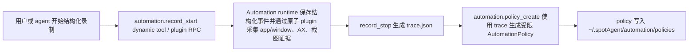
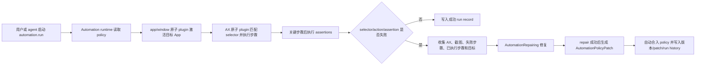
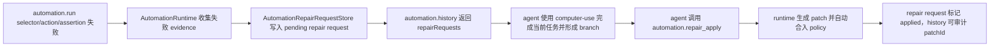

# Self-Evolving Automation Implementation Plan

## Automation Policy runtime 录制、执行与自进化闭环

### Goal

在 Context History 的原子 plugin 基础上，新增独立 Automation plugin runtime。第一阶段由 runtime API 接收结构化操作事件并采集前后证据，再基于 trace 创建受限 Automation Policy；运行时解释执行受限 policy，优先走 AX selector 与断言；失败时收集 AX 树、截图、失败步骤、已执行步骤和目标，保存 agent/computer use repair request；repair fallback 成功后生成可审计 policy patch，并自动合入当前 policy 版本。

### Existing Flow Inventory

- 复用 `PluginDynamicToolManager` 的官方 plugin 安装、enabled always-on lifecycle 和常驻 plugin RPC。
- 复用 Context History plan 中的 AX、screenshot、app/window 原子 plugin，通过 plugin-to-plugin RPC 获取桌面状态和执行 AX 动作。
- 新增 Automation runtime 作为官方 always-on plugin，不放进普通 `host_macos.*` provider，也不把 Automation Policy 当作任意 Swift 代码执行。
- 第一版 agent repair 的边界通过 injectable `AutomationRepairing` protocol 表达；生产实现可先返回 structured repair request，后续接入真实 agent/computer use。

### Core structure

```swift
struct AutomationPolicy: Codable {
    let id: String
    var version: Int
    var title: String
    var target: AutomationTarget
    var branches: [AutomationBranch]
    var failureFallback: AutomationFallback
}

struct AutomationBranch: Codable {
    let id: String
    var conditions: [AutomationCondition]
    var steps: [AutomationStep]
    var assertions: [AutomationAssertion]
}

enum AutomationStep: Codable {
    case activateApp(bundleId: String?)
    case click(selector: AXSelector)
    case setValue(selector: AXSelector, value: String)
    case typeText(String)
    case hotkey([String])
    case waitFor(AutomationCondition, timeoutMs: Int)
}

struct AutomationRunRecord: Codable {
    let id: String
    let policyId: String
    let policyVersion: Int
    let startedAt: Date
    var steps: [AutomationStepRecord]
    var failure: AutomationFailure?
    var repair: AutomationRepairResult?
}

struct AutomationPolicyPatch: Codable {
    let id: String
    let sourceRunId: String
    let basePolicyVersion: Int
    let branch: AutomationBranch
    let evidence: AutomationEvidence
}
```

存储路径：

- `~/.spotAgent/automation/policies/<policy-id>.json`
- `~/.spotAgent/automation/runs/<run-id>.json`
- `~/.spotAgent/automation/traces/<trace-id>/trace.json`
- `~/.spotAgent/automation/patches/<patch-id>.json`
- `~/.spotAgent/automation/repair-requests/<repair-request-id>.json`

官方 plugin manifest：

- `handagent-automation-runtime`：`kind = automation`，`lifecycle = alwaysOn`，默认 `enabled = false`；依赖 `app_window`、`ax`、`screenshot`；提供 `automation.record_start`、`automation.record_event`、`automation.record_stop`、`automation.policy_create`、`automation.run`、`automation.history`、`automation.apply_patch`、`automation.repair_apply`。

### Use case map





- Integration test need to create: `apps/builtin-plugins/Tests/AutomationRuntimeTests.swift`
  - 用 fake app/window、AX、screenshot plugin client 执行一条 policy：激活 app、点击 selector、set value、断言成功。
  - 断言运行记录包含目标、步骤、AX/截图引用、成功状态。
  - 构造 selector 失败，fake repair 返回成功分支；断言 runtime 生成 patch、自动合入 policy version + 1，并写入 patch evidence 与 run repair 结果。
- Integration test need to update: `apps/desktop/TestsSwift/AppServices/PlatformBridge/PluginDynamicToolsTests.swift`
  - 官方 installer 写入 Automation runtime manifest，默认 `enabled = false`。
  - 覆盖 Automation manifest 的 `alwaysOn`、`kind = automation`、原子 plugin 依赖和 `automation.*` tool 集合。
  - always-on plugin 的 reload / 常驻 RPC 路由行为沿用同文件中的通用 lifecycle 测试覆盖；Automation runtime 的 tool 路由、policy 执行和 history 由 `AutomationRuntimeTests.swift` 覆盖。

### Implementation tasks

1. 在官方 plugin installer 中加入 `handagent-automation-runtime` manifest，默认关闭，声明 `kind = automation` 和原子 plugin 依赖。
2. 新增 Automation runtime core：policy schema、trace schema、run record、patch schema、JSON store。
3. 实现受限 policy interpreter：目标 app 激活、AX selector 匹配、click/set value/type/hotkey/wait/assertion。
4. 实现录制 trace 存储接口：第一版以 runtime API 接收 structured user events，并在每个 event 前后读取 app/window、AX、截图引用。
5. 实现 failure collection 与 `AutomationRepairing` 边界：失败时收集当前 AX tree、截图、失败步骤、已执行步骤和目标。
6. 实现 repair 成功后的 patch 生成与自动合入：更新 policy version，保存 patch、run history 和证据引用。
7. 暴露 `automation.*` dynamic tools：record_start、record_event、record_stop、policy_create、run、history、apply_patch；第二阶段追加 repair_apply。
8. 更新 `platform-bridge.md`、`app-services.md`、builtin plugin 文档和 `docs/manual-qa.md`。

### Self-review

- Automation runtime 是独立 plugin，不混入普通 dynamic tool plugin 的进程模型。
- Automation Policy 是受限 JSON policy，不允许 AI 直接生成并执行任意 Swift 代码。
- 运行时优先用 AX selector 与断言，失败才进入 repair。
- repair 成功后自动合入 patch，不要求用户审核。
- 不把 Context History 和 Automation 合并；它们只共享原子 plugin 能力。

## 第二阶段：agent/computer-use repair 队列与回填闭环

### Goal

把第一阶段的 repair request 从“仅落盘”推进为 agent 可消费、可回填的 runtime 队列。`automation.run` 失败时仍收集当前 app/window、AX、截图、失败步骤、已执行步骤和目标，并保存 repair request；`automation.history` 必须返回 pending repair requests，让 agent 可以发现需要 computer-use 介入的失败运行。agent / computer-use 完成当前任务后，通过新的 repair result 入口提交可执行 branch，runtime 生成 `AutomationPolicyPatch`、自动合入 policy，并把 repair request 标记为 applied。

这一阶段仍不把 plugin 进程直接连到 `/api/thread`，也不让 Automation runtime 自己驱动 LLM。agent 触发与 computer-use 执行由当前 thread/tool 体系承担；Automation runtime 负责提供可审计的 request/result 数据边界和自动合入语义。

### Existing Flow Inventory

- 复用 `AutomationRepairRequestStore.saveRepairRequest` 的 request 落盘能力，扩展为可列举、可加载、可标记状态的 repair request store。
- 复用 `AutomationToolRouter.history` 作为 agent 查看运行历史的入口，追加 `repairRequests`，避免新增仅用于列表的 tool。
- 复用 `AutomationStore.applyPatch` 的 policy version + patch 落盘语义；新增 repair result 入口只负责从 agent 返回的 branch 构造 patch 并调用 apply。
- 不绕过 dynamic tool provider：agent 仍通过 `automation.*` tool 调用 runtime。

### Core structure

```swift
struct AutomationRepairRequestRecord: Codable {
    let id: String
    let status: String // pending | applied
    let policyId: String
    let runId: String
    let failedStepIndex: Int
    let completedSteps: [[String: JSONValue]]
    let appWindow: [String: JSONValue]
    let axSnapshot: [String: JSONValue]
    let screenshot: [String: JSONValue]
    var patchId: String?
    var appliedAt: String?
}

automation.history -> {
  runs: [...],
  patches: [...],
  repairRequests: [AutomationRepairRequestRecord]
}

automation.repair_apply({
  repairRequestId,
  branch: { id, steps, assertions },
  evidence: { ... }
}) -> {
  policy,
  patch,
  repairRequest
}

// 非 pending repair request 必须拒绝，避免同一个 agent/computer-use
// repair result 重复合入并重复递增 policy version。
```

### Use case map



- Integration test need to update: `apps/builtin-plugins/Tests/AutomationRuntimeTests.swift`
  - 构造失败 policy，断言 `automation.history` 返回 pending repair request，包含 runId、failedStepIndex、completedSteps、appWindow、axSnapshot、screenshot。
  - 调用 `automation.repair_apply`，传入 agent/computer-use 生成的 branch，断言 policy version + 1、patch 写入、repair request status 变为 applied，并在 history 中带 patchId。

### Implementation tasks

1. 扩展 repair request 存储：列举、加载、标记 applied，保存时包含 `status = pending`。
2. 扩展 `automation.history` 返回 `repairRequests`。
3. 新增 `automation.repair_apply` tool 路由：解析 `repairRequestId`、branch、evidence，只允许 pending request 构造 patch、调用 `AutomationStore.applyPatch` 并标记 request applied；已 applied request 必须拒绝，避免重复合入。
4. 更新官方 Automation manifest tool 列表、desktop manifest 测试、builtin plugin 文档和 manual QA。
