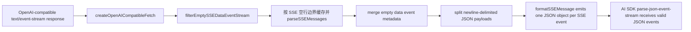

# Websearch SSE Parser Fix Implementation Plan

## Responses SSE NDJSON payload use case

### Goal

修复 OpenAI-compatible Responses 流式响应中，同一个 SSE `data` payload 内包含多个换行分隔 JSON 对象时，AI SDK JSON parser 抛错导致 tool call 不进入 `AgentRuntime` 的问题。

### Existing Flow Inventory

- `VercelClient` 创建 OpenAI-compatible provider 时总是通过 `createOpenAICompatibleFetch` 包装 fetch。
- `createOpenAICompatibleFetch` 只处理 `text/event-stream` response，并把 body 交给 `filterEmptySSEDataEventStream`。
- `filterEmptySSEDataEvents` 当前只兼容“`event:*` + 空 `data:` 被拆成独立事件”的网关形态。
- 真实 QA 失败边界是同一 `data` payload 内出现 `{"type":"response.output_item.done"...}\n{"type":"response.completed"...}`，AI SDK 将其作为单个 JSON 解析并失败。

### Core structure

```ts
function filterEmptySSEDataEvents(raw: string): string;

type EventSourceMessage = {
  id?: string;
  event?: string;
  data: string;
};
```

扩展点保持在 `VercelAdapters.ts` 内：在空 data/event 合并之后，将每个 `EventSourceMessage` 的 `data` 归一化。如果 `data` 的每个非空行都是独立 JSON 对象，则拆成多条 SSE message；否则保持原样，避免破坏普通多行文本数据。streaming 包装层必须按完整 SSE message 边界处理，而不是按普通换行处理，避免 provider / HTTP 层把连续 `data:` 行拆到不同网络 chunk 后重新被 AI SDK 合并为单个 JSON payload。

### Use case map



### Integration test to create

- `packages/core/tests/llm/vercel-client.test.ts`
  - Add a use-case test under `VercelClient adapters`.
  - Input SSE text has two `data:` lines in one event, each containing a complete Responses JSON object.
  - Expected output is two separate SSE events separated by a blank line, preserving existing event/id metadata where present.
  - Add a streaming wrapper test where an empty `data:` metadata event and its following JSON `data:` event arrive in separate network chunks; expected output preserves the metadata.
  - Add a streaming wrapper test through `createOpenAICompatibleFetch` where those two `data:` lines arrive in separate network chunks; expected output still contains two complete SSE messages.
  - Add a negative adapter test proving ordinary multiline data and non-object JSON payloads stay intact.
  - Keep existing empty-data compatibility tests green.

### Implementation tasks

1. Add the failing adapter test.
2. Extend `filterEmptySSEDataEvents` with a small helper that splits newline-delimited JSON payloads only when every non-empty line parses as JSON.
3. Change the streaming wrapper to feed chunks through `eventsource-parser` and emit complete normalized SSE messages, carrying pending empty event metadata across chunk boundaries.
4. Run targeted LLM tests and full `bash ./scripts/test.sh`.
5. Update `packages/core/src/llm/llm.md` to mention both Responses SSE compatibility shapes and the streaming boundary requirement.
6. Re-run live QA for the original Websearch item; if it passes, move the item from `docs/bugs.md` to `docs/archive.md` or record any remaining defect.
