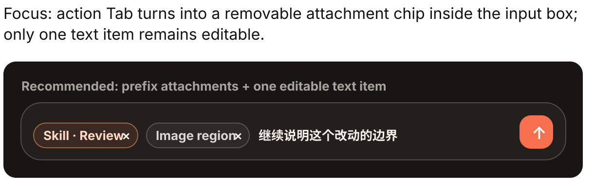
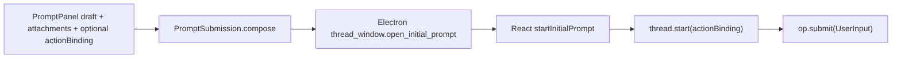
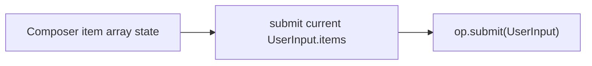

# 输入框 Item 化与 Plugin 删除实现计划

## 参考视觉



这张图是实现验收标准之一：Tab 选中的 action 必须变成输入框内部的可删除 chip；React composer 的真实状态必须是 item array；数组中只有一个可编辑 `text` item，所有 chip 都渲染在它前面。

## 修改范围与职责

本计划围绕一个主用例展开：用户把 action/skill、附件和文本组成一个输入框 item 数组，提交后由 core/server 解析成 runtime 用户消息。

涉及目录：

- `apps/thread-window-web/`：React ThreadWindow 的 Composer、socket client、协议编码、store queue preview。这里必须把输入框自身抽象成 item array，并负责 chip 显示、chip 删除、唯一 text item 编辑。
- `apps/desktop/`：PromptPanel action、Settings、Swift 到 Electron 的 initial prompt payload。这里负责删除 action 参数、删除 Plugin 页，并让 action Tab/快捷键追加 skill item。
- `apps/electron-shell/`：Swift command bridge 的 initial prompt payload guard。这里只做字段删除和类型守卫同步。
- `apps/agent-server/`：thread.start 路由、thread persistence、tool scope、用户输入内容组合。这里负责删除 actionBinding 和 plugin-scoped MCP，并把 `UserInput.items` 转成持久化/runtime content。
- `packages/core/`：跨进程协议与 action manifest 解析。这里负责删除 plugin/actionBinding 类型，保留 `SkillInputItem` 作为输入 item；thread 持久化 metadata 清理落在 `@handagent/thread-store`。
- `examples/`、`docs/`、各级 `<dir>.md`：删除 plugin 文档，更新 append prompt/skill prompt schema 与手工 QA。

## 现有流盘点

当前首轮输入流：



本次复用这个流，但删除 `actionBinding`，并把 action 结果合并进 `UserInput.items`。

当前 React 后续输入流：


本次扩展这个流为：



不新增提交通道。

## 用例 1：React Composer 以 Item Array 作为真实输入状态 Integrate Test

`/Users/mu9/proj/handAgent/.worktrees/input-items-action-plugin-removal/apps/thread-window-web/tests/composerInputItems.test.tsx`

> **For agentic workers:** REQUIRED SUB-SKILL: Use superpowers:subagent-driven-development to make the test work.

测试目标：Composer 自身维护 item array，chip 显示与数组一致，提交原样发送数组。

建议测试代码语义：

```tsx
test("submits the composer item array with skill chips before the editable text item", async () => {
  const submitted: UserInput[] = [];
  render(
    <Composer
      disabled={false}
      stopDisabled={true}
      inputItems={[
        { type: "skill", id: "skill-1", actionId: "review", title: "Review", prompt: "Review this code" },
        { type: "text", id: "text-1", text: "focus on regressions" },
      ]}
      onInputItemsChange={setItems}
      onSubmit={(input) => submitted.push(input)}
      onStop={() => {}}
    />,
  );

  expect(screen.getByText("Review")).toBeVisible();
  expect(screen.getByDisplayValue("focus on regressions")).toBeVisible();
  await user.click(screen.getByTitle("发送"));

  expect(submitted).toEqual([{
    items: [
      { type: "skill", id: "skill-1", actionId: "review", title: "Review", prompt: "Review this code" },
      { type: "text", id: "text-1", text: "focus on regressions" },
    ],
  }]);
});
```

实现能力：

- `Composer` props 从 `onSubmit(text: string)` 改为 `onSubmit(userInput: UserInput)` 或等价 item array。
- `Composer` 渲染非 text item chip，唯一 textarea 绑定 text item。
- 删除 chip 更新 item array。
- text 开头 Backspace 删除前一个 chip。
- 空 text 但有 skill/attachment 时允许提交。

## 用例 2：React 后续输入与运行态队列沿用 UserInput.items Integrate Test

`/Users/mu9/proj/handAgent/.worktrees/input-items-action-plugin-removal/apps/thread-window-web/tests/threadWindowStore.test.ts`

> **For agentic workers:** REQUIRED SUB-SKILL: Use superpowers:subagent-driven-development to make the test work.

测试目标：运行态排队和 preview 不把 item array 退化为纯文本。

```ts
test("queues and previews composer input items without flattening to text", () => {
  const userInput = {
    items: [
      { type: "skill", id: "skill-1", actionId: "explain", title: "Explain", prompt: "Explain this" },
      { type: "text", id: "text-1", text: "with edge cases" },
    ],
  };

  store.getState().queueComposerInput("thread-1", {
    type: "user_input",
    opId: "op-1",
    timestamp: "2026-06-12T00:00:00.000Z",
    payload: userInput,
  });

  expect(selectQueuedPreview(store.getState(), "thread-1")).toContain("Explain");
  expect(selectQueuedPreview(store.getState(), "thread-1")).toContain("with edge cases");
});
```

实现能力：

- `ThreadWorkspacePane` / `App` 把 Composer 的 `UserInput` 直接提交或排队。
- `queuedInputPreview` 按 item array 生成摘要，skill chip 优先显示 title，不再只显示 prompt。
- `createUserInputFromText` 从 Composer 主路径删除；若测试仍需要文本输入构造，改成普通测试 helper，不保留产品兼容语义。

## 用例 3：Swift PromptPanel Action 追加 Skill Item Integrate Test

`/Users/mu9/proj/handAgent/.worktrees/input-items-action-plugin-removal/apps/desktop/TestsSwift/PromptPanel/PromptPanelViewModelTests.swift`

> **For agentic workers:** REQUIRED SUB-SKILL: Use superpowers:subagent-driven-development to make the test work.

测试目标：Tab 选中 action 后不提交、不预填参数，而是追加 skill item，保留输入焦点和后续文本能力。

```swift
func testSubmitSelectedActionAppendsSkillItemWithoutSubmittingThread() {
    let action = ActionDefinition.skill(
        id: "append:review",
        trigger: "review",
        title: "Review",
        description: nil,
        prompt: "Review this code",
        defaultShortcut: nil,
        submission: .appendSkill
    )
    let viewModel = PromptPanelViewModel(actions: [action])

    viewModel.submitSelectedAction()

    guard case .skill(_, "append:review", "Review", "Review this code") = viewModel.inputItems[0] else {
        XCTFail("expected first item to be a skill chip")
        return
    }
    guard case .text(_, "") = viewModel.inputItems[1] else {
        XCTFail("expected second item to be the editable text item")
        return
    }
    XCTAssertNil(submittedPrompt)
}
```

实现能力：

- PromptPanel ViewModel 引入输入 item array 或等价 `skillItems + draft` 状态，但对外提交为 `PromptUserInput.items`。
- `ActionSubmission` 删除 `.plugin`，新增/保留 `.appendSkill`。
- `ActionDefinition` 删除 `arguments`，保留 trigger/title/description/prompt/defaultShortcut。
- `ActionInvocation` 收敛为 trigger 匹配，不再解析 bracket 参数和 placeholder。
- `PromptPanelView` 渲染 skill chip，支持删除 chip。

## 用例 4：Initial Prompt 不再携带 ActionBinding Integrate Test

`/Users/mu9/proj/handAgent/.worktrees/input-items-action-plugin-removal/apps/desktop/TestsSwift/AppServices/ElectronShell/ElectronShellProtocolTests.swift`

`/Users/mu9/proj/handAgent/.worktrees/input-items-action-plugin-removal/apps/thread-window-web/tests/threadSocketClient.test.ts`

> **For agentic workers:** REQUIRED SUB-SKILL: Use superpowers:subagent-driven-development to make the test work.

测试目标：Swift、Electron、React 三层 initial prompt payload 都只携带 `clientRequestId` 与 `userInput`。

```swift
func testInitialPromptPayloadDoesNotEncodeActionBinding() throws {
    let payload = InitialPromptPayload(
        clientRequestId: "request-1",
        prompt: PromptSubmission(userInput: PromptUserInput(items: [.text(id: "text-1", text: "Hi")]), summary: "Hi")
    )

    let json = try JSONSerialization.jsonObject(with: JSONEncoder().encode(payload)) as! [String: Any]
    XCTAssertNil(json["actionBinding"])
}
```

```ts
test("startInitialPrompt starts a thread without actionBinding and submits the original userInput", () => {
  client.startInitialPrompt({
    clientRequestId: "request-1",
    userInput: { items: [{ type: "skill", id: "skill-1", actionId: "review", title: "Review", prompt: "Review" }] },
  });

  expect(sentThreadStart.payload).toEqual({ workspaceId: null });
  receiveThreadStarted("request-1", "thread-1");
  expect(sentOpSubmit.payload.op.payload.items[0].type).toBe("skill");
});
```

实现能力：

- 删除 Swift `ActionBindingPayload` 与 `PromptSubmission.actionBinding`。
- 删除 Electron protocol guard 中的 `isActionBinding`。
- 删除 React `InitialPromptPayload.actionBinding` 与 `encodeThreadStart.actionBinding` 参数。
- 更新 core `ThreadStartCommand` payload。

## 用例 5：agent-server 删除 Plugin Scope 后仍能启动 Thread 并提交 UserInput Integrate Test

`/Users/mu9/proj/handAgent/.worktrees/input-items-action-plugin-removal/apps/agent-server/tests/thread/ThreadCommandRouter.test.ts`

`/Users/mu9/proj/handAgent/.worktrees/input-items-action-plugin-removal/apps/agent-server/tests/thread/ThreadScopedToolRegistry.test.ts`

> **For agentic workers:** REQUIRED SUB-SKILL: Use superpowers:subagent-driven-development to make the test work.

测试目标：`thread.start` 不再解析 action binding；tool registry 激活后只组合 builtin + global MCP。

```ts
test("thread.start creates a thread without resolving action binding", async () => {
  await router.receive({
    type: "thread.start",
    commandId: "command-1",
    timestamp: "2026-06-12T00:00:00.000Z",
    payload: { workspaceId: null },
  }, "connection-1");

  expect(persistence.createThread).toHaveBeenCalledWith(undefined, null);
  expect(publisher.last.type).toBe("thread.started");
});
```

```ts
test("activated registry uses builtin and global MCP tools only", async () => {
  await registry.activate("thread-1");
  expect(listMcpTools).toHaveBeenCalledWith("global-server");
  expect(listMcpTools).not.toHaveBeenCalledWith("plugin-server");
});
```

实现能力：

- 删除 `ActionBindingResolver` 注入、源码和测试。
- `ThreadPersistence.createThread(id?, workspaceId?)` 不再接收 binding。
- `@handagent/thread-store` 删除 `ThreadActionBinding`、metadata 字段、create input 字段。
- `ThreadScopedToolRegistry.refreshForThread(threadId)` 不再接收 binding。
- server 组合根删除 plugin directory / action binding resolver 接线。

## 用例 6：UserInput.items 在 Server 侧组合成模型文本 Integrate Test

`/Users/mu9/proj/handAgent/.worktrees/input-items-action-plugin-removal/apps/agent-server/tests/protocol/MessageTranslator.test.ts`

> **For agentic workers:** REQUIRED SUB-SKILL: Use superpowers:subagent-driven-development to make the test work.

测试目标：server 侧按 item 顺序组合 skill/text/text_selection/image，而不是依赖 Swift/React 预先拼好的文本。

```ts
test("composes user input items in order before persisting the user message", async () => {
  const content = await composeUserInputContent({
    items: [
      { type: "skill", id: "skill-1", actionId: "review", title: "Review", prompt: "Review this" },
      { type: "text_selection", id: "sel-1", text: "selected code" },
      { type: "text", id: "text-1", text: "focus on regressions" },
    ],
  }, blobStore);

  expect(content).toBe("Review this\\n\\n[选区]\\nselected code\\n\\nfocus on regressions");
});
```

实现能力：

- 新增 `composeUserInputContent(userInput, blobStore)` 或调整 `composeUserContent` 接收 `UserInput`。
- `ThreadRuntimeOrchestrator` / `ThreadPersistence.appendUserInput` 使用 server 侧组合函数。
- 保持 image Blob/STUB 逻辑不回退。

## 用例 7：Settings 删除 Plugin，Append Prompt 删除参数 Integrate Test

`/Users/mu9/proj/handAgent/.worktrees/input-items-action-plugin-removal/apps/desktop/TestsSwift/Settings/AppendPromptSettingsViewModelTests.swift`

`/Users/mu9/proj/handAgent/.worktrees/input-items-action-plugin-removal/apps/desktop/TestsSwift/Settings/SettingsViewTests.swift`

> **For agentic workers:** REQUIRED SUB-SKILL: Use superpowers:subagent-driven-development to make the test work.

测试目标：Settings 不再暴露 Plugin Tab；Append Prompt 创建的 manifest 不包含 `arguments`。

```swift
func testCreateAppendPromptDoesNotWriteArguments() throws {
    XCTAssertTrue(viewModel.createPrompt(
        name: "explain",
        trigger: "explain",
        title: "Explain",
        description: "",
        template: "Explain this"
    ))

    let raw = try Data(contentsOf: manifestURL)
    let json = try JSONSerialization.jsonObject(with: raw) as! [String: Any]
    let prompts = json["prompts"] as! [[String: Any]]
    XCTAssertNil(prompts[0]["arguments"])
}
```

实现能力：

- 删除 `PluginSettingsViewModel.swift`、`PluginSettingsView.swift`、对应测试和 production/test injection。
- `SettingsTab` 删除 `.plugins`。
- `SettingsView` 删除 plugin viewModel 参数和 tab 内容。
- `AppendPromptSettingsView` 删除“必填参数”字段。
- `AppendPromptSettingsViewModel.createPrompt` 删除 `requiredArgumentName` 参数，写入 schema 不包含 `arguments`。

## 执行顺序

1. 协议与持久化清理：core `ThreadCommand`、`ThreadProtocolShared` 与 `@handagent/thread-store` 的 `SessionMeta` / 兼容派生类型确认不再包含 actionBinding。
2. agent-server 清理：ThreadCommandRouter、ThreadPersistence、ThreadScopedToolRegistry、server 组合根删除 plugin binding。
3. server 输入组合：把 `UserInput.items` 到模型文本的转换集中到 MessageTranslator/ThreadPersistence。
4. React 输入模型：Composer 改为 item array 状态，App/ThreadWorkspacePane/store/socket 同步 UserInput 提交。
5. Swift PromptPanel：ActionDefinition/ActionInvocation/ViewModel/Submission 改为追加 skill item，删除参数和 plugin 分支。
6. Settings 和示例：删除 Plugin 页，Append Prompt 删除参数，examples 改为 skill prompt。
7. 文档更新：按涉及目录更新 `<dir>.md` 链路、README、manual QA。
8. 验证：先分层测试，再全量 `bash ./scripts/test.sh`、`bash ./scripts/swiftw test`、`bash ./scripts/swiftw build`。

## 文档与 QA

实现完成后必须更新：

- `handAgent.md`
- `README.md`
- `apps/apps.md`
- `apps/thread-window-web/thread-window-web.md`
- `apps/desktop/desktop.md`
- `apps/desktop/Sources/PromptPanel/prompt-panel.md`
- `apps/desktop/Sources/Settings/settings.md`
- `apps/desktop/Sources/Coordinator/coordinator.md`
- `apps/agent-server/agent-server.md`
- `apps/agent-server/src/src.md`
- `apps/agent-server/src/actions/actions.md`
- `apps/agent-server/src/thread/thread.md`
- `packages/core/src/src.md`
- `packages/core/src/tools/tools.md`
- `packages/core/src/protocol/protocol.md`
- `packages/thread-store/thread-store.md`
- `examples/examples.md`
- `docs/manual-qa.md`

若删除某个源码目录或测试目录，也同步删除或改写对应 `<dir>.md` 中的索引。

## 风险与验证重点

- React Composer 不能只在提交时临时把 text 转 item；状态本身必须是 item array。
- 不能留下 `actionBinding` 的半截类型，否则 Swift/Electron/React/server 任一层会协议不一致。
- 删除 Plugin 页会影响 Settings 注入和测试辅助构造参数，需要一次性清理生产和测试装配。
- 删除 action 参数会影响用户手写 trigger 的行为：手写 trigger 不再特殊解析，只有 Tab/快捷键选择 action 才追加 skill chip。
- server 侧组合 `UserInput.items` 后，要确认 image STUB 与 text_selection 仍按原方式持久化。
