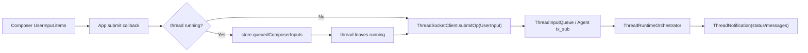
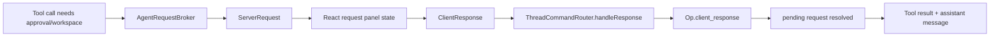
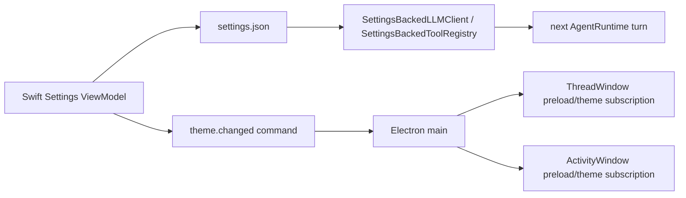
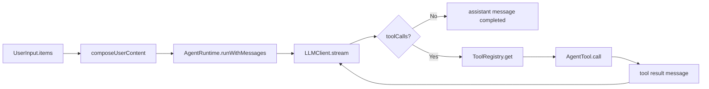

```mermaid
flowchart LR
  A["PromptSubmission(userInput)"] --> B["ElectronBackedAppServer.openInitialPrompt"]
  B --> C["InitialPromptPayload(clientRequestId,userInput)"]
  C --> D["ThreadSocketClient.startInitialPrompt"]
  D --> E["ThreadStartCommand"]
  E --> F["thread.started"]
  F --> G["Op.user_input"]
  G --> H["ThreadRuntimeOrchestrator.run"]
  H --> I["AgentRuntimeEvent"]
  I --> J["ThreadNotification + PersistedThread + AgentActivityEvent"]
```

```mermaid
flowchart LR
  A["AgentRuntime tool call"] --> B["RemotePlatformAdapter"]
  B --> C["WebSocketPlatformBridge.call"]
  C --> D["/api/platform platform_request"]
  D --> E["Swift PlatformBridgeConnectionClient"]
  E --> F["PlatformBridgeService"]
  F --> G["MacPlatformProvider"]
  G --> H["platform_response"]
  H --> I["tool_result + assistant continuation"]
```

```mermaid
flowchart LR
  A["ThreadWindow connected"] --> B["workspace.list + thread.list"]
  B --> C["ThreadCommandRouter"]
  C --> D["FileThreadStore / FileWorkspaceRegistry"]
  D --> E["workspace.listed + thread.listed"]
  E --> F["React history grouped by workspace"]
  F --> G["thread.resume / thread.delete"]
  G --> H["thread.snapshot / thread.deleted"]
  H --> I["React active thread and history state"]
```

```mermaid
flowchart LR
  A["AppCoordinator.bootstrap"] --> B["ElectronBackedAppServer.start"]
  B --> C["Electron shell process"]
  C --> D["AgentServerSupervisor"]
  D --> E["agent_server.health"]
  E --> F["ThreadWindowPrewarmer"]
  F --> G["thread_window.prepared"]
  G --> H["Swift availability true"]
  H --> I["activity_window.show"]
  I --> J["ActivityWindowController"]
```

# 用例驱动集成测试收敛计划

## 背景与目标

当前仓库自动化测试约 124 个文件：

- `packages/core/tests`：37 个。
- `apps/agent-server/tests`：18 个。
- `apps/thread-window-web/tests`：13 个。
- `apps/electron-shell/tests`：17 个。
- `apps/desktop/TestsSwift`：39 个。

目标不是简单减少文件数量，而是把测试重心从“每个内部函数一个单测”收敛到“每个核心 use case 一组集成测试”。删除测试前必须先有 use-case 集成测试覆盖同一行为；难以通过集成测试稳定复现的核心基础设施测试保留。

本计划是总计划。实际执行必须分阶段拆 worktree，每阶段都能独立验证、独立提交。

## 修改范围与职责

- `packages/core/`：runtime、tool、platform、protocol、storage、workspace、permission 的跨平台核心。保留少量核心基础设施测试；把 runtime/tool/permission/MCP 组合行为合并成 use-case 级测试。
- `apps/agent-server/`：本地 WebSocket bridge、thread route、persistence、activity、platform bridge、settings-backed registry/client。新增 server use-case harness，用真实 router/orchestrator/persistence 组合覆盖主路径。
- `apps/thread-window-web/`：React ThreadWindow UI 状态、socket client、协议编码、历史、composer、请求面板。把 store/socket/UI 分散测试收敛到用户可见工作流。
- `apps/electron-shell/`：Electron main、agent-server supervisor、ThreadWindow prewarm、ActivityWindow、preload bridge。把 controller/preload/supervisor 微测合并到 shell lifecycle use case。
- `apps/desktop/`：Swift AppCoordinator、PromptPanel、Settings、Electron command bridge、PlatformBridgeService。Swift 侧以宿主 use case 和平台 RPC use case 为主，保留无法稳定集成的系统边界测试。
- `docs/`：更新各测试目录文档、架构文档中的验证说明，并补 `docs/manual-qa.md`。

## 现有流盘点

主产品链路：

```mermaid
flowchart LR
  A["PromptPanel 提交 PromptSubmission"] --> B["ElectronBackedAppServer.openInitialPrompt"]
  B --> C["Electron thread_window.open_initial_prompt"]
  C --> D["React ThreadSocketClient.startInitialPrompt"]
  D --> E["/api/thread thread.start"]
  E --> F["/api/thread op.submit(UserInput)"]
  F --> G["agent-server ThreadCommandRouter"]
  G --> H["AgentManager / ThreadRuntimeOrchestrator"]
  H --> I["packages/core AgentRuntime"]
  I --> J["LLMClient + ToolRegistry"]
  J --> K["ThreadNotification / ServerRequest"]
  K --> L["React store + UI"]
```



关键可复用入口：

- Swift：`AppCoordinator.send`、`PromptSubmission.compose`、`ElectronBackedAppServer.openInitialPrompt`、`PlatformBridgeService.handle`.
- Electron：command socket runtime、`ThreadWindowPrewarmer`、`ActivityWindowController`、preload exposed globals、agent-server supervisor factory.
- React：`ThreadSocketClient`、`createThreadWindowStore`、`App` 的 initial prompt / history / request handling callbacks.
- agent-server：`attachThreadSocketHandlers`、`ThreadCommandRouter`、`AgentManager`、`ThreadRuntimeOrchestrator`、`ThreadPersistence`、`AgentActivityPublisher`、`WebSocketPlatformBridge`.
- core：`AgentRuntime.runWithMessages`、`ToolRegistry`、builtin tools、MCP adapters、permission policy、workspace registry、file thread/blob stores、protocol DTO guards.

## 测试保留与删除标准

保留：

- 跨进程 DTO 编解码、类型守卫、协议兼容边界。
- runtime/tool/permission/storage/MCP/platform bridge 这类复用基础设施的关键边界测试。
- 文件系统持久化、token fencing、timeout、abort、外部进程/网络 adapter 等集成测试难以稳定覆盖的失败语义。
- smoke/build/path alias/theme token 这类防止构建或生成物回退的测试。

合并或删除：

- 只验证内部 helper 被调用、只检查 mock 调用次数、没有证明最终状态或副作用的测试。
- 多个文件分别覆盖同一状态机局部转换，但能由一个 use-case 集成测试覆盖完整输入、状态变化、输出的测试。
- UI 纯布局细节测试；若不是高风险布局约束，迁到 manual QA 或少量 smoke。
- settings/view model 的字段级测试；合并为“用户修改设置后下游 runtime/tool/theme 生效”的 use-case 测试。

禁止：

- 先删测试再补集成测试。
- 用大量 mock 替代本仓库业务模块，只证明“mock 被调用”。
- 一次性删除跨多个 use case 的测试，导致失败时无法定位。

## 执行切分

每个阶段执行前：

1. 从主 checkout 运行 `bash ./scripts/create-worktree.sh test-usecase-<stage>`。
2. 使用脚本输出的 `CodeGraph projectPath`。
3. 跑基线：默认 `bash ./scripts/test.sh`；涉及 `apps/desktop/`、`Package.swift`、Swift 脚本或启动链路时追加 `bash ./scripts/swiftw build`。
4. 先写目标 use-case 集成测试，确认它能失败或至少能暴露待收敛行为。
5. 再删除被覆盖的非核心单测。
6. 更新相关 `<dir>.md`、`docs/manual-qa.md`，提交。

## 阶段 1：首轮 Prompt 到 Assistant 消息

### Use Case

用户在 Swift PromptPanel 输入文本并提交，Electron 展示 ThreadWindow，React 通过 `/api/thread` 建 thread 并提交首轮 `UserInput`，agent-server 调用 core runtime，最终 React 收到 assistant 消息，thread 被持久化，activity 状态更新。

### 数据流



### Integrate Test

`apps/agent-server/tests/use-cases/initialPromptTurn.integration.test.ts`

> **For agentic workers:** REQUIRED SUB-SKILL: Use `superpowers:subagent-driven-development` to make the test work.

语义测试：

```ts
test("creates a thread, runs the first user input, persists messages, and publishes activity", async () => {
  const app = createAgentServerUseCaseHarness({
    llm: fakeStreamingLLM("收到"),
    home: tempSpotAgentHome(),
  });

  const socket = app.connectThreadSocket();
  await socket.send(threadStart({ commandId: "request-1", workspaceId: null }));
  await socket.expect("thread.started", { commandId: "request-1" });

  await socket.send(opSubmitUserInput({
    threadId: socket.threadId,
    opId: "request-1",
    items: [{ type: "text", id: "text-1", text: "你好" }],
  }));

  await socket.expectMessageText("收到");
  await socket.expect("thread.status.changed", { status: "completed" });
  await expect(app.threadStore.read(socket.threadId)).resolves.toMatchObject({
    messages: [
      { role: "user" },
      { role: "assistant" },
    ],
  });
  expect(app.activityEvents()).toContainEqual(expect.objectContaining({ status: "completed" }));
});
```

需要实现或复用的能力：

- `createAgentServerUseCaseHarness`：组合真实 router、persistence、notification publisher、activity publisher、AgentManager；只 mock LLM 和外部 platform。
- `ThreadPersistence` 使用临时目录真实文件实现或内存等价实现。
- 断言最终状态，而不是断言内部方法调用次数。

可被合并评估的测试：

- `apps/agent-server/tests/thread/ThreadCommandRouter.test.ts`
- `apps/agent-server/tests/thread/ThreadRuntimeOrchestrator.test.ts`
- `apps/agent-server/tests/thread/ThreadPersistence.test.ts`
- `apps/agent-server/tests/thread/ThreadNotificationPublisher.test.ts`
- `apps/agent-server/tests/activity/AgentActivityPublisher.test.ts`
- `apps/thread-window-web/tests/threadSocketClient.test.ts` 中 initial prompt 局部场景
- `apps/desktop/TestsSwift/AppServices/ElectronShell/ElectronBackedAppServerTests.swift` 中 open initial prompt 局部场景

保留边界：

- `ThreadCommand` / `ThreadNotification` DTO guard。
- Swift/Electron initial prompt payload 编解码测试。

## 阶段 2：Composer 追问、运行态排队与中断

### Use Case

用户在 ThreadWindow 中对同一 thread 追问。如果 thread 正在 running，React 把输入排队；当前 turn 完成后只发送一条 queued input。用户点击停止时发送 `op.submit(Interrupt)`，server 让运行中的 turn 收敛为 interrupted 状态。

### 数据流



### Integrate Test

`apps/thread-window-web/tests/use-cases/composerQueue.integration.test.tsx`

> **For agentic workers:** REQUIRED SUB-SKILL: Use `superpowers:subagent-driven-development` to make the test work.

语义测试：

```tsx
test("queues one composer input while the active thread is running and submits it after completion", async () => {
  const harness = renderThreadWindowUseCase();
  harness.receive(threadSnapshot({ threadId: "thread-1", status: "running" }));

  await harness.composer.type("继续解释");
  await harness.composer.submit();
  expect(harness.sentCommands()).not.toContainEqual(expect.objectContaining({ type: "op.submit" }));
  expect(harness.screen.getByText(/继续解释/)).toBeVisible();

  harness.receive(statusChanged({ threadId: "thread-1", status: "completed" }));

  expect(harness.sentCommands()).toContainEqual(expect.objectContaining({
    type: "op.submit",
    payload: expect.objectContaining({ threadId: "thread-1" }),
  }));
});
```

需要实现或复用的能力：

- React use-case harness 渲染 `App` 或最接近入口，而不是只测 store reducer。
- fake WebSocket 只作为系统边界；store、socket client、App callback 使用真实实现。
- 中断流另建同组测试：点击 stop 后发送 `RuntimeOp` 中的 `Interrupt`，最终 UI 显示 interrupted/completed 可区分状态。

可被合并评估的测试：

- `apps/thread-window-web/tests/threadWindowStore.test.ts`
- `apps/thread-window-web/tests/threadWindowStorePersistence.test.ts`
- `apps/thread-window-web/tests/composerInputItems.test.ts`
- `apps/agent-server/tests/thread/ThreadInputQueue.test.ts`
- `packages/core/tests/runtime/agent-runtime.test.ts` 中 interrupt 局部测试

## 阶段 3：Permission / Workspace 请求闭环

### Use Case

runtime 调用需要用户确认的 tool。agent-server 发布 `permission.requested` 或 `workspace.requested`，React 展示请求面板；用户回答后 React 发送 `ClientResponse`，agent-server 包装成 `client_response` Op，runtime 继续执行并写入最终消息。

### 数据流



### Integrate Test

`apps/agent-server/tests/use-cases/requestResponseLoop.integration.test.ts`

> **For agentic workers:** REQUIRED SUB-SKILL: Use `superpowers:subagent-driven-development` to make the test work.

语义测试：

```ts
test("continues a tool turn after the UI answers a permission request", async () => {
  const app = createAgentServerUseCaseHarness({
    tool: fakeToolThatRequestsPermission("file.read"),
  });
  const socket = await app.startThreadWithPrompt("read file");

  const request = await socket.expectRequest("permission.requested");
  await socket.send(permissionAnswered({
    requestId: request.requestId,
    threadId: socket.threadId,
    decision: { type: "allow", scope: "once" },
  }));

  await socket.expect("tool.result");
  await socket.expectMessageText(/file content/);
});
```

需要实现或复用的能力：

- server harness 必须走 `ThreadCommandRouter.handleResponse`，不能直接调用 broker resolve。
- React 侧同组测试覆盖 request panel 展示、回答后清除 panel。
- timeout、socket close、旧 token 回包这类失败语义保留低层测试，除非 use-case harness 能稳定覆盖。

可被合并评估的测试：

- `apps/agent-server/tests/agent/AgentRequestBroker.test.ts`
- `apps/agent-server/tests/agent/AgentManager.test.ts`
- `packages/core/tests/permission/permission-runtime.test.ts`
- `packages/core/tests/tools/builtins/workspace-ask-user-tool.test.ts`
- `apps/thread-window-web/tests/threadWindowStore.test.ts` 中 request reducer 场景

保留边界：

- broker timeout / socket close token fencing。
- permission policy 文件规则读写。

## 阶段 4：Platform Tool 经 Swift `/api/platform` 执行

### Use Case

assistant turn 触发 platform tool。core 通过 `RemotePlatformAdapter` 发起 `PlatformBridgeMessage.platform_request`；agent-server 的 `/api/platform` 转发给 Swift；Swift `PlatformBridgeService` 调 `MacPlatformProvider`，再回写 `platform_response`；runtime 得到 tool result 并继续生成 assistant 消息。

### 数据流



### Integrate Test

`apps/agent-server/tests/use-cases/platformToolBridge.integration.test.ts`

`apps/desktop/TestsSwift/UseCases/PlatformBridgeUseCaseTests.swift`

> **For agentic workers:** REQUIRED SUB-SKILL: Use `superpowers:subagent-driven-development` to make the test work.

语义测试：

```ts
test("routes a runtime platform request through the platform bridge and returns the tool result", async () => {
  const app = createAgentServerUseCaseHarness({
    llm: fakeLLMCallsPlatformTool("screen.capture"),
    platformBridge: fakeDesktopBridge({ result: { text: "captured" } }),
  });

  const socket = await app.startThreadWithPrompt("look at screen");

  await socket.expect("tool.call", { toolName: "screen.capture" });
  await socket.expect("tool.result", { status: "success" });
  await socket.expectMessageText(/captured/);
});
```

需要实现或复用的能力：

- TypeScript 侧覆盖 core runtime 到 WebSocket platform bridge 的完整路径。
- Swift 侧覆盖 `platform_request` JSON 到 `PlatformBridgeService` provider call 再到 response JSON。
- 真实 macOS 权限、屏幕内容不进自动化测试，进入 manual QA。

可被合并评估的测试：

- `apps/agent-server/tests/bridges/WebSocketPlatformBridge.test.ts`
- `packages/core/tests/tools/builtins/platform-tools.test.ts`
- `apps/desktop/TestsSwift/AppServices/PlatformBridge/PlatformBridgeServiceTests.swift`
- `apps/desktop/TestsSwift/AppServices/PlatformBridge/MacPlatformProviderParsingTests.swift`

保留边界：

- bridge request token fencing、timeout、disconnect。
- `MacPlatformProvider` 输入解析中容易出错的参数边界。

## 阶段 5：历史、恢复、删除与 workspace 分组

### Use Case

用户打开 ThreadWindow 历史列表，React 请求 `thread.list` 和 `workspace.list`。用户选中历史 thread 后发送 `thread.resume`，server 返回 `thread.snapshot`；用户删除 thread 后 server 删除持久化文件并广播 `thread.deleted`，React 历史与当前展示状态同步更新。

### 数据流



### Integrate Test

`apps/agent-server/tests/use-cases/threadHistory.integration.test.ts`

`apps/thread-window-web/tests/use-cases/historySidebar.integration.test.tsx`

> **For agentic workers:** REQUIRED SUB-SKILL: Use `superpowers:subagent-driven-development` to make the test work.

语义测试：

```ts
test("lists persisted threads, resumes one snapshot, and deletes it", async () => {
  const app = createAgentServerUseCaseHarness({
    persistedThreads: [
      persistedThread({ id: "thread-1", workspaceId: "workspace-1", title: "旧对话" }),
    ],
    workspaces: [{ id: "workspace-1", name: "项目" }],
  });
  const socket = app.connectThreadSocket();

  await socket.send(workspaceList());
  await socket.send(threadList());
  await socket.expect("workspace.listed", { workspaces: [{ id: "workspace-1" }] });
  await socket.expect("thread.listed", { threads: [{ id: "thread-1" }] });

  await socket.send(threadResume("thread-1"));
  await socket.expect("thread.snapshot", { threadId: "thread-1" });

  await socket.send(threadDelete("thread-1"));
  await socket.expect("thread.deleted", { threadId: "thread-1" });
  await expect(app.threadStore.exists("thread-1")).resolves.toBe(false);
});
```

需要实现或复用的能力：

- 用真实持久化 store 或临时目录，避免只 mock list/delete。
- React 侧验证 workspace 分组、默认对话排序、删除当前 thread 后 UI 状态。

可被合并评估的测试：

- `packages/core/tests/storage/file-thread-store.test.ts`
- `packages/core/tests/workspace/workspace-registry.test.ts`
- `apps/agent-server/tests/thread/ThreadPersistence.test.ts`
- `apps/thread-window-web/tests/groupThreads.test.ts`
- `apps/thread-window-web/tests/historySidebar.test.ts`

保留边界：

- 文件格式解析失败、损坏 JSON、排序稳定性这类数据边界。

## 阶段 6：Settings 改动影响下一次 runtime/tool/theme

### Use Case

用户在 Swift Settings 修改模型、tool、MCP、外观主题。Swift 写入 `~/.spotAgent/settings.json` 并发送 `theme.changed`；agent-server 下一次 runtime turn 按文件 stamp 热加载 LLM/tool 设置；Electron 把 resolved theme 广播给 ThreadWindow 和 ActivityWindow。

### 数据流



### Integrate Test

`apps/agent-server/tests/use-cases/settingsHotReload.integration.test.ts`

`apps/electron-shell/tests/use-cases/themeBroadcast.integration.test.ts`

`apps/desktop/TestsSwift/UseCases/SettingsToRuntimeUseCaseTests.swift`

> **For agentic workers:** REQUIRED SUB-SKILL: Use `superpowers:subagent-driven-development` to make the test work.

语义测试：

```ts
test("uses updated LLM and tool settings on the next turn without restarting the server", async () => {
  const home = tempSpotAgentHome();
  writeSettings(home, { provider: "mock-a", tools: { fileRead: false } });
  const app = createAgentServerUseCaseHarness({ home });

  await app.runPrompt("first");
  expect(app.llmCalls()).toHaveLength(1);

  writeSettings(home, { provider: "mock-b", tools: { fileRead: true } });
  await app.runPrompt("second");

  expect(app.lastLLMProvider()).toBe("mock-b");
  expect(app.availableTools()).toContain("file.read");
});
```

需要实现或复用的能力：

- settings-backed client/registry 走真实 file stamp 缓存。
- Swift Settings 侧只验证用户操作到 settings 文件和 Electron command，不模拟 agent-server 内部。
- Electron 侧验证 theme command 同步给两个 renderer 入口。

可被合并评估的测试：

- `apps/agent-server/tests/settings/SettingsBackedLLMClient.test.ts`
- `apps/agent-server/tests/settings/SettingsBackedToolRegistry.test.ts`
- `packages/core/tests/config/model-settings.test.ts`
- `packages/core/tests/config/tool-settings.test.ts`
- `apps/desktop/TestsSwift/Settings/*ViewModelTests.swift`
- `apps/electron-shell/tests/preload/*Preload.test.ts`
- `apps/thread-window-web/tests/themeConfig.test.ts`

保留边界：

- setting schema 解析失败、默认值、文件不存在。
- theme token 生成测试。

## 阶段 7：Electron shell 启动、预热、ActivityWindow 生命周期

### Use Case

Swift 启动 Electron shell。Electron shell 启动 agent-server supervisor，收到 health 后预热隐藏 ThreadWindow，回报 `thread_window.prepared`；Swift 标记 app-server available 并发送 `activity_window.show`。ThreadWindow 可见关闭后 Electron 重新预热；activity renderer crash 不影响 thread server 可用性。

### 数据流



### Integrate Test

`apps/electron-shell/tests/use-cases/shellLifecycle.integration.test.ts`

`apps/desktop/TestsSwift/UseCases/DesktopShellLifecycleUseCaseTests.swift`

> **For agentic workers:** REQUIRED SUB-SKILL: Use `superpowers:subagent-driven-development` to make the test work.

语义测试：

```ts
test("starts the server, prewarms ThreadWindow, shows ActivityWindow, and recovers visible window close", async () => {
  const shell = createElectronShellHarness({
    supervisor: fakeHealthySupervisor(),
    browserWindows: fakeBrowserWindows(),
  });

  await shell.start();
  await shell.expectEvent("agent_server.health", { available: true });
  await shell.expectEvent("thread_window.prepared");

  await shell.command({ type: "activity_window.show", commandId: "activity-1" });
  expect(shell.activityWindowShown()).toBe(true);

  shell.visibleThreadWindow.close();
  await shell.expectEvent("thread_window.closed", { wasVisible: true });
  await shell.expectEvent("thread_window.prepared");
});
```

需要实现或复用的能力：

- Electron harness 组合 command runtime、supervisor fake、window fake。
- Swift harness 覆盖 `AppCoordinator` 对 available/fatal/activity command 的响应。

可被合并评估的测试：

- `apps/electron-shell/tests/main/electronShellRuntime.test.ts`
- `apps/electron-shell/tests/windows/threadWindowPrewarmer.test.ts`
- `apps/electron-shell/tests/windows/activityWindowController.test.ts`
- `apps/electron-shell/tests/serverSupervisor/*Supervisor*.test.ts`
- `apps/desktop/TestsSwift/Coordinator/AppCoordinatorTests.swift`
- `apps/desktop/TestsSwift/Coordinator/ElectronThreadWindowLifecycleTests.swift`
- `apps/desktop/TestsSwift/AppServices/ElectronShell/ElectronBackedAppServerTests.swift`

保留边界：

- supervisor fallback 选择、指数退避、child/utility process 参数。
- Swift process parsing、JSON line bridge 编解码。

## 阶段 8：Core runtime/tool/MCP 基础设施收敛

### Use Case

runtime 收到包含文本和附件的 `UserInput`，构造 messages，调用 LLM，执行 builtin/MCP tool，处理 tool result，再生成最终 assistant message。MCP server 或外部 LLM 是系统边界，只 mock 边界，不 mock runtime/tool registry 本身。

### 数据流



### Integrate Test

`packages/core/tests/use-cases/runtimeToolLoop.integration.test.ts`

> **For agentic workers:** REQUIRED SUB-SKILL: Use `superpowers:subagent-driven-development` to make the test work.

语义测试：

```ts
test("runs a tool loop and returns coherent messages and runtime events", async () => {
  const runtime = createRuntimeUseCaseHarness({
    llm: fakeLLM([
      toolCall("file.read", { path: "/tmp/a.txt" }),
      assistantText("文件内容是 A"),
    ]),
    tools: realBuiltinToolsWithTempWorkspace({ "/tmp/a.txt": "A" }),
  });

  const events: AgentRuntimeEvent[] = [];
  const result = await runtime.runWithMessages([
    userMessageFromInput({ items: [{ type: "text", id: "text-1", text: "读文件" }] }),
  ], (event) => events.push(event));

  expect(events.map((event) => event.type)).toEqual([
    "tool_call",
    "tool_result",
    "assistant_message_start",
    "assistant_message_delta",
    "assistant_message_end",
  ]);
  expect(result.messages.at(-1)).toMatchObject({ role: "assistant" });
});
```

需要实现或复用的能力：

- runtime harness 用真实 `AgentRuntime`、真实 `ToolRegistry`、临时 workspace/file/blob。
- MCP client 行为可用 fake MCP server 或现有 real-server integration；网络 LLM integration 仍保持 opt-in。

可被合并评估的测试：

- `packages/core/tests/runtime/*`
- `packages/core/tests/tools/*`
- `packages/core/tests/tools/builtins/*`
- `packages/core/tests/mcp/*`
- `packages/core/tests/blob/filesystem-blob-store.test.ts`
- `packages/core/tests/llm/mock-llm-client.test.ts`

保留边界：

- real MCP protocol compatibility。
- opt-in `vercel-client.integration.test.ts`。
- file/blob storage corruption or cleanup edge cases。

## 文档与 manual QA

每个阶段完成后必须更新：

- 对应目录的 `<dir>.md` 或 `tests/tests.md`：测试职责从“按源码目录单测”改为“按 use case 测试 + 少量核心边界测试”。
- `handAgent.md` 中如有验证命令或架构不变量变更，同步更新。
- `docs/manual-qa.md`：记录被自动化测试替代的 QA 项，以及仍需要人工验证的 macOS 权限、真实屏幕、真实 Electron 窗口行为。

## 验证策略

每个阶段最小验证：

```bash
bash ./scripts/test.sh
```

涉及 Swift 或桌面启动链路时追加：

```bash
bash ./scripts/swiftw test
bash ./scripts/swiftw build
```

涉及独立包时可先跑局部：

```bash
pnpm --filter handagent-thread-window-web test
pnpm --filter handagent-electron-shell test
pnpm exec vitest run apps/agent-server/tests packages/core/tests
```

## 风险控制

- 第一阶段只新增 harness 和首个 use-case 集成测试，删除数量要保守；确认失败定位清晰后再扩展。
- 每次删除测试时在 commit message 或阶段说明里写明“由哪个 use-case 测试覆盖”。
- 对历史 bug 的单测先标记来源；没有等价集成场景前保留。
- 跨语言链路不要强行做一个端到端巨测；按进程边界拆成 Swift、Electron、React、agent-server/core 的 use-case 集成测试，用共享 DTO 合约衔接。
- 保留少量低层失败语义测试，避免集成测试只覆盖 happy path。

## 自检

- 本计划复用现有主调用链路，没有引入新的产品流程。
- 所有测试收敛都先定义 use case 和接口契约，再删除低层测试。
- 外部系统边界只 mock LLM、真实 macOS 能力、Electron BrowserWindow、WebSocket transport、MCP server 这类不可控边界。
- 计划没有要求一次性删除全部单测；每阶段都可独立验证和提交。
- 计划明确保留核心基础设施测试，避免把质量完全押在少数 happy-path 集成测试上。

