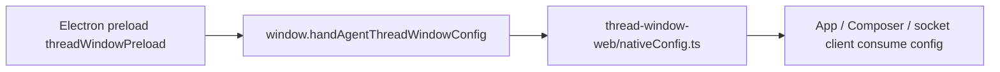
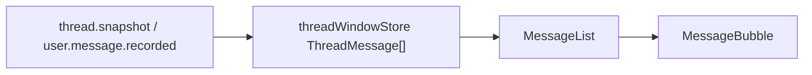
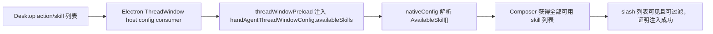
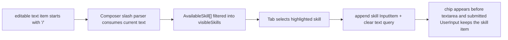
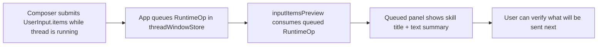
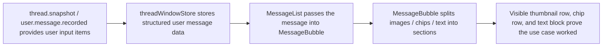
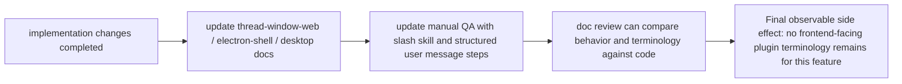

# User Message 渲染与 Slash Skill Composer Implementation Plan

## 修改范围与职责

本计划围绕两个紧耦合用例展开：

1. ThreadWindow 按 `UserInput.items` 结构渲染 `user` message。
2. Composer 在不扩协议的前提下，通过宿主注入的 skill 列表支持 slash 选择并追加 `skill` item。

涉及目录：

- `apps/thread-window-web/`
  - 职责：React ThreadWindow UI、native host config 读取、Composer、消息列表与相关测试。
  - 本次复用现有 `Composer -> onSubmit(UserInput) -> App -> ThreadSocketClient.submitOp` 提交流。
- `apps/electron-shell/src/preload/`
  - 职责：ThreadWindow renderer 的受控 host config 注入。
  - 本次只扩只读 skill 列表，不暴露新执行能力。
- `apps/electron-shell/src/main/windows/`
  - 职责：ThreadWindow preload 初始参数与 host theme/initial prompt 注入。
  - 本次只补把 skill 列表带进 renderer 的配置通路。
- `apps/desktop/`
  - 职责：当前 action/skill 来源与命名真相。
  - 本次不改变运行时行为，只在文档和桥接命名上对齐 `ActionSubmission.appendSkill`。
- `docs/` 与各级 `<dir>.md`
  - 职责：更新这次改动影响到的分层说明与 manual QA。

## 现有流盘点

### 现有 ThreadWindow 宿主配置流



这条流已经承载：

- `threadWebSocketURL`
- initial prompt receiver
- theme subscription

本次复用它继续承载只读 skill 列表，不新增 server 拉取链路。

### 现有 Composer 提交流


这条流已经满足统一 `UserInput.items` 提交；本次只扩输入交互，不改提交协议。

### 现有消息展示流



当前 `ThreadMessage` 对 `user` message 只保留一段 `text`。本次计划要先补齐 `ThreadMessage` 的结构化输入信息，才能在 `MessageBubble` 中分层渲染。

## 用例 1：宿主注入只读 skill 列表给 Composer



 consumed structure:

- 当前可用 skill 的最小只读描述列表

consumer function / interface:

- Electron ThreadWindow host config
- `threadWindowPreload.ts`
- `nativeConfig.ts`

result structure:

- renderer 侧 `AvailableSkill[]`

how consumed next:

- `App` 或 `ThreadWorkspacePane` 传给 `Composer`

capability to implement / extend / reuse:

- 复用现有 `handAgentThreadWindowConfig` 注入模式
- 扩展 preload config 与 React native config 类型

## 用例 1 Integrate Test

`/Users/mu9/proj/handAgent/.worktrees/user-message-ui/apps/electron-shell/tests/preload/threadWindowPreload.test.ts`

自然语言描述：

- 构造 preload 执行环境。
- 断言 `window.handAgentThreadWindowConfig` 除 `threadWebSocketURL` 外，还会暴露 `availableSkills`。
- 断言 renderer 未收到该配置时，React fallback 为空数组，不抛错。

> **For agentic workers:** REQUIRED SUB-SKILL: Use superpowers:subagent-driven-development (recommended) to make the test work

```ts
test("injects readonly available skills into thread window host config", () => {
  runThreadWindowPreload({
    availableSkills: [
      { actionId: "review/code", title: "Review", prompt: "Review this code", description: "Review code changes" },
    ],
  });

  expect(mainWorld.handAgentThreadWindowConfig?.availableSkills).toEqual([
    { actionId: "review/code", title: "Review", prompt: "Review this code", description: "Review code changes" },
  ]);
});

test("native config falls back to an empty skill list when preload did not inject one", () => {
  expect(getAvailableSkills()).toEqual([]);
});
```

## 用例 2：Composer 通过 slash 选择 skill 并追加到 item array



consumed structure:

- 当前唯一 `text` item 的文本
- 已注入的 `AvailableSkill[]`

consumer function / interface:

- `Composer`

result structure:

- 更新后的 `InputItem[]`
- slash menu UI state

how consumed next:

- 用户继续编辑
- 或按发送，沿用现有 `onSubmit(UserInput)`

capability to implement / extend / reuse:

- 复用当前 `InputItem[]` 状态、chip 删除与提交逻辑
- 扩展键盘事件处理和 slash menu 状态

## 用例 2 Integrate Test

`/Users/mu9/proj/handAgent/.worktrees/user-message-ui/apps/thread-window-web/tests/composerInputItems.test.ts`

自然语言描述：

- 从真实 `Composer` 渲染入口出发。
- 注入全部可用 skills。
- 输入 `/` 和过滤词。
- 用 `Tab` 选中 skill。
- 断言新增的是结构化 `skill` item，不是文本替换。
- 断言 skill-only 仍允许提交。

> **For agentic workers:** REQUIRED SUB-SKILL: Use superpowers:subagent-driven-development (recommended) to make the test work

```tsx
test("shows all available skills for slash commands and appends the selected skill as a chip on Tab", async () => {
  const submitted: UserInput[] = [];
  render(
    <Composer
      disabled={false}
      stopDisabled={true}
      availableSkills={[
        { actionId: "review/code", title: "Review", prompt: "Review this code" },
        { actionId: "explain/code", title: "Explain", prompt: "Explain this code" },
      ]}
      onSubmit={(input) => submitted.push(input)}
      onStop={() => {}}
    />,
  );

  await user.type(screen.getByRole("textbox"), "/rev");
  expect(screen.getByText("Review")).toBeVisible();
  expect(screen.queryByText("Explain")).not.toBeInTheDocument();

  await user.keyboard("{Tab}");
  expect(screen.getByText("Skill · Review")).toBeVisible();
  expect(screen.getByRole("textbox")).toHaveValue("");

  await user.click(screen.getByTitle("发送"));
  expect(submitted[0].items.some((item) => item.type === "skill" && item.actionId === "review/code")).toBe(true);
});
```

## 用例 3：运行态排队与输入摘要继续复用 item array



consumed structure:

- `RuntimeOp.user_input.payload.items`

consumer function / interface:

- `threadWindowStore`
- `inputItemsPreview`

result structure:

- 队列项摘要字符串

how consumed next:

- `ThreadWorkspacePane` queued panel 展示

capability to implement / extend / reuse:

- 复用现有队列与 preview 入口
- 保持 skill title 优先的摘要策略

## 用例 3 Integrate Test

`/Users/mu9/proj/handAgent/.worktrees/user-message-ui/apps/thread-window-web/tests/composerInputItems.test.ts`

自然语言描述：

- 构造运行态下的 `RuntimeOp.user_input`。
- 断言 `inputItemsPreview` 优先显示 skill title，而不是退化成 prompt 原文或空字符串。

> **For agentic workers:** REQUIRED SUB-SKILL: Use superpowers:subagent-driven-development (recommended) to make the test work

```ts
test("queued preview keeps skill title when the queued user input came from slash selection", () => {
  expect(inputItemsPreview({
    op: {
      type: "user_input",
      opId: "op-1",
      timestamp: "2026-06-12T00:00:00.000Z",
      payload: {
        items: [
          { type: "skill", id: "skill-1", actionId: "review/code", title: "Review", prompt: "Review this code" },
          { type: "text", id: "text-1", text: "focus on regressions" },
        ],
      },
    },
  })).toBe("Review focus on regressions");
});
```

## 用例 4：user message 按结构化 sections 渲染



consumed structure:

- 用户消息对应的 `InputItem[]`

consumer function / interface:

- `threadWindowStore.handleNotification`
- `MessageBubble`

result structure:

- 可直接渲染的 user message sections

how consumed next:

- `MessageBubble` 生成顶部图片、chip 行和底部文本块

capability to implement / extend / reuse:

- 复用现有消息列表和 copy 行为
- 服务端贯通结构化 items（详见 spec 「1.5 user message 结构化 items 透传协议」）：
  - `packages/core` 协议：`UserMessageRecordedNotification.payload.items`、`ConversationMessage.inputItems`、`UserAgentMessage.inputItems`。
  - `AgentRunner` / `ThreadRuntimeOrchestrator` 两处 `user.message.recorded` 发出点带 `items`。
  - `ThreadPersistence.persistUserInput` 保存 `inputItems`，`agentMessagesToConversation` 透传到 snapshot，使 live 与 resume 两条路径一致。
- 前端扩展 `ThreadMessage` 以容纳 `userInputItems`，并在 `thread.snapshot` / `user.message.recorded` 处理处读取结构化 items
- 前端 `threadProtocol.ts` 镜像类型同步补 `items` / `inputItems`

## 用例 4 Integrate Test

`/Users/mu9/proj/handAgent/.worktrees/user-message-ui/apps/thread-window-web/tests/messageBubble.test.tsx`

自然语言描述：

- 用真实 `MessageBubble` 渲染一个带 image、skill、text_selection、text 的 user message。
- 断言三段结构都出现。
- 再覆盖“只带图片和 chip、没有文本”的空白分支，确保不渲染空文本块。

> **For agentic workers:** REQUIRED SUB-SKILL: Use superpowers:subagent-driven-development (recommended) to make the test work

```tsx
test("renders user messages as image strip, chip row, and text block based on input items", () => {
  render(
    <MessageBubble
      message={{
        id: "user-1",
        role: "user",
        text: "focus on regressions",
        userInputItems: [
          { type: "image", id: "image-1", mimeType: "image/png", base64: "abc" },
          { type: "skill", id: "skill-1", actionId: "review/code", title: "Review", prompt: "Review this code" },
          { type: "text_selection", id: "selection-1", text: "selected code" },
          { type: "text", id: "text-1", text: "focus on regressions" },
        ],
      }}
      onCopy={() => {}}
    />,
  );

  expect(screen.getByTestId("user-message-images")).toBeVisible();
  expect(screen.getByText("Skill · Review")).toBeVisible();
  expect(screen.getByText(/selected code/)).toBeVisible();
  expect(screen.getByText("focus on regressions")).toBeVisible();
});
```

## 用例 5：manual QA 与文档命名对齐到 skill / prompt action



consumed structure:

- 实现后的 UI 行为与宿主桥接边界

consumer function / interface:

- 各级文档
- `docs/manual-qa.md`

result structure:

- 一致的 skill / prompt action 术语
- 新手工验收项

how consumed next:

- 最终文档审核子 agent 依据这些文档做一致性检查

capability to implement / extend / reuse:

- 复用现有文档索引与 QA 维护规则

## 用例 5 Integrate Test

`/Users/mu9/proj/handAgent/.worktrees/user-message-ui/docs/manual-qa.md`

自然语言描述：

- 新增一条手工验收项，覆盖 slash 列表、Tab 选择 skill、skill-only 提交，以及 user message 三段式渲染。
- 不写自动化代码，但实现完成后必须补进去。

> **For agentic workers:** REQUIRED SUB-SKILL: Use superpowers:subagent-driven-development (recommended) to make the test work

```md
- 手工回归步骤：
  1. 在 ThreadWindow 输入框开头输入 `/`，确认出现全部可用 skill 列表。
  2. 输入过滤词后按 `Tab`，确认左下角出现 skill chip，输入框清空但仍保留焦点。
  3. 不输入文本直接发送，确认 user message 正常落库并显示。
  4. 提交包含图片、skill、text_selection、text 的输入，确认消息区显示图片缩略图、chip 行和独立文本块。
```

## 实施任务

1. 扩 Electron ThreadWindow host config
   - 在 preload 与 React native config 间加入 `AvailableSkill[]`
   - 为该配置补 preload/nativeConfig 测试

2. 扩 Composer slash 交互
   - 新增 slash menu 状态、过滤与键盘导航
   - 维持现有 `InputItem[]` 提交与 queued preview 语义
   - 抽共享 chip 样式

3. 扩 user message 结构化渲染（含服务端协议透传）
   - 服务端：`UserMessageRecordedNotification.payload` 增 `items`，`ConversationMessage` / `UserAgentMessage` 增可选 `inputItems`，贯通 `AgentRunner`、`ThreadRuntimeOrchestrator.recordUserInput`、`ThreadPersistence.persistUserInput`、`agentMessagesToConversation`，使 live 与 resume 两条路径都带结构化 items（`content` 扁平化字符串语义不变）
   - 前端：`threadProtocol.ts` 镜像 `items` / `inputItems`，`ThreadMessage` 保存 `userInputItems`，`thread.snapshot` 与 `user.message.recorded` 处理处填充
   - 在 `MessageBubble` 中按 sections 渲染
   - 为服务端 round-trip（含 resume）与 message 渲染补测试

4. 更新文档与 QA
   - 读取并更新受影响 `<dir>.md`
   - 更新 `docs/manual-qa.md`

5. 实现后执行仓库强制流程
   - 运行验证
   - 分发独立子 agent 做文档审核与文档更新确认
   - 确认所有相关 md 和 manual QA 已更新后再提交

## 自检

1. skill 列表沿用现有 preload config 流，没有新建 agent-server skill 列表接口。user message 结构化渲染按决策扩展 `user.message.recorded` / `ConversationMessage` / `UserAgentMessage` 的可选载荷字段透传 `items`，不改 `InputItem` 自身形状，也不改 `content` 喂 LLM 的语义。
2. 计划只覆盖 spec 范围内的结构化 user message 与 slash skill Composer，没有提前实现动态 tool 注入。
3. 大文件策略保持现状，优先在现有 `Composer.tsx` / `MessageBubble.tsx` 上扩展，只在确实需要复用样式时新增小组件或 helper。
