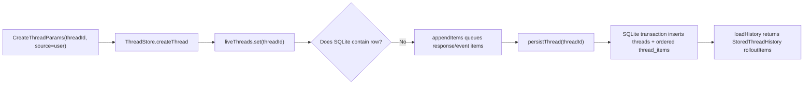
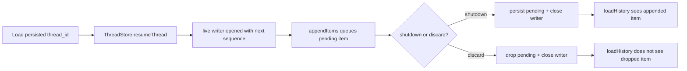
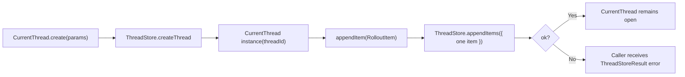
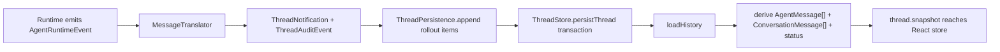
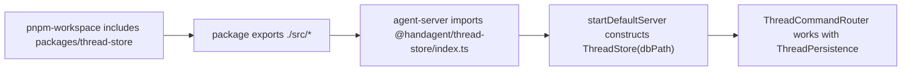

# Thread Store Refactor Implementation Plan

## 背景与范围

本计划把 thread 持久化从 `packages/core/src/storage` 的整文件 JSON store，迁到 `packages/thread-store` 新 workspace 包。新包与 `packages/core` 同级，提供具体 `ThreadStore` class 和 `CurrentThread` 语义层，不再定义同名抽象接口。

用户给的接口是 Rust 风格伪代码；当前仓库是 TypeScript / Node。本计划按现有技术栈映射：

- `ThreadId` 先用 `string` 类型别名，避免在本轮引入品牌类型重构。
- `ThreadStore` 是具体 class，不是 interface。
- `CurrentThread.create(threadStore, params)` 接收具体 `ThreadStore` 实例；不使用 `Arc<dyn ThreadStore>` 等抽象接口形态。
- `node:sqlite` 在本机 Node `v24.16.0` 可导入。实现使用 `DatabaseSync`，但对外保持 async API。
- `create_thread` 返回 `ThreadStoreResult<void>`：成功时没有 payload，失败时通过 `ThreadStoreResult` 携带错误；TypeScript 实现为 `Promise<ThreadStoreResult<void>>`。

本轮不实现 `parent_thread_id`、`dynamic_tools`、`CompactedItem` 的业务语义，只持久化字段和占位 union。`flush_thread` 保留 public 方法并返回 `not_implemented`，`shutdown_thread` 仍通过 `persist_thread` 保证已排队 item 落盘后关闭 writer。

## 修改范围与职责

- `packages/thread-store/`：新增 workspace 包，承载 SQLite schema、`ThreadStore` 具体实现、`CurrentThread` 语义层、rollout item 类型、包级测试与文档。
- `packages/core/`：保留 runtime / protocol / tool / workspace 等跨平台核心；移除或停止导出旧 `ThreadStore` interface、`FileThreadStore`、`InMemoryThreadStore`。`AgentMessage`、`ThreadNotification` 等协议/runtime DTO 仍从 core 复用；`ThreadAuditEvent`、`DynamicToolSpec` 由 `@handagent/thread-store` 承载，避免 core 继续拥有 thread 持久化类型。
- `apps/agent-server/src/thread/`：改造 `ThreadPersistence`，让它通过 `CurrentThread` 写入 canonical rollout items，再从 `load_history` 派生现有 `AgentMessage[]`、history list、snapshot 和 incomplete-turn 恢复语义。
- `apps/agent-server/src/server/`：组合根从 `new FileThreadStore(paths.threadsDir)` 改为 `new ThreadStore({ dbPath: paths.threadsDbPath })`，并注入 `ThreadPersistence`。
- `apps/agent-server/tests/`：把现有 thread persistence / router / orchestrator 测试切到新 store harness，增加 SQLite lazy-create、resume、shutdown/discard 语义覆盖。
- `pnpm-workspace.yaml` 与相关 `package.json`：加入 `packages/thread-store` workspace；`handagent-agent-server` 依赖 `@handagent/thread-store`。
- 文档：更新 `packages/packages.md`、新增 `packages/thread-store/thread-store.md`，更新 `packages/core/core.md`、`packages/core/src/src.md`、`packages/core/src/storage/storage.md` 或删除该 storage 入口说明，更新 `apps/agent-server` 相关文档和 `docs/manual-qa.md`。

## 现有流盘点

当前生产路径：

```mermaid
flowchart LR
  A["React thread.start"] --> B["ThreadCommandRouter.handleCreateThread"]
  B --> C["ThreadPersistence.createThread"]
  C --> D["FileThreadStore.create writes ~/.spotAgent/threads/<id>.json"]
  D --> E["thread.started"]
  E --> F["React thread.resume + op.submit(UserInput)"]
  F --> G["ThreadRuntimeOrchestrator.recordUserInput"]
  G --> H["ThreadPersistence.persistUserInput"]
  H --> I["FileThreadStore.appendMessages rewrites JSON file"]
  I --> J["runtime delta appendMessages + appendEvents"]
```



要复用的现有能力：

- `ThreadCommandRouter` 的公开命令语义：`thread.start`、`thread.resume`、`thread.list`、`thread.delete`、`op.submit` 不新增公开通道。
- `ThreadRuntimeOrchestrator` 的 active run / generation / queued input 语义。
- `MessageTranslator` 的 `AgentRuntimeEvent -> ThreadNotification / ThreadAuditEvent` 转换。
- `agentMessagesToConversation` 的 snapshot 转换。
- `AgentMessage` 作为当前项目实际的 ResponseItem 消息类型。
- `ThreadNotification` 作为 EventMsg 的当前项目对应物。

要替换的旧流：

- 不再在 `thread.start` 时立即创建 JSON 文件。
- 不再用 `messages[] + events[]` 两个数组作为持久化真相；SQLite 中以 `RolloutItem[]` append-only 序列作为真相。
- 不再把 store 抽象放在 core 内部；`packages/thread-store` 是 Node 存储包。

## 新数据结构

建议包内类型：

```ts
export type ThreadId = string;

export type ThreadSource = "user" | "subagent";

export type ThreadStoreResult<T = void> =
  | { ok: true; value: T }
  | { ok: false; error: ThreadStoreError };

export type RolloutItem =
  | { kind: "session_meta"; payload: SessionMeta }
  | { kind: "response_item"; payload: AgentMessage }
  | { kind: "compacted"; payload: CompactedItem }
  | { kind: "turn_context"; payload: TurnContextItem }
  | { kind: "event_msg"; payload: ThreadNotification };
```

`SessionMeta` 按用户规格落库：

```ts
export type SessionMeta = {
  id: ThreadId;
  forkedFromId?: ThreadId;
  parentThreadId?: ThreadId;
  timestamp: string;
  originator: string;
  threadSource: ThreadSource;
  agentPath?: string;
  dynamicTools?: DynamicToolSpec[];
};
```

`CompactedItem`、`TurnContextItem` 只占位：

```ts
export type CompactedItem = {
  status: "placeholder";
};

export type TurnContextItem = {
  turnId: string;
  status?: "running" | "completed" | "interrupted" | "failed";
  timestamp: string;
};
```

SQLite schema：

```sql
CREATE TABLE IF NOT EXISTS threads (
  thread_id TEXT PRIMARY KEY,
  created_at TEXT NOT NULL,
  updated_at TEXT NOT NULL,
  forked_from_id TEXT,
  parent_thread_id TEXT,
  thread_source TEXT NOT NULL,
  originator TEXT NOT NULL,
  agent_path TEXT,
  dynamic_tools_json TEXT,
  closed_at TEXT
);

CREATE TABLE IF NOT EXISTS thread_items (
  thread_id TEXT NOT NULL,
  sequence INTEGER NOT NULL,
  kind TEXT NOT NULL,
  payload_json TEXT NOT NULL,
  created_at TEXT NOT NULL,
  PRIMARY KEY (thread_id, sequence),
  FOREIGN KEY (thread_id) REFERENCES threads(thread_id) ON DELETE CASCADE
);

CREATE INDEX IF NOT EXISTS idx_thread_items_thread_sequence
  ON thread_items(thread_id, sequence);
```

`create_thread` 只在内存 `liveThreads` 中登记 `SessionMeta` 和空队列，不写 `threads` 表。`persist_thread` 第一次 materialize 时，在一个 SQLite transaction 内插入 `threads` 行、`session_meta` item 和所有 queued items。

## 用例 1：Lazy Create 与 SQLite Materialize Integrate Test

`/Users/mu9/proj/handAgent/.worktrees/thread-store-refactor/packages/thread-store/tests/thread-store-lifecycle.test.ts`

测试目标：前端新建对话只打开 live writer，不产生可列出的持久 thread；首次 persist 后才落库，并按 rollout 顺序读回。



> **For agentic workers:** REQUIRED SUB-SKILL: Use `superpowers:subagent-driven-development` to make the test work.

语义测试：

```ts
test("create opens a live thread without materializing sqlite rows until persist", async () => {
  const dbPath = tempSqlitePath();
  const store = new ThreadStore({ dbPath, now: fixedNow });

  await expectOk(store.createThread({
    threadId: "thread-1",
    forkedFromId: null,
    parentThreadId: null,
    threadSource: "user",
    dynamicTools: [],
  }));

  await expectOkValue(store.loadHistory({ threadId: "thread-1" }), {
    threadId: "thread-1",
    rolloutItems: [],
    persisted: false,
  });

  await expectOk(store.appendItems({
    threadId: "thread-1",
    items: [
      { kind: "response_item", payload: { role: "user", content: "hi" } },
      { kind: "event_msg", payload: threadStatusChanged("thread-1", "idle") },
    ],
  }));

  await expectOk(store.persistThread("thread-1"));

  const history = await unwrap(store.loadHistory({ threadId: "thread-1" }));
  expect(history.rolloutItems.map((item) => item.kind)).toEqual([
    "session_meta",
    "response_item",
    "event_msg",
  ]);
  expect(history.rolloutItems[0].payload).toMatchObject({
    id: "thread-1",
    threadSource: "user",
  });
});
```

需要实现的能力：

- `ThreadStore` per-thread async queue，保证同一 thread 的 create / append / persist 串行。
- `ThreadStore` lazy live state，不在 create 时写 SQLite。
- `persistThread` transaction：materialize thread row、append session meta、drain queued items、更新 `updated_at`。
- `loadHistory` 能读 persisted history，也能读取 live but unpersisted history，供 `thread.resume` 在初始 prompt 流中使用。
- `deleteThread` 可在本用例外保留兼容方法，或在 agent-server 层通过新的 store 方法实现删除。

## 用例 2：Resume / Shutdown / Discard 的 Live Writer 语义 Integrate Test

`/Users/mu9/proj/handAgent/.worktrees/thread-store-refactor/packages/thread-store/tests/thread-store-live-writer.test.ts`

测试目标：`resume_thread` 只打开已存在 thread 的 live writer；`shutdown_thread` 持久化 pending items 并关闭；`discard_thread` 丢弃未落盘 pending items。



> **For agentic workers:** REQUIRED SUB-SKILL: Use `superpowers:subagent-driven-development` to make the test work.

语义测试：

```ts
test("shutdown persists pending items while discard drops pending items", async () => {
  const store = await materializedStoreWithSession("thread-1");

  await expectOk(store.resumeThread({ threadId: "thread-1" }));
  await expectOk(store.appendItems({
    threadId: "thread-1",
    items: [{ kind: "response_item", payload: { role: "assistant", content: "saved" } }],
  }));
  await expectOk(store.shutdownThread("thread-1"));
  expect(await messageTexts(store, "thread-1")).toContain("saved");

  await expectOk(store.resumeThread({ threadId: "thread-1" }));
  await expectOk(store.appendItems({
    threadId: "thread-1",
    items: [{ kind: "response_item", payload: { role: "assistant", content: "dropped" } }],
  }));
  await expectOk(store.discardThread("thread-1"));
  expect(await messageTexts(store, "thread-1")).not.toContain("dropped");
});
```

需要实现的能力：

- `resumeThread` 校验 SQLite 中存在 thread；不存在返回 `{ ok: false, error: { code: "thread_not_found" } }`。
- `resumeThread` 根据 `MAX(sequence)` 初始化 live writer 的 next sequence。
- `shutdownThread` 调 `persistThread` 后关闭 live writer。
- `discardThread` 不调用 persist，直接删除 live writer。
- `flushThread` public 方法存在，返回 `not_implemented`；不要让产品路径依赖它。

## 用例 3：CurrentThread 语义层的事务保证 Integrate Test

`/Users/mu9/proj/handAgent/.worktrees/thread-store-refactor/packages/thread-store/tests/current-thread.test.ts`

测试目标：上层不直接拼 `append_items` 参数；通过 `CurrentThread` 表达 create/resume/append_item/shutdown，并保证单个语义操作要么完整落入 live queue，要么返回 error。



> **For agentic workers:** REQUIRED SUB-SKILL: Use `superpowers:subagent-driven-development` to make the test work.

语义测试：

```ts
test("CurrentThread serializes appendItem calls through the underlying store", async () => {
  const store = new ThreadStore({ dbPath: tempSqlitePath(), now: fixedNow });
  const current = await unwrap(CurrentThread.create(store, {
    threadId: "thread-1",
    threadSource: "user",
  }));

  await Promise.all([
    current.appendItem({ kind: "response_item", payload: { role: "user", content: "one" } }),
    current.appendItem({ kind: "response_item", payload: { role: "assistant", content: "two" } }),
  ]);
  await expectOk(current.shutdown());

  expect(await messageTexts(store, "thread-1")).toEqual(["one", "two"]);
});
```

需要实现的能力：

- `CurrentThread.create(store, params)` 调用 store create，并只在 success 时返回实例。
- `CurrentThread.resume(store, params)` 调用 store resume，并只在 success 时返回实例。
- `appendItem(item)` 只是单 item 的语义化封装，不暴露 batch shape。
- `appendItems(items)` 可作为内部/少量高吞吐路径，但默认产品代码用 `appendItem` 表达事件。
- `shutdown()`、`discard()` idempotent；重复调用返回 success，不重复写入。

## 用例 4：agent-server 首轮输入沿用现有协议但不提前落盘 Integrate Test

`/Users/mu9/proj/handAgent/.worktrees/thread-store-refactor/apps/agent-server/tests/thread/ThreadCommandRouter.test.ts`

测试目标：`thread.start` 仍返回 `thread.started`，React 随后 `thread.resume` 能拿到空 snapshot；如果用户从未发送 `op.submit`，`thread.list` 不出现该空 thread。首个用户输入追加后才 materialize。


> **For agentic workers:** REQUIRED SUB-SKILL: Use `superpowers:subagent-driven-development` to make the test work.

语义测试：

```ts
test("thread.start opens a live thread, resume snapshots it, and list excludes it until input persists", async () => {
  const { router, publisher, persistence } = makeRouterWithSqliteThreadStore();

  await router.receive(threadStart({ commandId: "start-1" }), "conn-1");
  const threadId = publisher.last("thread.started").threadId;

  await router.receive(threadList({ commandId: "list-empty" }), "conn-1");
  expect(publisher.last("thread.listed").payload.threads).not.toContainEqual(
    expect.objectContaining({ id: threadId }),
  );

  await router.receive(threadResume({ commandId: "resume-1", threadId }), "conn-1");
  expect(publisher.last("thread.snapshot")).toMatchObject({
    threadId,
    payload: { messages: [], status: "idle" },
  });

  await router.receive(opSubmitUserInput({ threadId, text: "hi" }), "conn-1");
  await persistence.waitForDurableForTest(threadId);

  await router.receive(threadList({ commandId: "list-1" }), "conn-1");
  expect(publisher.last("thread.listed").payload.threads).toContainEqual(
    expect.objectContaining({ id: threadId, messageCount: 1 }),
  );
});
```

需要实现的能力：

- `ThreadPersistence.createThread` 生成 id 后调用 `CurrentThread.create`，不直接落库。
- `ThreadPersistence.getThread` 或新等价方法从 `loadHistory` 派生 `PersistedThread` 兼容结构，供 router 现有逻辑少改。
- `ThreadPersistence.listThreads` 只列 SQLite materialized thread。
- `ThreadPersistence.persistUserInput` 写 `response_item`，并在首条用户输入时调用 `persistThread` materialize。
- `autoTitle` 从 rollout item 派生 `messageCount` 和 preview；如果继续保留单独 metadata 更新，需要在 SQLite transaction 内更新 `threads.updated_at`。

## 用例 5：runtime delta / notification / snapshot 从 RolloutItem 恢复 Integrate Test

`/Users/mu9/proj/handAgent/.worktrees/thread-store-refactor/apps/agent-server/tests/thread/ThreadRuntimeOrchestrator.test.ts`

测试目标：runtime 仍能持久化 user/assistant/tool message、audit event 和 UI notification；`thread.resume` 从 SQLite rollout history 还原现有 UI snapshot，不要求 React 改协议。



> **For agentic workers:** REQUIRED SUB-SKILL: Use `superpowers:subagent-driven-development` to make the test work.

语义测试：

```ts
test("runtime deltas persist as rollout items and resume reconstructs the existing snapshot shape", async () => {
  const harness = createRunningThreadHarnessWithSqliteStore({
    runtimeEvents: [
      assistantDelta("assistant-1", "hello"),
      toolStarted("tc-1", "workspace.list"),
      toolFinished("tc-1", "workspace.list", "[]"),
    ],
    resultMessages: [
      { role: "user", content: "hi" },
      { role: "assistant", content: "hello" },
      { role: "tool", toolCallId: "tc-1", name: "workspace.list", content: "[]" },
    ],
  });

  await harness.submitUserInput("hi");
  await harness.waitForIdle();

  const raw = await unwrap(harness.store.loadHistory({ threadId: harness.threadId }));
  expect(raw.rolloutItems.map((item) => item.kind)).toEqual(expect.arrayContaining([
    "response_item",
    "event_msg",
    "turn_context",
  ]));

  await harness.router.receive(threadResume({ threadId: harness.threadId }), "conn-1");
  expect(harness.publisher.last("thread.snapshot").payload.messages).toEqual([
    expect.objectContaining({ role: "user", text: "hi" }),
    expect.objectContaining({ role: "assistant", text: "hello" }),
    expect.objectContaining({ role: "tool", text: "[]" }),
  ]);
});
```

需要实现的能力：

- `persistRunDelta` 将 generated `AgentMessage[]` 存为多个 `response_item`。
- runtime notification 需要同时写入 `event_msg`，至少覆盖 `turn.started`、`assistant.delta`、`tool.started`、`tool.finished`、`turn.completed`、`thread.status.changed`。
- `ThreadAuditEvent` 当前不是用户给的 RolloutItem 成员；计划把它保留为 `turn_context` 的 `auditEvents?: ThreadAuditEvent[]` 或新增内部 payload 字段。若实现时发现审计恢复必须单独查询，优先在 `turn_context` 中承载，不扩展公开 union。
- `load_history` 返回 `StoredThreadHistory`，`ThreadPersistence` 负责派生现有 `AgentMessage[]`、`ConversationMessage[]`、`ThreadSummary`。
- incomplete-turn 恢复从“最后一条 AgentMessage 是 user”改为从 rollout item 派生最后可见 response_item 判断。

## 用例 6：删除旧 core storage 并接入 workspace 构建 Integrate Test

`/Users/mu9/proj/handAgent/.worktrees/thread-store-refactor/packages/thread-store/tests/package-exports.test.ts`

`/Users/mu9/proj/handAgent/.worktrees/thread-store-refactor/apps/agent-server/tests/server/server.test.ts`

测试目标：新包能通过 workspace import 被 agent-server 消费；core 不再暴露旧 store；server 组合根创建 SQLite store。



> **For agentic workers:** REQUIRED SUB-SKILL: Use `superpowers:subagent-driven-development` to make the test work.

语义测试：

```ts
test("startDefaultServer wires the sqlite ThreadStore package", async () => {
  const deps = await makeStartDefaultServerHarness({ spotAgentHome: tempDir() });
  await deps.start();

  await deps.threadSocket.send(threadStart({ commandId: "start-1" }));
  const threadId = await deps.threadSocket.expectThreadStarted();
  await deps.threadSocket.send(opSubmitUserInput({ threadId, text: "hello" }));
  await deps.threadSocket.expectThreadStatus("idle");

  expect(await sqliteThreadExists(deps.paths.threadsDbPath, threadId)).toBe(true);
});
```

需要实现的能力：

- `pnpm-workspace.yaml` 增加 `packages/thread-store`。
- `packages/thread-store/package.json` 包名 `@handagent/thread-store`，`type: "module"`，`exports: { "./*": "./src/*" }`。
- `apps/agent-server/package.json` 加 workspace 依赖。
- `resolveServerPaths` 新增 `threadsDbPath`，建议 `~/.spotAgent/threads.sqlite`。
- 旧 `packages/core/src/storage` 若删除，要同步更新 imports；若本轮保留空兼容 re-export，会违背“不考虑兼容”的项目约束，因此推荐直接迁移引用并删除旧实现。

## 执行顺序

1. 从主 checkout 执行 `bash ./scripts/create-worktree.sh thread-store-refactor codex/thread-store-refactor`，确认 `.worktrees` 已被 ignore，并使用脚本输出的 CodeGraph `projectPath`。
2. 在 worktree 跑基线：`bash ./scripts/test.sh`。
3. 新建 `packages/thread-store` 包、文档和包级测试；实现 `ThreadStoreResult`、rollout item 类型、SQLite schema、lazy create、persist、load、resume、shutdown/discard。
4. 实现 `CurrentThread` 并让包级测试覆盖事务/串行语义。
5. 改 `ThreadPersistence`，先让现有 agent-server thread tests 通过。
6. 改 `server.ts` 组合根、workspace 配置和 package 依赖。
7. 删除或迁移 `packages/core/src/storage` 旧实现与 tests，修正所有 imports。
8. 更新文档：`packages/packages.md`、`packages/thread-store/thread-store.md`、`packages/core/core.md`、`packages/core/src/src.md`、`apps/agent-server/agent-server.md`、`apps/agent-server/src/thread/thread.md`、相关 tests 文档。
9. 更新 `docs/manual-qa.md`，新增 SQLite thread store 回归项。
10. 执行验证：`bash ./scripts/test.sh`。本任务不改 Swift / desktop 启动链路；若 `resolveServerPaths` 或打包启动参数受影响，再追加 `bash ./scripts/swiftw build`。
11. 任务完成某个 spec 后，按 AGENTS 要求分发独立子 agent 做文档审核与文档更新；主 agent 确认审核结论、相关 md 和 `docs/manual-qa.md` 后再 commit。

## 自审

- 没有新增公开 `/api/thread` 协议；React UI 仍消费 `thread.started`、`thread.snapshot`、`thread.listed` 等现有 notification。
- 新 store 不放进 core，避免 core 继续持有 Node-only SQLite 实现。
- 没有实现 subagent、dynamic tools、compaction 业务，只持久化字段和占位 item。
- 没有设计旧 JSON 文件迁移。项目尚未上线且 AGENTS 明确无需兼容；旧 `~/.spotAgent/threads/<id>.json` 数据会被新 store 忽略。
- `ThreadStore` 不做 interface；测试使用真实 SQLite 临时文件，不通过 mock interface 证明行为。
- `flush_thread` 只留出 public 方法，不成为当前产品路径依赖。
