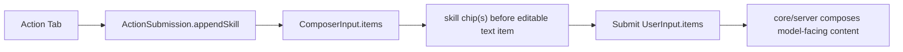
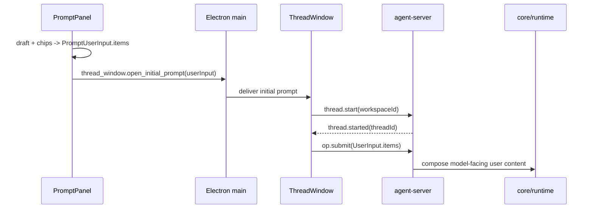
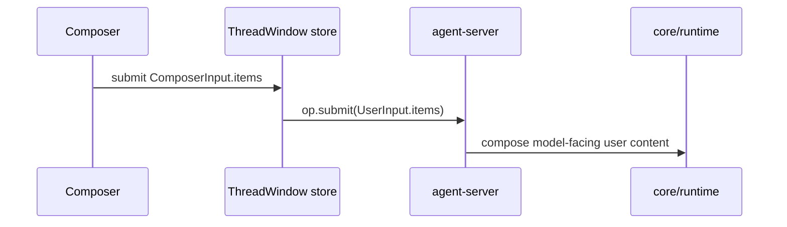

# 输入框 Item 化与 Plugin 概念删除设计

## 背景

当前系统已经有 `UserInput.items` / `InputItem` 协议，但输入框和 action 仍没有统一落到这个模型：

- React `Composer` 只维护纯文本 `text`，提交时临时构造单个 text item。
- Swift PromptPanel 已有 `PromptInputItem`，但 action 仍通过 `actionBinding` 旁路影响 `thread.start`。
- Plugin action 会把 `{ pluginId, promptName }` 写入 thread metadata，再由 agent-server 重新读取 manifest 绑定 thread-scoped MCP tools。
- Action 参数依赖 `[name: value]` 解析和 `{{name}}` template 渲染。

本次目标是把提交语义收敛到输入框 item 数组，并删除旧 Plugin/actionBinding 模型。项目尚未上线，不保留兼容层。

## 目标

1. 输入框抽象为 `InputItem[]`：UI 渲染 skill、text、image、text_selection 等结构化 item。
2. 数组内始终只有一个可编辑 `text` item；其他 chip 都排在它前面。
3. Tab 补全 action 后视觉上追加一个内嵌 attachment chip，不影响后续输入。
4. 提交时统一提交完整 `UserInput.items`，最终给大模型的文本只在 core/agent-server 输入解析阶段生成。
5. 删除 action 参数能力：不再支持 `[name: value]`、必填参数校验和 template placeholder 替换。
6. 删除 Plugin 概念：移除 Plugin Settings、plugin manifest 示例、`actionBinding`、thread metadata 里的 plugin MCP scope。
7. 保留 `ActionSubmission` 抽象，当前只表达“追加 skill item”；后续可扩展为动态 tool 声明，但本次不实现动态 tool。

## 非目标

- 不实现“Swift 客户端在 `thread.start` 临时声明、并由该客户端实际执行的动态 tool”。
- 不实现富文本混排编辑器；chip 不插入 text 中间。
- 不迁移已有用户 `~/.spotAgent/plugins/*` 数据。
- 不保留 plugin/actionBinding 的向后兼容协议。

## 推荐方案

采用 Prefix Chips 模型：



### 输入框状态

输入框状态是一个结构化数组：

```ts
type ComposerInputItem =
  | { type: "skill"; id: string; actionId: string; title: string; prompt: string }
  | { type: "text"; id: string; text: string }
  | { type: "image"; id: string; mimeType: "image/png" | "image/jpeg" | "image/webp"; base64: string }
  | { type: "text_selection"; id: string; text: string };
```

UI 规则：

- 初始化时创建一个空 `text` item。
- 任何 action Tab 都追加一个 `skill` item，并保持 text item 聚焦。
- 渲染时将非 text item 放在 text item 前面。
- 用户在 text 开头按 Backspace 时，删除最靠近 text 的前一个 chip。
- chip 可通过自身删除按钮移除。
- 提交按钮启用条件：至少一个 skill/attachment item，或 text item trim 后非空。
- 提交后重置为一个空 text item。

### ActionSubmission

保留 `ActionSubmission`，但去掉 plugin 分支：

- `appendSkill`：把 action 的 prompt 作为 `skill` item 追加到输入数组。

action 不再立即创建 thread，也不再携带 action binding。PromptPanel 全局快捷键触发 action 时也走同一条逻辑：打开/聚焦 PromptPanel，并追加 skill chip，用户可以继续输入补充文本，也可以直接提交仅包含 skill chip 的输入。

### 删除参数

Action manifest prompt 只保留完整 prompt 文本：

- 删除 `arguments` 字段。
- 删除 `ActionInvocation.parseBracketArguments`。
- 删除 `{{name}}` 替换。
- Tab 行为不再预填 `trigger [arg: ]`。
- Return 不再把手写 `trigger [arg: value]` 当作参数化 action；普通文本就是普通 text item。

如果用户需要变量化 prompt，后续应通过动态 tool 或更明确的 prompt 编辑能力重新设计，不沿用 bracket 参数。

### 删除 Plugin

删除这些概念和入口：

- `PluginSettingsViewModel` / Plugin Settings 页。
- `examples/plugins/example-review` 等 plugin 示例。
- `PluginPromptKind` 中的 `plugin` 概念。
- `ActionPluginBinding`、`ActionBindingPayload`、`ThreadActionBinding`。
- `thread.start.payload.actionBinding`。
- `ThreadMetadata.actionBinding`。
- `ActionBindingResolver`。
- `ThreadScopedToolRegistry` 中由 binding 合并 `mcpServerIds` 的逻辑。

保留 MCP 全局配置：

- `~/.spotAgent/mcp.json` 仍是全局 MCP server 配置。
- `ThreadScopedToolRegistry` 仍保留 `use_tools` 懒激活、builtin tools、global MCP tools。
- 本轮不增加 thread-scoped 动态 tool 来源。

### 提交流程

首轮 PromptPanel 提交流程：



后续 React Composer 提交流程：



### Core/server 输入解析

`UserInput.items` 是提交真相。记录 user message 前，由 agent-server 的输入转换层把 items 转为 runtime/persisted content：

- `skill.prompt` 和 `text.text` 都进入文本内容。
- `text_selection.text` 继续作为用户主动附件进入文本内容或附件展示。
- `image` 继续走 Blob/STUB 流程。
- 最终文本拼接顺序以 item 顺序为准，非文本 chip 在 text 前面。

这会把 PromptPanel 当前 `PromptSubmission.composed` 的职责下沉，避免 Swift 和 server 各自生成不同模型文本。

## 影响范围

### Swift desktop

- `ActionDefinition.swift`：删除 plugin binding、arguments，保留 skill-like action definition。
- `ActionInvocation.swift`：删除参数解析和 placeholder 渲染，或收敛为 trigger 到 action 的简单匹配。
- `PromptPanelViewModel.swift`：action Tab 追加 skill item/chip，不再预填参数，不再创建 actionBinding。
- `PromptSubmission.swift`：删除 `ActionBindingPayload`，提交完整 `PromptUserInput.items`。
- `ElectronShellProtocol.swift`：`InitialPromptPayload` 不再编码 `actionBinding`。
- Settings：删除 Plugin 页与相关 ViewModel；Append Prompt 表单删除“必填参数”，后续命名可收敛为 Skill/Prompt Action。
- 测试：更新 PromptPanel、ActionDefinition、ActionInvocation、ElectronShellProtocol、Settings 相关测试。

### React ThreadWindow

- `Composer.tsx`：输入框自身抽象为 item array，而不是保留 `text: string` 再在提交前临时转换；组件直接渲染 prefix chips + 唯一 textarea。
- React Composer 的增删改都操作 item array：Tab/后续 action 追加 `skill` item，文本编辑只更新唯一 `text` item，chip 删除直接移除对应非 text item。
- Composer UI 必须和数组结构一致：非 text item 以 chip 显示在输入框内部、唯一 textarea 排在所有 chip 后面，提交时原样发送当前 item array。
- `threadProtocol.ts`：删除 `InitialPromptPayload.actionBinding` 和 `encodeThreadStart` 的 actionBinding 参数。
- `threadSocketClient.ts`：`thread.start` 只发 workspaceId；首轮 `op.submit` 仍发送 initial `userInput`。
- `threadWindowStore.ts`：queued composer input 继续保存 `RuntimeOp`，预览逻辑按 item array 展示 chip/text 摘要。
- 测试：补充 item array submit、chip 删除、Backspace 删除前一个 chip、空 text 但有 skill 可提交。

### agent-server

- `ThreadCommandRouter.ts`：`thread.start` 不解析 actionBinding。
- `ThreadPersistence.ts`：`createThread` 不接收 actionBinding。
- `ThreadScopedToolRegistry.ts`：删除 binding 参数和 binding MCP 合并。
- `server.ts`：删除 `ActionBindingResolver` 组合。
- 删除 `src/actions/ActionBindingResolver.ts` 及测试。

### core

- `ThreadCommand.ts` / `ThreadProtocolShared.ts`：删除 `ActionBindingPayload`。
- `ThreadRecord.ts` / `ThreadStore.ts` / File/InMemory store：删除 `ThreadActionBinding` 与 metadata 字段。
- `PluginManifest.ts` / `ActionBinding.ts`：删除或改名为 prompt action manifest 解析；不再包含 plugin、mcpServerIds、arguments。
- `Op.ts`：保留 `SkillInputItem`，它是本次输入框 action 的结构化载体。
- 文档：更新 protocol、actions、storage、conversation 相关说明。

### 示例与文档

- 删除 plugin 示例目录。
- 保留 append prompt / skill prompt 示例，但 schema 删除 `arguments`。
- 更新 `README.md`、`handAgent.md`、`apps/*.md`、`packages/core/src/protocol/protocol.md`、`apps/thread-window-web/thread-window-web.md`、`apps/desktop/.../prompt-panel.md`、`apps/agent-server/.../actions.md`。
- `docs/manual-qa.md` 最终新增手工验证项。

## 错误处理

- `UserInput.items` 必须至少包含一个有意义 item；空数组或空 text-only 输入应在 UI 层禁止，在 server 层拒绝。
- 不再出现“缺少必填参数”错误。
- action prompt 解析失败只影响 action 列表加载；普通输入不被 action 解析阻断。
- 删除 plugin 后，缺失 `~/.spotAgent/plugins` 不再是错误。

## 测试策略

实现时按用例级集成测试优先：

1. React Composer：Tab action 后追加 skill chip，继续输入，提交完整 item array。
2. Swift PromptPanel：action 提交生成 `PromptUserInput.items`，不再编码 actionBinding。
3. Thread start：`thread.start` 不接受/不需要 actionBinding，首轮 `op.submit(UserInput)` 正常记录用户消息。
4. Tool scope：激活后只组合 builtin + global MCP，不再读取 thread metadata binding。
5. Settings：Plugin 页消失，Append Prompt/Skill Prompt 不再创建参数字段。

## 决策记录

- 采用 Prefix Chips，而不是富文本混排。理由：满足当前交互，同时避免引入富文本 editor、复杂 caret/selection 序列化和 chip 中间插入语义。
- 不保留 plugin/actionBinding 兼容。理由：项目尚未上线，旧模型会干扰后续动态 tool 设计。
- 不在本轮实现动态 tool。理由：它是新的执行协议，需要单独设计 Swift 客户端声明、server 校验、tool call 路由和权限边界。
