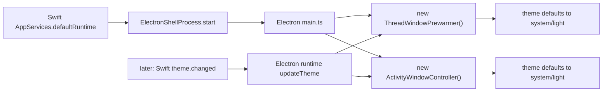
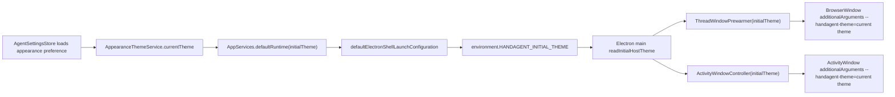
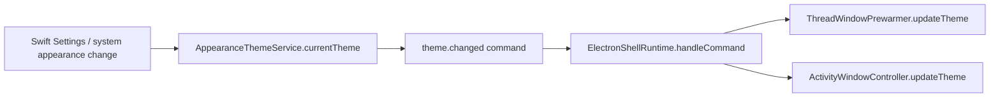

# Electron 初始主题启动注入设计

## 背景

当前跨端主题同步已经有两条链路：

- 运行时链路：Swift Settings 或系统外观变化后，Swift 发送 `theme.changed` command，Electron main 再 fan-out 到 ThreadWindow 和 ActivityWindow renderer。
- 窗口创建链路：Electron window controller 把自己保存的 `HostTheme` 通过 preload `additionalArguments` 注入 renderer，renderer 用 `window.handAgentTheme` 初始化 `data-theme`。

已验证的断点是：运行时链路可以工作，但 Electron main 启动时 `ThreadWindowPrewarmer` 和 `ActivityWindowController` 的内存主题默认值仍是：

```ts
{ preference: "system", resolved: "light" }
```

因此，当 Swift 持久化偏好是深色或系统解析为深色时，Electron 在收到首个 `theme.changed` 之前创建的隐藏 ThreadWindow / ActivityWindow 仍可能以浅色作为初始主题。后续运行时同步可以纠正它，但启动瞬间存在竞态和闪烁风险。

## 目标

1. Swift 启动 Electron 时直接传递当前真实 host theme。
2. Electron main 在创建 `ThreadWindowPrewarmer` 和 `ActivityWindowController` 时使用该初始主题。
3. 首个 Electron renderer 创建时，preload `--handagent-theme=...` 已经是 Swift 当前解析后的主题。
4. 保留现有 `theme.changed` 运行时链路，用于 Settings 切换和系统外观变化。
5. 打包 app、开发态 `pnpm ... electron` 和自定义 Electron binary 三种启动方式都保持一致。

## 强约束

启动时传递的必须是 Swift 当前解析后的真实主题：

```json
{"preference":"dark","resolved":"dark"}
```

或：

```json
{"preference":"system","resolved":"dark"}
```

禁止使用“启动时固定传 `dark`，再通过后续 `theme.changed` 同步纠偏”的方案。固定 dark 会让浅色用户、系统浅色用户和切换过程都出现错误初态，本质上只是把固定 light 的问题换成固定 dark。

## 非目标

- 不改变 `theme.changed` command 的协议字段。
- 不让 React 持久化主题偏好。
- 不让 Electron main 自己解析 macOS 系统外观。
- 不把主题偏好迁移到 agent-server。
- 不新增 renderer 直接读取 settings 文件的能力。

## 现有链路



问题在于 `D/E` 创建时还没有消费 Swift 当前主题，只能等待后续 IPC。

## 推荐方案

使用环境变量传递初始主题：

```text
HANDAGENT_INITIAL_THEME={"preference":"system","resolved":"dark"}
```

选择环境变量而不是命令行参数的原因：

- 当前启动器可能是 `/usr/bin/env electron main.js`、`pnpm --filter handagent-electron-shell exec electron main.js` 或自定义 `HANDAGENT_ELECTRON_BINARY`。
- 命令行参数在不同启动器下更容易出现“参数属于 pnpm / electron / app main”的归属问题。
- 项目已有 `HANDAGENT_REPO_ROOT`、`HANDAGENT_LLM_MODE`、`HANDAGENT_ELECTRON_MAIN` 等环境变量作为启动配置通道。

## 新链路



运行时切换仍走原链路：



两条链路职责不同：

- `HANDAGENT_INITIAL_THEME`：只负责 Electron main 启动时的初始内存值。
- `theme.changed`：负责进程已启动后的实时变化。

## 设计细节

### 1. Swift AppServices 装配顺序

当前 `AppServices.init` 先调用 `AppServices.defaultRuntime(...)`，后创建 `AppearanceThemeService`。需要调整为：

1. 确定 `settingsStore`。
2. 创建 `AppearanceThemeService(store: settingsStore)`。
3. 读取 `appearanceThemeService.currentTheme`。
4. 调用 `defaultRuntime(initialTheme: currentTheme, ...)`。

测试态和显式注入 `appServer` 的路径不应启动 Electron，不需要写入环境变量。

### 2. Swift 环境变量编码

新增常量：

```swift
HANDAGENT_INITIAL_THEME
```

值由 `HostThemePayload` JSON encode 得到。字段必须与现有 `theme.changed` payload 一致：

```json
{
  "preference": "light" | "dark" | "system",
  "resolved": "light" | "dark"
}
```

编码失败时不应静默传错误值；建议 fallback 为不设置该 env，让 Electron 使用自己的校验 fallback，同时测试覆盖正常编码路径。

### 3. Electron main 初始主题解析

在 `main.ts` 组合根读取：

```ts
const initialTheme = readInitialHostTheme(process.env.HANDAGENT_INITIAL_THEME);
```

解析规则：

- 缺失：fallback `{ preference: "system", resolved: "light" }`
- JSON 无效：fallback
- `preference` 不在 `light/dark/system`：fallback
- `resolved` 不在 `light/dark`：fallback

不要让 Electron main 自行解析系统外观；`resolved` 以 Swift 传入为准。

### 4. Window controllers 接收 initialTheme

`ThreadWindowPrewarmer` options 增加：

```ts
initialTheme?: HostTheme;
```

`ActivityWindowController` options 增加同名字段。

构造时：

```ts
this.theme = options.initialTheme ?? fallbackTheme;
```

新建窗口时继续沿用现有 `additionalArguments`：

```ts
--handagent-theme=<encoded HostTheme>
```

这样 preload 不需要知道主题来源是启动 env 还是运行时 command。

### 5. 运行时同步保持不变

`AppCoordinator.setupAppearanceTheme()` 和 `setupAgentServerHealth()` 中的 `sendThemeChanged(currentTheme)` 仍保留。

原因：

- 用户运行中切换主题必须实时刷新。
- `system` 模式下 macOS 外观变化仍需要重新下发。
- Electron 重启后可能先用 env 初值启动，随后 health available 时再收到一次同值 `theme.changed`，这是幂等的。

## 用例

### 用例 1：深色偏好下 Electron 首个 ThreadWindow 初始就是深色

触发：

- `~/.spotAgent/settings.json` 中 `appearance.themePreference = "dark"`
- 用户启动桌面 App

期望：

- Swift 传入 `HANDAGENT_INITIAL_THEME={"preference":"dark","resolved":"dark"}`
- Electron main 创建 `ThreadWindowPrewarmer` 时内存主题已经是 dark
- hidden ThreadWindow 首次创建时 `--handagent-theme` 是 dark
- React 首次读取 `window.handAgentTheme` 即为 dark，不需要先 light 再切 dark

### 用例 2：系统模式解析为深色时传 system/dark

触发：

- `appearance.themePreference = "system"`
- Swift 当前系统外观解析为 dark

期望：

- Swift 传入 `{"preference":"system","resolved":"dark"}`
- Electron 不把 `system` 自行改写为 light
- renderer 初始 `data-theme` 为 dark

### 用例 3：浅色用户不被固定 dark 污染

触发：

- `appearance.themePreference = "light"`

期望：

- Swift 传入 `{"preference":"light","resolved":"light"}`
- Electron 初始 theme 是 light
- 不允许出现启动时固定 dark 后再同步回 light 的行为

### 用例 4：非法 env 不破坏启动

触发：

- `HANDAGENT_INITIAL_THEME` 被外部设为非法 JSON 或非法字段

期望：

- Electron fallback 到 `{ preference: "system", resolved: "light" }`
- Electron main 不崩溃
- 后续 Swift `theme.changed` 仍可纠正主题

## 测试策略

### Swift AppServicesTests

新增或扩展：

- 构造 `AgentSettingsStore`，令主题偏好为 dark。
- 创建 `AppServices` 或调用 `defaultRuntime(initialTheme:)`。
- 断言 `ElectronShellLaunchConfiguration.environment["HANDAGENT_INITIAL_THEME"]` 等于真实 JSON。

重点断言：

- dark 偏好传 dark/dark。
- system + fake resolver dark 传 system/dark。
- light 偏好传 light/light，证明没有固定 dark。

### Electron main helper tests

建议把解析函数抽到可测试 helper，例如：

```ts
readInitialHostTheme(raw: string | undefined): HostTheme
```

覆盖：

- `undefined` fallback
- invalid JSON fallback
- invalid `resolved` fallback
- valid dark 返回 dark
- valid system/dark 返回 system/dark

### ThreadWindowPrewarmer tests

新增：

- 构造 `ThreadWindowPrewarmer({ initialTheme: { preference: "dark", resolved: "dark" } })`
- 调用 `prepare()`
- 断言 `BrowserWindow.webPreferences.additionalArguments` 含 dark `--handagent-theme`

### ActivityWindowController tests

新增：

- 构造 `ActivityWindowController({ initialTheme: { preference: "system", resolved: "dark" } })`
- 调用 `show()`
- 断言 `BrowserWindow.webPreferences.additionalArguments` 含 system/dark `--handagent-theme`

### 打包 / 手工验收

1. 执行 `bash ./scripts/package-app.sh`。
2. 启动当前 worktree 的 `dist/HandAgentDesktop.app`。
3. 在 Settings 设置为深色。
4. 退出 App。
5. 重新启动同一个 `.app`。
6. 打开 ThreadWindow，确认首屏不出现浅色初态。
7. 切回浅色并重启，确认首屏不被固定 dark 污染。

## 文档更新

需要同步：

- `handAgent.md`：主题偏好由 Swift 持久化和解析，启动时通过 env 给 Electron 初值，运行时通过 `theme.changed` 同步。
- `apps/desktop/Sources/AppServices/ElectronShell/electron-shell.md`：补充 `HANDAGENT_INITIAL_THEME`。
- `apps/electron-shell/electron-shell.md`：补充 Electron main 从 env 读取 initial host theme。
- `apps/electron-shell/src/main/windows/windows.md`：补充 controller 初始主题来源。
- `docs/manual-qa.md`：补充“深色偏好重启后 Electron 首屏即深色”的手工项。

## 验收标准

- Electron main 启动后 controller 内存主题不再固定为 light。
- 深色偏好重启后，首次创建的 ThreadWindow / ActivityWindow preload 参数就是 dark。
- 浅色偏好重启后，首次创建的 ThreadWindow / ActivityWindow preload 参数就是 light。
- `theme.changed` 运行时链路仍保留并通过既有测试。
- 非法 `HANDAGENT_INITIAL_THEME` 不导致 Electron 启动失败。

