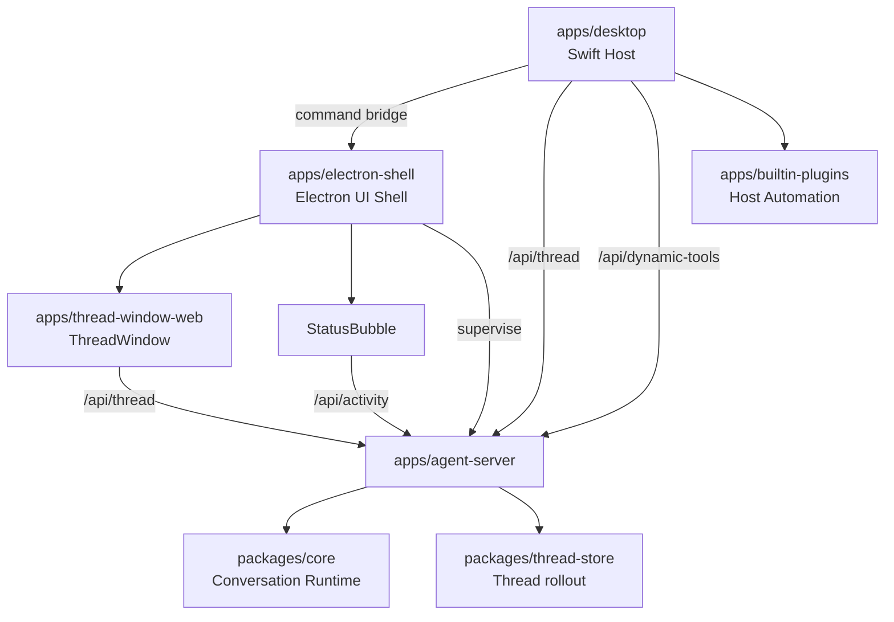

# Wisp Pocket 架构

统一术语从 [CONTEXT-MAP.md](/Users/mu9/proj/handAgent/CONTEXT-MAP.md) 进入；本文只记录跨上下文架构、所有权和不可从单个模块看出的合约。

## 分层架构

## 所有权

| 层 | 唯一职责 |
| --- | --- |
| `apps/desktop` | macOS 生命周期、PromptPanel、Settings、AgentTrigger、宿主能力与 Electron 启停 |
| `apps/electron-shell` | 常驻 UI 容器、agent-server supervisor、ThreadWindow 预热与窗口生命周期 |
| `apps/thread-window-web` | Thread 历史、消息、请求、Composer 和当前展示状态 |
| `apps/agent-server` | WebSocket 路由、Agent 编排、协议翻译、Tool 组合与持久化适配 |
| `packages/core` | Conversation Runtime、协议 DTO、LLM/Tool/Workspace/Permission 抽象 |
| `packages/thread-store` | SQLite rollout 与 Thread 派生视图 |
| `apps/builtin-plugins` | 宿主原子能力、Context History 与 Automation |

## 跨层合约

- 初始上下文只来自用户主动提交的 Input Item。屏幕、剪贴板、文件和 App 状态必须由 Tool 按需读取。
- `/api/thread` 承载 `ThreadCommand`、`ThreadNotification`、`ServerRequest` 与 `ClientResponse`。React 是持续连接和交互式请求 owner；Swift 只创建 PromptPanel / AgentTrigger Thread 并提交首轮 `UserInput`。
- `/api/activity` 只发送 Agent Activity，不承载 Thread 消息或历史。
- `/api/dynamic-tools` 只连接 Dynamic Tool Provider。Swift Host 统一暴露原生与 enabled Plugin 的能力。
- Electron UI Shell 是 agent-server 的唯一 supervisor，也是 ThreadWindow 与 StatusBubble 的唯一宿主；关闭 UI 窗口不停止 agent-server。
- `thread.snapshot` 是打开既有 Thread 的状态入口。React 当前不做断线重连、订阅恢复或自动 snapshot 拉取。

## 状态源

- Swift Host 持久化模型设置、主题偏好、AgentTrigger 与 Plugin enablement；React 只消费解析后的主题。
- React ThreadWindow 持有完整 UI Thread 状态；Swift 与 Electron main 不 mirror 消息或历史。
- agent-server 持有运行中的 Agent、订阅和请求路由；core 不持有 socket 或数据库。
- Thread 历史主文件是 `~/.spotAgent/threads.sqlite`；其他本地配置和数据路径由 owning 模块文档说明。

## 阅读路由

1. 从 [CONTEXT-MAP.md](/Users/mu9/proj/handAgent/CONTEXT-MAP.md) 取得相关术语。
2. 应用入口见 [apps/apps.md](/Users/mu9/proj/handAgent/apps/apps.md)。
3. 跨平台核心见 [packages/packages.md](/Users/mu9/proj/handAgent/packages/packages.md)。
4. 协议字段以 [packages/core/src/protocol](/Users/mu9/proj/handAgent/packages/core/src/protocol/protocol.md) 和代码类型为真相。
