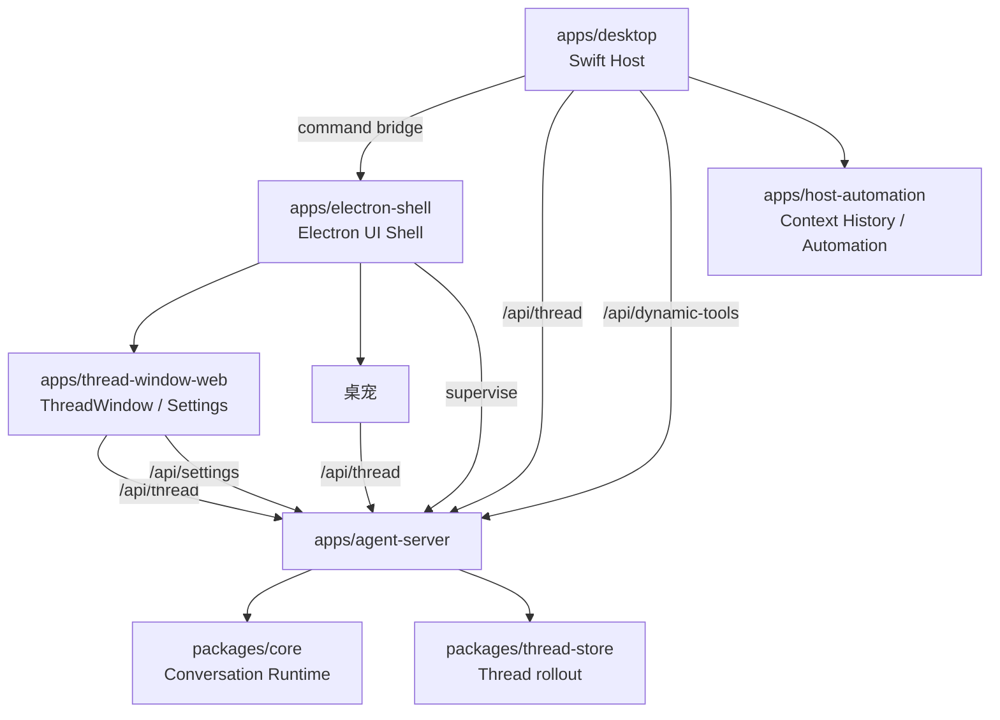

# Wisp Pocket 架构

统一术语从 [CONTEXT-MAP.md](/Users/mu9/proj/handAgent/CONTEXT-MAP.md) 进入；本文只记录跨上下文架构、所有权和不可从单个模块看出的合约。

## 分层架构

## 所有权

| 层 | 唯一职责 |
| --- | --- |
| `apps/desktop` | macOS 生命周期、menu bar、PromptPanel、原生宿主设置、AgentTrigger、宿主能力与 Electron 启停 |
| `apps/electron-shell` | 常驻 UI 容器、agent-server supervisor、ThreadWindow 预热、独立设置、桌宠与原生窗口生命周期 |
| `apps/thread-window-web` | ThreadWindow / 设置界面，以及供 React 界面复用的 Thread 协议、消息投影与连接 |
| `apps/agent-server` | HTTP 设置接口、WebSocket 路由、协议翻译、依赖组合与持久化适配 |
| `packages/core` | Conversation Runtime、协议 DTO、LLM/Tool/Workspace/Permission 抽象 |
| `packages/thread-store` | SQLite rollout 与 Thread 派生视图 |
| `apps/host-automation` | 应用进程内的 Context History、Automation 业务状态与持久化 |

## 跨层合约

- **单后端，多个独立前端**是产品设计边界：领域业务事实、Thread 执行、请求仲裁与持久化由同一个后端拥有；桌宠、PromptPanel、ThreadWindow 等前端各自通过后端协议接入。前端之间不依赖对方转发业务输入，也不依赖对方的 store、当前选择、草稿、窗口显示与连接来完成自身任务。
- 前端各自拥有界面、导航、草稿和订阅生命周期。打开、关闭、切换或重建一个前端不等于切换其他前端的选择或结束后端 Thread；观察同一 Thread 时同步的是后端事实，回执仍由后端仲裁。
- 共享协议有变更时，各消费者需同步 DTO、编码 / 守卫及必要调用参数，但这不自动扩大为其他前端的交互重设计，也不要求多个前端一起启用。用户确认的功能范围与提交前检查分别决定改动和验证边界。
- 初始上下文只来自用户主动提交的 Input Item。未主动交付的屏幕、剪贴板、文件和 App 状态由 Tool 按需读取。
- `/api/thread` 承载 `ThreadCommand`、`ThreadNotification`、`ServerRequest` 与 `ClientResponse`。ThreadWindow 和桌宠分别连接并共享后端 Thread；Swift 只创建 PromptPanel / AgentTrigger Thread 并提交首轮 `UserInput`。
- `/api/activity` 只发送 Agent Activity，不承载 Thread 消息或历史。
- `/api/dynamic-tools` 只连接 Dynamic Tool Provider。Swift Host 暴露原生能力与已启用的 Automation，并向两个业务模块提供共享 macOS 实现；Context History 的已保存记录由 agent-server 普通工具直接读取。
- `/api/settings/*` 管理模型、builtin Tool、MCP 配置与永久 Permission；Workspace 管理仍走 `/api/thread`。Pet 资料、图片和桌面分配归 Electron main 的前端 store，通过受控 IPC 操作；设置表单失败保留草稿，MCP 保存不刷新运行连接。
- Electron UI Shell 是 agent-server 的唯一 supervisor，也是 ThreadWindow 与桌宠的唯一宿主；关闭 UI 窗口不停止 agent-server。
- 桌宠以结构化 `file_reference` 交付原文件路径，模型收到路径文字，持久接收后才确认；模型按需调用默认开放、免 Permission 的 file.read / Context History 工具。各入口使用统一的首轮执行规则与按需 user.ask；PromptPanel 图片仍经 Blob / 多模态链路。输入队列由 core Thread 持久化协调。
- 建议按钮发送普通 UserInput；Permission 保持 ClientResponse。core 请求表只接受一次有效回执，`request.resolved` 同步清理两端展示。
- `thread.snapshot` 是既有 Thread 的状态入口。ThreadWindow 当前不做断线恢复；桌宠重连后按 Workspace 查询历史，从前端 Pet store 恢复当前 Thread；空选择表示准备新对话，不自动选最近历史。失效 Thread 清理关联，存储故障保留恢复状态。后台新建不改变选择。

Swift 提交可用性只依赖 agent-server health；hidden ThreadWindow prepared、桌宠选择和显隐不影响 PromptPanel / AgentTrigger 独立执行。窗口打开失败由 command ack 单独返回，见 [Swift 宿主](./apps/desktop/desktop.md)。

## 状态源

- 后端持久化模型、Tool、MCP 与永久 Permission；Swift Host 持久化主题偏好、Append Prompt、快捷键、AgentTrigger 与 Automation 启用选择。原生外观使用独立 `native-preferences.json`，不重写后端 `settings.json`；React 只消费解析后的主题。
- Context History 的采集与 Automation 的录制、执行由 Swift Host 应用生命周期管理。关闭窗口继续运行，Automation 禁用时或应用完全退出时清理对应任务；长期业务数据由各模块持久化。正常退出等待 Automation 取消结果落盘后再答复 AppKit。
- 两种 React 界面各持 Thread 投影和输入控制器，权威历史共用同一个后端 Thread。Electron main 的唯一 Pet store 持久化资料、图片、Workspace / 当前 Thread、显隐、位置与大小；renderer 持有对话显隐和逐 Thread 草稿，Swift 不镜像这些状态。
- core Workspace 注册表与 Thread 通过同一 SQLite 拥有项目和历史；实际目录唯一且固定，创建项目不生成 Pet。Thread 只固定保存 workspaceId，执行根由 Workspace 派生，不保存伙伴身份、版本或角色快照。同项目共享文件，不合并各 Thread 上下文。
- Thread 实际 Turn 开始读取项目根 AGENTS.md 一次，同轮固定、下一轮重读；缺失为空，其他读取错误明确失败。Pet 角色仅在新 Thread 首轮作为普通 skill Input Item 保存；接续不重新注入。ThreadWindow、PromptPanel 与 AgentTrigger 只凭 Workspace 创建任务，不读取 Pet store。
- core ThreadRegistry / Thread 持有运行中的 Thread、历史、Turn、请求和工具状态；agent-server 仅持有连接、订阅与路由。Electron main 的轻量观察连接消费 Workspace / Thread 身份、有效 Permission 和请求结束事实；统一分配伙伴承接任意来源请求，不持消息或历史。
- Thread 历史主文件是 `~/.spotAgent/threads.sqlite`；其他本地配置和数据路径由 owning 模块文档说明。

## 阅读路由

1. 从 [CONTEXT-MAP.md](/Users/mu9/proj/handAgent/CONTEXT-MAP.md) 取得相关术语。
2. 编写或修订涉及界面的 spec / 设计前，先从 [docs/docs.md](/Users/mu9/proj/handAgent/docs/docs.md) 读取 PRODUCT 与对应 surface，确认现有交互合约，再筛选调研；未经明确要求改变的交互继续保留。
3. 应用入口见 [apps/apps.md](/Users/mu9/proj/handAgent/apps/apps.md)。
4. 跨平台核心见 [packages/packages.md](/Users/mu9/proj/handAgent/packages/packages.md)。
5. 协议字段以 [packages/core/src/protocol](/Users/mu9/proj/handAgent/packages/core/src/protocol/protocol.md) 和代码类型为真相。
