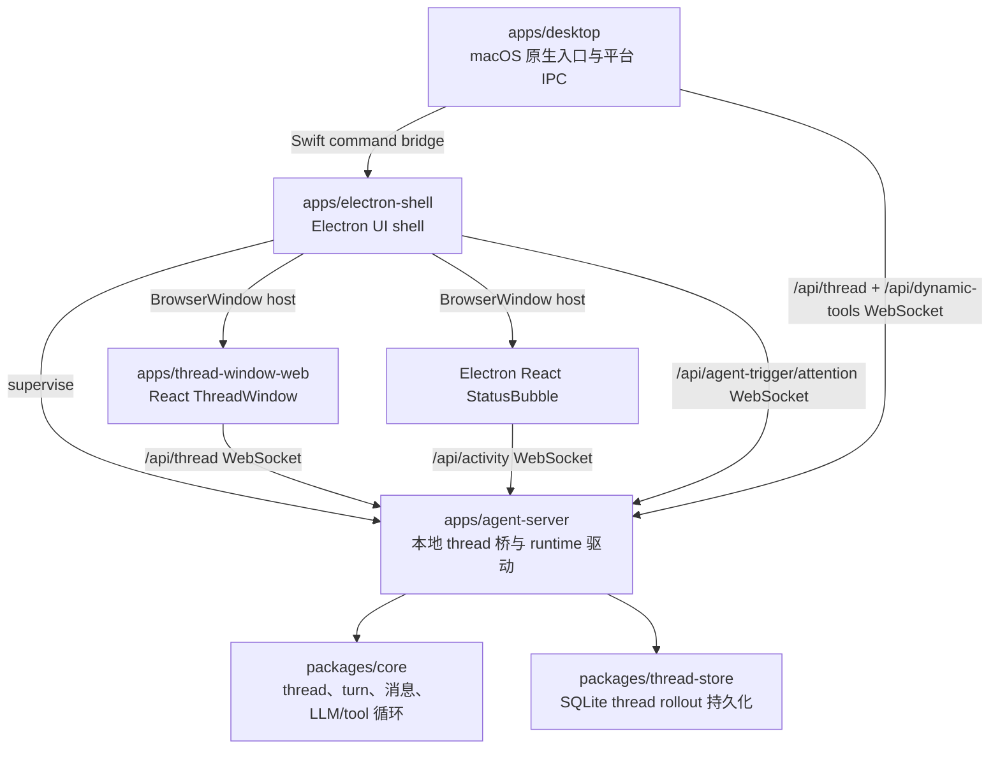
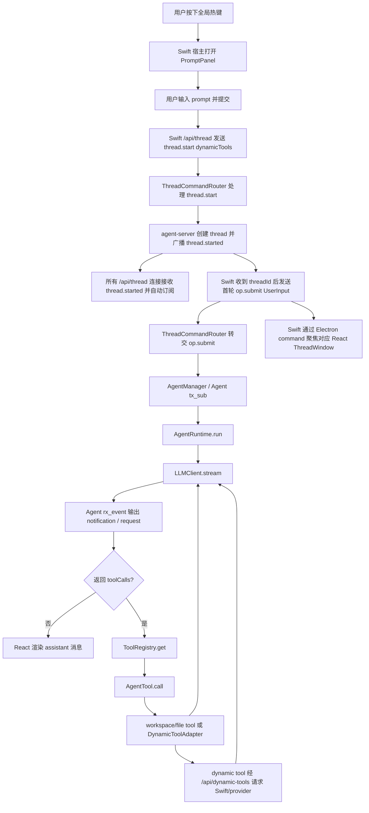

# handAgent

## 分层架构

Electron UI shell 是桌面端唯一 UI shell。Swift 启动 Electron，Electron 监督 agent-server，在 agent-server ready 后主动预热隐藏 ThreadWindow，并在 PromptPanel submit、openHistory 和 focus 时展示或聚焦 Electron `BrowserWindow` ThreadWindow；Electron ActivityWindow 承载 React StatusBubble，renderer 直接订阅 `/api/activity`。Swift 不启动 agent-server，不创建 `WKWebView` ThreadWindow，不显示 Swift StatusBubble，也不 mirror Electron activity 状态。macOS 原生能力由 Swift 默认 dynamic tool provider 通过 `/api/dynamic-tools` 执行；Swift PromptPanel 可通过 `/api/thread` 直连创建 thread 并提交首轮输入。

### 分层职责

- `apps/desktop`：负责宿主生命周期、热键、PromptPanel、Settings、焦点恢复、Swift <-> Electron command bridge，以及通过 `MacPlatformProvider` 实现 macOS 原生能力（ScreenCaptureKit / NSWorkspace / NSPasteboard 等）。
- `apps/electron-shell`：负责 Electron main 进程、Swift command socket、agent-server supervisor、隐藏 ThreadWindow 预热、PromptPanel submit/openHistory/focus 对应的 Electron `BrowserWindow` ThreadWindow 生命周期，以及 React StatusBubble ActivityWindow 生命周期。StatusBubble 点击只尝试通过 Electron main 聚焦已有 Electron ThreadWindow；没有可聚焦 ThreadWindow 时不唤起 PromptPanel。
- `apps/thread-window-web`：负责 React ThreadWindow UI，直接持有 `/api/thread` WebSocket，管理历史、后台 thread 状态缓存、当前右侧展示 thread、消息、请求回执和 composer 状态。
- `apps/agent-server`：负责本地 WebSocket thread 桥、`/api/thread`、`/api/activity`、`/api/dynamic-tools` 路径分流、thread/turn 路由、持久化封装和 runtime 驱动。
- `packages/core`：负责 thread 输入归一化、消息模型、tool 注册、dynamic tool adapter 与 LLM/tool 循环；macOS 原生能力不再通过 core 平台适配器内置。

## 主调用链路

## 跨层合约

- 初始上下文只来自用户主动输入和主动附件。PromptPanel 的 attachment 只作为 `UserInput.items` 经 `/api/thread` 进入 thread；屏幕、剪贴板、App 状态和文件读取都必须走 tool。
- Thread 主协议只跑在 `/api/thread`：所有 `/api/thread` 连接默认收到 `thread.started` 并自动订阅该 thread 后续普通 notification；React 负责完整 UI thread 命令与 `ClientResponse`，Swift 仅在 PromptPanel 首轮提交路径发送 `thread.start` / `op.submit(UserInput)` 并等待 `thread.started` 或 `thread.error`；`acceptServerRequests=1` 只表示该连接是 permission / workspace 等交互式 `ServerRequest` owner。app-server 内部会把 `ClientResponse` 包装为 `client_response` Op 投回 Agent `tx_sub`。
- Activity 轻量状态只跑在 `/api/activity`：agent-server 只发送 `AgentActivityEvent`；新连接先收到 `activity.snapshot`，状态变化时收到 `activity.changed`。该流由 `ThreadNotification` / `ServerRequest` 派生，不承载完整 thread 消息。
- 后台 AgentTrigger attention 只跑在 `/api/agent-trigger/attention`：agent-server 只发送 `AgentTriggerAttention`；Electron main 订阅该流，在后台 thread 命中权限、工作区选择或失败时引导用户注意。后台 trigger 启动入口是 `POST /api/agent-trigger/fire`。
- 主题偏好由 Swift 宿主持久化和解析：用户只在 Swift Settings 中选择 `light` / `dark` / `system`。Swift 启动 Electron 时先通过 `HANDAGENT_INITIAL_THEME` 环境变量传入当前真实 `{ preference, resolved }`，避免 Electron 首个 renderer 用固定浅色或固定深色启动；运行中主题变化再通过 `theme.changed` command 同步给 Electron。Electron main 同步给 ThreadWindow 和 ActivityWindow renderer，React 侧只应用 resolved theme，不持久化偏好。
- Dynamic tool provider 只跑在 `/api/dynamic-tools`：provider 发送 `provider_hello` 注册 `clientId` 与工具候选，agent-server 按 `DynamicToolSpec.clientId` 转发 `tool_call_request` 并等待 `tool_call_response`。Swift 默认 provider 的 namespace 是 `host_macos`。
- `thread.snapshot` 是用户打开历史 thread 或初始 prompt 建立 thread 后的状态入口；React 和 app-server 之间不做断线恢复，非主动断开后不重连、不恢复订阅、不拉取 snapshot、不发送恢复命令。`workspace.listed` 是 `workspace.list` 的连接级响应，不带 `threadId`。
- `permission.requested` / `workspace.requested` 是 server 向交互式 UI 提问、等待 UI 回执的少量交互；当前只有 React 预热连接使用 `/api/thread?acceptServerRequests=1` 成为 owner，Swift 直连 thread client 不设置该参数。
- Thread 持久化主文件是 `~/.spotAgent/threads.sqlite`；workspace、permission、blob、log、Append Prompt manifest 和 MCP 配置分别由对应模块文档说明。
- 图片 attachment 先落 Blob/STUB；agent-server 在 runtime 前展开为多模态 image part，最终能否理解图片取决于当前 provider capability。

协议字段详见 [protocol/protocol.md](/Users/mu9/proj/handAgent/packages/core/src/protocol/protocol.md)。desktop 内部提交模型见 [PromptPanel](/Users/mu9/proj/handAgent/apps/desktop/Sources/PromptPanel/prompt-panel.md)，React UI 状态见 [thread-window-web](/Users/mu9/proj/handAgent/apps/thread-window-web/thread-window-web.md)，agent-server 编排见 [agent-server](/Users/mu9/proj/handAgent/apps/agent-server/agent-server.md)。

## 当前架构不变量

- Swift desktop 持有窄口径 thread client，仅用于 PromptPanel 直连创建 thread、提交初始 `UserInput`，收到 `thread.started.threadId` 后再让 Electron 打开或聚焦 React ThreadWindow；Swift 不订阅 `/api/activity`，也不 mirror React thread 状态。
- Swift 不发送 `thread_window.prepare`；Electron main 是 hidden ThreadWindow 预热的唯一 owner。agent-server 是唯一承载 core runtime 的后台进程，关闭 Electron UI 窗口不停止该进程。
- React ThreadWindow 是历史、后台 thread 状态缓存、消息、运行态、permission/workspace 请求面板和 composer 的 UI 状态源；右侧当前展示的 thread 由 React `App` 本地 state 编排，不进入 store。
- agent-server 是组合根和本地桥：负责 socket 路径拆分、thread 生命周期路由、持久 Agent owner、runtime 驱动、持久化封装、Agent request broker 和 dynamic tool provider 转发；外部运行期输入统一是 `op.submit(UserInput | Interrupt)`，UI 回执在 server 内部抽象为 `client_response` Op。
- packages/core 只定义跨平台 runtime、tool、dynamic tool、protocol、workspace 和 permission 抽象，不实现 UI、持久化后端或 macOS 原生能力；thread rollout 持久化由 `packages/thread-store` 承担。

## 阅读顺序建议

1. 先读本文档，建立整体分层和主链路。
2. 再读 [apps/apps.md](/Users/mu9/proj/handAgent/apps/apps.md)，理解入口与交互层。
3. 再读 [packages/packages.md](/Users/mu9/proj/handAgent/packages/packages.md)，理解核心 runtime 与平台实现。
