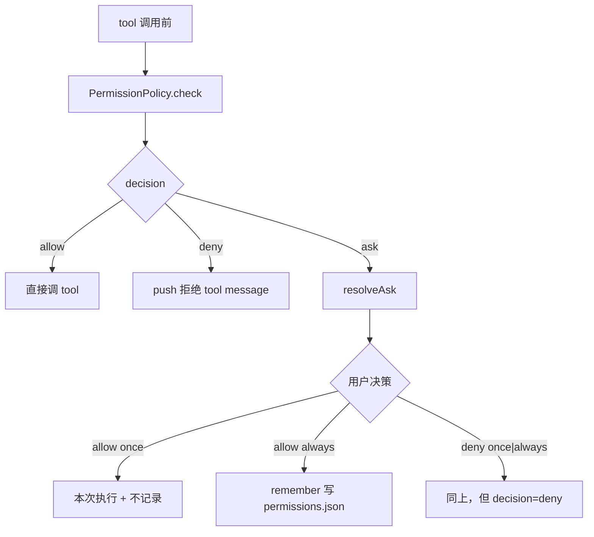

# permission

Tool 调用前的权限策略。runtime 默认 `AllowAllPermissionPolicy`；生产由 agent-server 注入 `FilePermissionPolicy(askResolver = core Thread requests.askPermission)`。

## 文件

| 文件 | 职责 |
|------|------|
| `PermissionPolicy.ts` | `PermissionPolicy` 接口（`check / resolveAsk / remember`）+ 输入输出类型 + `AllowAllPermissionPolicy` + `DENY_TOOL_RESULT_TEXT = "用户拒绝执行该 tool"` |
| `adapters/filesystem/FilePermissionPolicy.ts` | 权限策略：持久化 `~/.spotAgent/permissions.json`（按完整 `toolName` 全局命中）→ fallback 调 `askResolver`；持久化规则缓存按文件状态戳失效 |

## 决策三态 + 两档记忆



`PermissionResolution.remember`：

- `"once"` 或不传：什么也不记。
- `"always"`：去重后追加到 `~/.spotAgent/permissions.json`。

## 持久化文件

`~/.spotAgent/permissions.json`：

```json
{
  "version": 2,
  "rules": [
    {
      "toolName": "codex.execute",
      "decision": "allow",
      "createdAt": "2026-05-17T...",
    }
  ]
}
```

Codex 委托遵循本策略，拒绝时不启动 CLI；内部命令审批与沙箱仍归用户 Codex 配置，Wisp 不逐命令转交审批。永久规则只按完整 `toolName` 匹配，不比较任务参数；仅 version 2 且没有旧 `argHash` 的规则会生效。

## 编辑此目录的约束

- 不要在 policy 内做 UI 询问；UI 必须走 `askResolver` 注入。生产路径由 agent-server 端 `core Thread requests` 把 ask 转成 Agent `server.request` 事件。
- 权限不再有 Thread 内存规则；`always` 持久化层按 `toolName` 全局命中。
- `loadSync` 不启 watcher，但每次 `check / listPersistedRules / revoke / remember(always)` 读取持久化规则前都会比较 `permissions.json` 的 `mtimeMs + size`；文件被 Settings 或外部进程改动后，下一次调用会自动重读，写操作不会用旧缓存覆盖外部新增规则。
- 增加新 scope 时，三个调用点（`check / resolveAsk / remember`）+ runtime 的 `permission_decision` 事件 + 协议 `permission.answered.payload.scope` 必须同步。

## 相关文档

- 调用方：[runtime/runtime.md](/Users/mu9/proj/handAgent/packages/core/src/runtime/runtime.md)
- AskResolver UI 实现：[apps/agent-server/agent-server.md](/Users/mu9/proj/handAgent/apps/agent-server/agent-server.md)
- 协议帧：[protocol/protocol.md](/Users/mu9/proj/handAgent/packages/core/src/protocol/protocol.md)
