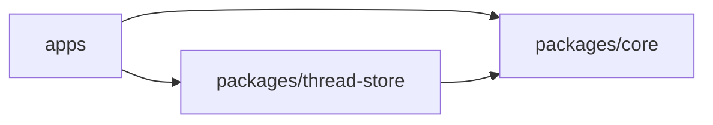

# packages

`packages/` 放可复用且不依赖产品 UI 的能力。Conversation Runtime 术语见 [core/CONTEXT.md](/Users/mu9/proj/handAgent/packages/core/CONTEXT.md)。

## 直接子节点

- [core/core.md](/Users/mu9/proj/handAgent/packages/core/core.md)：跨平台 Conversation Runtime、协议与 Tool 抽象。
- [thread-store/thread-store.md](/Users/mu9/proj/handAgent/packages/thread-store/thread-store.md)：SQLite Thread rollout 持久化。

## 依赖方向

- core 不依赖 AppKit、Electron、DOM、WebSocket server 或具体数据库。
- thread-store 可以依赖 core DTO；core 不反向依赖 thread-store。
- 平台能力通过 Dynamic Tool Provider 接入，不在 packages 内实现 macOS 能力。
