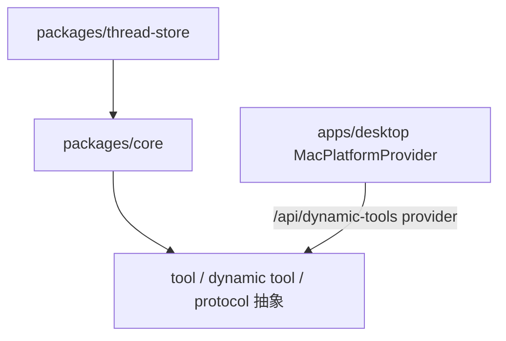

# packages

## 目录职责

`packages` 层承载可复用、可跨平台的核心能力抽象。

当前包含两个 workspace 包：

- [core/core.md](/Users/mu9/proj/handAgent/packages/core/core.md)：workspace 包名为 `@handagent/core`，对外通过 package exports 映射到 `src/`。
- [thread-store/thread-store.md](/Users/mu9/proj/handAgent/packages/thread-store/thread-store.md)：workspace 包名为 `@handagent/thread-store`，提供 SQLite thread rollout 持久化。

## 分层关系

## 包级边界

- `core` 只定义 thread、turn、消息、runtime、tool 协议、dynamic tool 协议，不依赖 AppKit，也不实现 thread 持久化后端。
- `thread-store` 依赖 core 的 `AgentMessage` / `ThreadNotification` DTO，在 Node 侧用 SQLite 保存 thread rollout items。
- macOS 平台能力由桌面 App 的 `MacPlatformProvider`（Swift）实现，通过 Swift dynamic tool provider 暴露为 `host_macos.*` 工具。
- 应用层 TypeScript 代码通过 `@handagent/core/...` 引用 core。
- 应用层 thread 持久化代码通过 `@handagent/thread-store/...` 引用 thread-store。

## 数据流角色

### `packages/core`

- 接收 Web 层传入的用户输入。
- 维护 `AgentMessage[]`。
- 调用 `LLMClient`。
- 解析 `toolCalls` 并回调 `ToolRegistry`。
- 通过 `DynamicToolAdapter` 与 agent-server dynamic tool bridge 发起 provider 工具请求。

### `packages/thread-store`

- 维护 `ThreadStore` 具体 class 和 `CurrentThread` writer 语义。
- 以 `session_meta`、`response_item`、`turn_context`、`event_msg` 等 rollout item 顺序保存 thread 历史。
- 向 agent-server 暴露兼容当前 UI 的 `PersistedThread`、`ThreadSummary` 派生视图。
